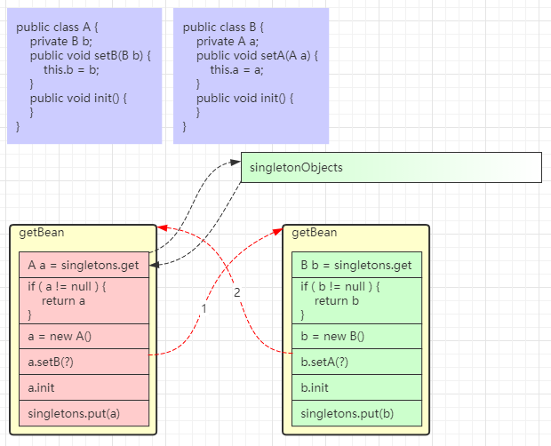
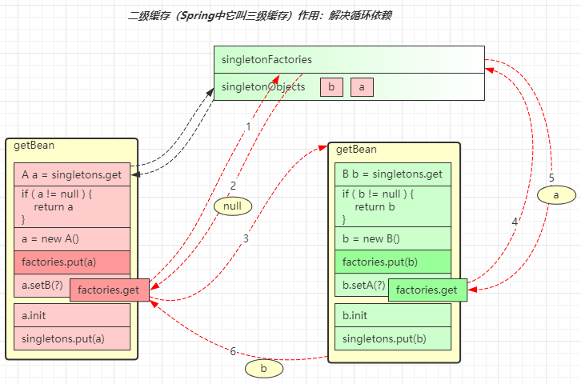
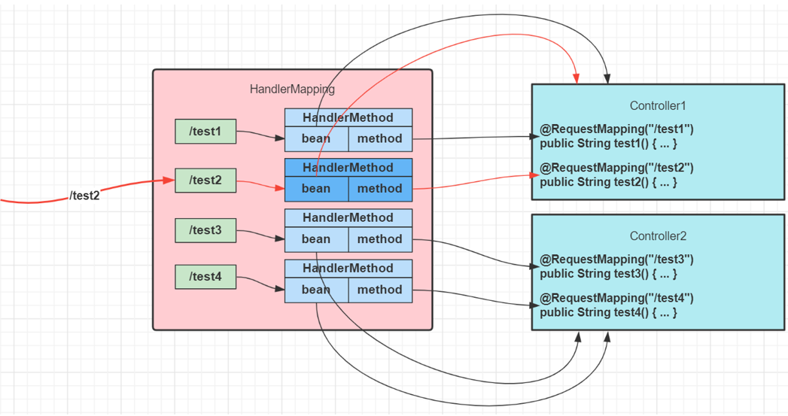
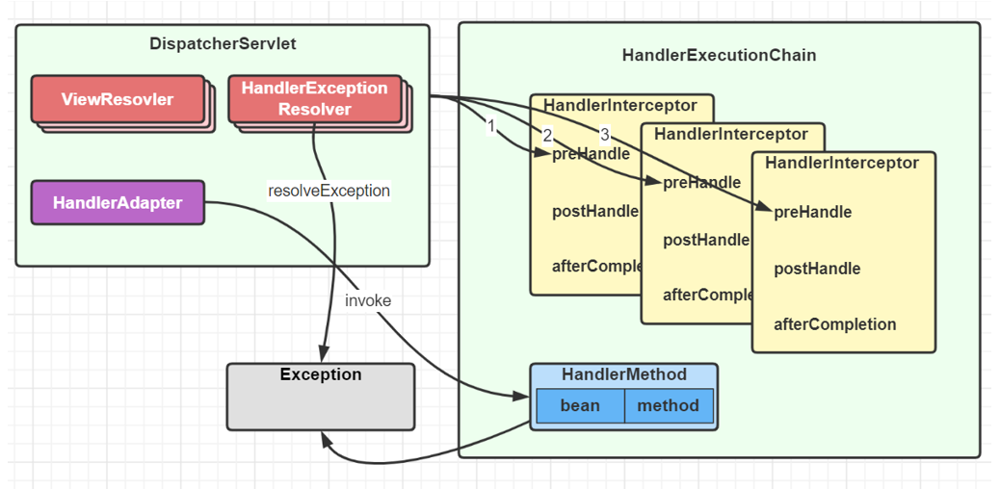
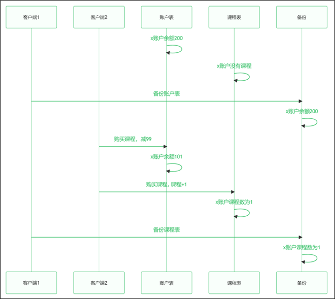
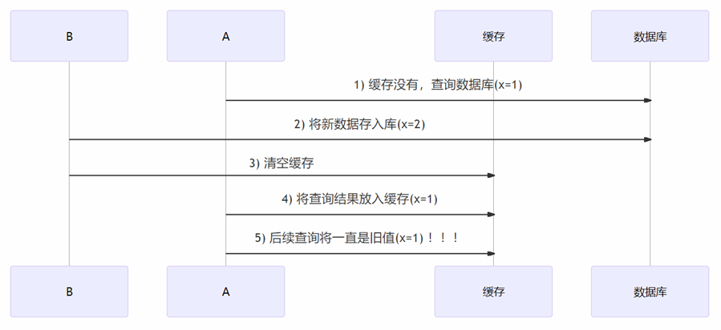
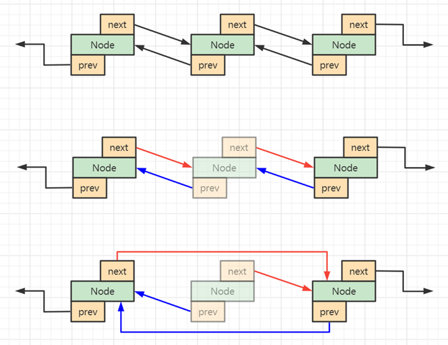
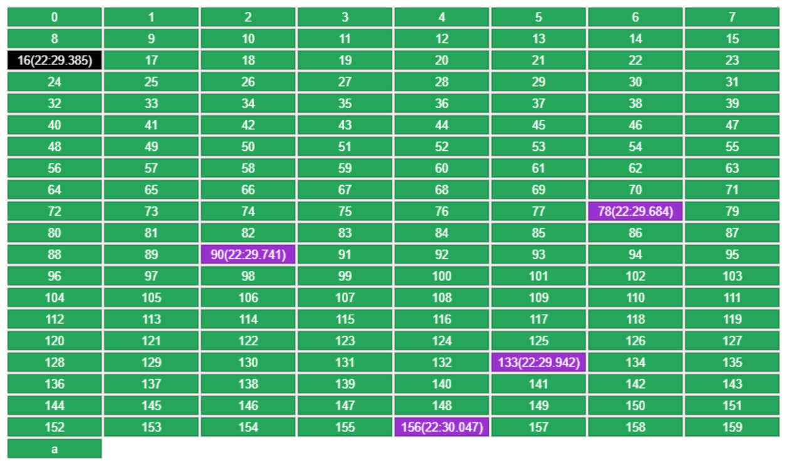

# 一、Java基础

## 1.1 语法篇

### 1.1.1 运算符 &和&&、|和||的区别

&运算符是按位与操作，只有当左右两边操作数对应的⼆进制数为都1时，结果位才为1，否则为0；

|运算符是按位或操作，只要左右两边操作数对应的⼆进制数有⼀个为1的时候，结果位就为1；

当用作逻辑运算时，& 和 && 都可以实现 且 这个功能，两者的区别（`a&b`、`a&&b`）：

- 无论a、b表达式的结果是true还是false，&会对a、b都进行运算；
- &&会先计算a，如果a为false，那么就不会继续计算b，直接返回结果，这称为短路操作；
- 判断语句中推荐使⽤ &&，效率更⾼；

| 和 || 和上面类似，&&和||称之为短路运算符。

### 1.1.2 用最有效率的方法计算2乘以8

使用位移运算符`2<<3`，将⼀个数左移n位，相当于乘以2的n次方，由于位运算是CPU直接⽀持的，所以效率更高。

在JDK源码中的位运算有很多，例如⾯HashMap的默认容量16：

```java
int DEFAULT_INITIAL_CAPACITY = 1 << 4; // aka 16
```

### 1.1.3 交换两个非0的int数值

⽅式⼀：

```java
public static void swap(int a, int b) {
	System.out.printf("a=%d, b=%d",a,b);
	a = a + b;
	b = a - b ;
	a = a - b;
	System.out.printf("\na=%d, b=%d",a,b);
}
```

方式二：

```java
public static void swap2(int a, int b){
	System.out.printf("a=%d, b=%d",a,b);
	a = a^b; // a1 = a^b
	b = b^a; // b = b^a^b
	a = a^b; // a = a1^b = a^b^a
	System.out.printf("\na=%d, b=%d",a,b);
}
```

### 1.1.4 Java数据类型的分类

- 基础数据类型：byte、short、int、long、float、double、char、boolean；
- 引⽤数据类型：其他都是引⽤类型；
  - String和Enum分别是什么类型：引⽤类型；

### 1.1.5 ++前置与后置

定义变量 `int i = 5;`，`return i++;` 和 `return ++i;` 返回结果是什么

- `return i++;`返回5；
- `return ++i;`返回6；

### 1.1.6 == 和equals的区别

- 基本数据类型需要⽤==判断是否相等；
- 引⽤数据类型：
  -  ==⽐较的是是栈中的值：
     -  基本数据类型是变量值；
     -  引用类型是堆中内存对象的地址；
  - equals⽐较的是具体的内容， 可以让开发者去定义什么条件去判断两个对象是否⼀样；

### 1.1.7 final关键字

- 修饰类：表示类不可被继承 ；
- 修饰方法：表示方法不可被子类重写，但是可以重载 ；
- 修饰变量：表示变量一旦被赋值就不可以更改它的值；

### 1.1.8 什么是字节码？采用字节码的好处是什么？

- 什么是字节码： 
  - Java中引入了虚拟机的概念，即在机器和编译程序之间加入了一层抽象的虚拟的机器；
    - JVM在任何平台上都提供给编译程序一个的共同的接口；
    - 编译程序只需要面向JVM，生成JVM能够理解的代码，然后由解释器来将JVM代码转换为特定系统的机器码执行;
  - 在Java中，供JVM理解的代码叫做**字节码**（即扩展名为 .class的文 件），它不面向任何特定的处理器，只面向JVM。;
  - 每一种平台的解释器是不同的，但是实现的JVM是相同的；
    - Java源程序经过编译器编译后变成字节码，字节码由JVM解释执行；
    - JVM将每一条要执行的字节码送给解释器，解释器将其翻译成特定机器上的机器码，然后在特定的机器上运行；
    - 这也就是解释了Java的编译与解释并存的特点；
  -  Java源代码---->编译器---->JVM可执行的Java字节码(即虚拟指令)---->JVM---->JVM中解释器----->机 器可执行的二进制机器码---->程序运行。 
- 采用字节码的好处：
  - （高效）Java语言通过字节码的方式，在一定程度上解决了传统解释型语言执行效率低的问题，同时又保留了解释型语言可移植的特点;
  - （跨平台）由于字节码并不专对一种特定的机器，因此Java程序无须重新编译便可在多种不同的计算机上运行;

### 1.1.9 使用泛型的好处

泛型提供了编译时类型安全检测机制，该机制允许程序员在编译时检测到非法的类型。泛型的本质 是参数化类型，也就是说所操作的数据类型被指定为一个参数。比如我们要写一个排序方法，能够 对整型数组、字符串数组甚至其他任何类型的数组进行排序，我们就可以使用 Java 泛型。

<u>**泛型的好处**</u>：

以集合来举例，使用泛型的好处是我们**不必因为添加元素类型的不同而定义不同类型的集合**，如整型集合类，浮点型集合类，字符串集合类，我们可以定义一个集合来存放整型、浮点型，字符串型数据；只要把底层存储设置了Object即可，添加的数据全部都可向上转型为Object，此外还可以通过规则按照自己的想法控制存储的数据类型；

### 1.1.10 try-catch-finally异常处理模块的返回值问题

下面代码 的try-catch-finally语句，try⾥⾯有个return, finally⾥⾯也有个return，结果会返回什么？为什么

```java
public static int test1() {
    int a = 1;
    try {
        System.out.println(a / 0);
        a = 2;
    } catch (ArithmeticException e) {
        a = 3;
        return a;
    } finally {
        a = 4;
    }
    return a;
}

public static int test2() {
    int a = 1;
    try {
        System.out.println(a / 0);
        a = 2;
    } catch (ArithmeticException e) {
        a = 3;
        return a;
    } finally {
        a = 4;
        return a;
    }
}
```

- `test1()`返回3、`test2()`返回4；
- 理由：
  - 在执⾏try、catch中的return之前不管有没有出现异常，**⼀定会执⾏finally中的代码**（如果finally存在）；
  - 如果finally中有return语句，就会直接执⾏finally中的return⽅法，所以finally中的return语句 ⼀定会被执⾏的；
  - 执⾏流程：finally执⾏前的代码⾥⾯有包含return，则会先确定return返回值的（此时并没有返回运算后的值，而是先把要返回的值保存起来，不管finally中的代码怎么样，返回的值都不会改变，任然是之前保存的值），然后再执行finally的代码，最后再执⾏return；

### 1.1.11 Exception与Error包结构

Java可抛出(Throwable)的结构分为三种类型：被检查的异常(CheckedException)，运行时异常 (RuntimeException)，错误(Error)。

### 1.1.12 JAVA 异常分类

### 1.1.13 throw 和 throws 的区别

### 1.1.12 找出某目录下的所有子目录以及子文件并打印到控制台

```java
private static void getAllFilePaths(File filePath, List<String> paths) {
    File[] files = filePath.listFiles();
    if(files == null){
        return;
    }
    for(File f : files){
        if(f.isDirectory()){
            paths.add(f.getPath());
            getAllFilePaths(f,paths);
        }else{
            paths.add(f.getPath());
        }
    }
}
```

## 1.2 String字符串

### 1.2.1 String str = new String("aaa"); 创建了几个对象

可能是一个、也可能是两个：

- 创建⼀个对象：如果常量池中存在`aaa`，则直接new⼀个`aaa`的字符串对象； 
- 创建两个对象：常量池不存在对象`aaa`，则会在常量池创建⼀个`aaa`对象，同时也会在堆里面创建⼀个`aaa`对象；

### 1.2.2  下面代码是比较什么？输出结果是什么？为什么是这样的结果？

```java
String str1= new String("aaa"); 
String str2= "aaa"; 
String str3= "aaa";
System.out.println(str1 == str2);
System.out.println(str2 == str3);
```

- `==`⽐较两边的引⽤内存地址是否⼀样;
- 第一个比较返回false，因为new 创建新的对象会开辟新的空间，所以地址不⼀样；
- 第二个比较返回true，因为此时"aaa" 存在于常量池中，都是从常量池⾥⾯获取值，地址相等

### 1.2.3 写出下面代码的执行结果，如果需要两个都为true，应该怎么修改？

```java
String s1 = "aaa";
String s2 = s1 + ".bbb";
String s3 = "aaa" + ".bbb";
System.out.println(s2 == "aaa.bbb"); 
System.out.println(s3 == "aaa.bbb");
```

- 第⼀条打印语句的结果为false， `s2 = s1 + ".bbb"` 构建了⼀个新的String对象，并将对象引⽤赋予s2变量，常量池中的地址不⼀样，但是值⼀样的；
  - 变量 + 常量 = 来⾃堆；
- 第⼆条语句打印的结果为true，javac编译会对""**字符串常量**""直接相加的表达式进⾏优化，不⽤等到运⾏期再去进⾏加法运算处理，⽽是直接将其编译成⼀个这些常量相连的结果；
  - 常量 + 常量 = 来⾃常量池；
- 如果需要第⼀个输出为true，只需要把变量改为常量即可，例如： `fianl String s1 = "aaa";` 。

不管是new String("XXX")和直接常量赋值, 都会在字符串常量池创建对应的字符串常量，只不过new String("XXX")方式会在堆中创建⼀个对象去指向常量池的对象，普通的常量赋值是直接赋值给变量。

### 1.2.4 String、StringBuffer与StringBuilder的区别及使用场景

相同点：

- 三者都是final， 不允许被继承；
- 本质都是char[]字符数组实现；

区别：

- String、StringBuffer与StringBuilder中，String是**不可变**对象，另外两个是**可变**的；
- String每次操作都会产生新的String对象；
- StringBuilder 效率更快，因为它不需要加锁，不具备多线程安全；
- StringBuffer⾥⾯操作⽅法都会使用`synchronized`关键字加锁，所以效率相对较低，但是是线程安全的；

使⽤场景： 

  - 操作少量的数据⽤String，但是如果需要经常改变内容且操作数据多情况下最好不要⽤ String ， 因为每次⽣成中间对象性能会降低 ；
  - 单线程下操作⼤量的字符串⽤StringBuilder，虽然线程不安全但是不影响 ；
  - 多线程下操作⼤量的字符串，且需要保证线程安全使用StringBuffer；

## 1.3 OOP

### 1.3.1 什么是面向对象？

对比面向过程，是两种不同的处理问题的角度，面向过程更注重事情的每一个步骤及顺序，面向对象更注重事情有哪些参与者（对象）、及各自需要做什么；

### 1.3.1 面向对象的四大特性

- 抽象:
  - 关键词abstract声明的类叫作抽象类，abstract声明的⽅法叫抽象方法；
  - 如果⼀个类中包含了⼀个或多个抽象⽅法，这个类就必须指定成抽象类；
  - 抽象抽象属于⼀种特殊的方法，它只是一个方法声明，并没有⽅法体；
  - 实际应用：抽象⽀付  `pay(⾦额，订单号)`，默认实现是本地⽀付，微信⽀付，⽀付宝⽀付，银⾏卡⽀付  
- 封装：
  - 明确标识出允许外部使用的所有成员函数和数据项，对数据的访问只能通过对外暴露的已定义的接口，这样可以做到内部实现细节对外部调用隐蔽，外部调用无需修改或者关心内部实现；
  - 在java中通过关键字`private`，`protected`和`public`以及缺省的访问权限修饰符实现封装；
  - 封装可以让代码更容易理解和维护，也加强了代码的安全性；
- 继承：
  - ⼦类继承⽗类的特征（属性）和⾏为（方法），使得⼦类对象具有⽗类的⽅法和属性；
  - ⼦类可以在父类的基础上做出自己的改变、扩展，子类共性的方法或者属性直接使用父类的，而不需要自己再定义，只需扩展自己个性化的；
- 多态：
  - 同⼀个⾏为具有多个不同表现形式的能⼒，基于对象所属类的不同，外部对同一个方法的调用，实际执行的逻辑不同；
  - 可以通过继承，方法重写，父类引用指向子类对象来实现多态；

### 1.3.2 Overload和Override的区别

- 重载Overload：表示**同⼀个类**中可以有多个方法名相同的⽅法，但这些⽅法的参数列表各不相同（参参数类型、个数、顺序），方法返回值和访问修饰符可以不同；
- 重写Override：发生在父子类中，子类重写父类方法表示**子类**中的⽅法可以与**父类**中的某个⽅法的名称和参数完全相同；
  - 子类返回值范围、抛出的异常范围小于等于父类，访问修饰符范围大于等于父类；
  - 如果父类方法访问修饰符为private则子类就不能重写该方法；

### 1.3.3 接口和抽象类的区别

抽象类：

- 可以存在普通成员方法；
- 成员变量可以是各种类型的；
- 抽象类只能继承一个；
- 接口的设计目的是对类的行为进行**约束**（更准确的说是一种“有”约束，因为接口不能规定类不可以有什么行为），也就是提供一种机制，可以强制要求不同的类具有相同的行为；接口只约束了行为的有无，但不对如何实现行为进行限制；
- 接口是对行为的抽象，表达的是 like a 的关系，比如： Bird like a Aircraft （像飞行器一样可以 飞），但其本质上 is a Bird 。接口的核心是定义行为，即实现类可以做什么，至于实现类主体是 谁、是如何实现的，接口并不关心。

接口：

- 只能存在public abstract 方法；
- 成员变量只能是public static final类型的；
- 接口可以实现多个；
- 抽象类的设计目的是代码复用，当不同的类具有某些相同的行为（记为行为集合A），且其中一 部分行为的实现方式一致时，A的非真子集（记为B）可以让这些类都派生于一个抽象类。在这个抽象类中实现了B，避免让所有的子类来实现B，这就达到了代码复用的目的。而A-B的部分则留给各个子类自己实现。正是因为A-B在这里没有实现，所以抽象类不允许实例化出来（否则当调用 到A-B时，无法执行）；
- 抽象类是对类本质的抽象，表达的是 is a 的关系，比如： BMW is a Car，抽象类包含并实现子类的通用特性，将子类存在差异化的特性进行抽象，交由子类去实现

### 1.3.3 接口是否可以继承接口？接口是否支持多继承？类是否支持多继承？接口里面是否可以有方法实现？

- 接口中可以有静态⽅法和⽅法体；
- 接口中所有的⽅法必须是抽象⽅法（JDK8之后就不是）；
- 接⼝不是被类继承了，⽽是要被类实现；
- 接⼝⽀持多继承，类不⽀持多个类继；

⼀个类只能继承⼀个类，但是能实现多个接口，接口能继承另⼀个接口，接口的继承使⽤`extends`关键字，和类继承⼀样；

### 1.3.4 JDK8中接口新特性

- interface中可以有static⽅法，但必须有⽅法实现体，该⽅法只属于该接口，接口名直接调⽤该⽅法 ；
- 接口中新增`default`关键字修饰的⽅法，default⽅法只能定义在接口中，可以在子类或子接口中被重写，default定义的⽅法必须有⽅法体；
- ⽗接⼝的default⽅法如果在⼦接⼝或⼦类被重写，那么子接口的实现对象、⼦类对象，调⽤该⽅法，以重写为准；
- 本类、接⼝如果没有重写⽗类（即接⼝）的default⽅法，则在调⽤default⽅法时，使⽤⽗类 （接⼝） 定义的default⽅法逻辑；

## 1.4 集合框架

### 1.4.1 Vector、ArrayList和LinkedList的联系和区别及使用场景

- `ArrayList`：
  - 底层是**数组**实现，每个元素之间不能有间隔，需要一块连续的内存；
  - **线程不安全**；
  - 随机访问快（根据下标进行访问）；
  - 尾部的插入和删除性能可以，但是对其他部分进行插入或者删除元素时，需要对数组进行复制、移动、代价比高；
- `LinkedList`： 
  - 底层是**双向链表**实现，不需要连续内存；
  - **线程不安全**；
  - 随机访问慢（需要沿着链表进行遍历）；
  - 头、尾插入和删除性能高，向链表中间增删元素时，性能也比较低
  - *LinkedList还提供了 List 接口中没有定义的方法，专门用于操作表头和表尾元素，可以当作堆、栈、队列和双向队列使用;*

- `Vector`：底层是**数组**实现，**线程安全**的，操作的时候使⽤synchronized进⾏加锁;
  - *某一时刻只有一 个线程能够写 Vector，避免多线程同时写而引起的不一致性*；

使⽤场景：

- Vector已经很少⽤了；
- 增加和删除场景多则⽤LinkedList；
- 查询和修改多则⽤ArrayList；

### 1.4.2 保证ArrayList线程安全的方式

- ⽅式⼀：⾃⼰写个包装类，根据业务⼀般是`add/update/remove`加锁；
- ⽅式⼆：使用`Collections.synchronizedList(new ArrayList<>());` ，其使用使⽤synchronized加锁；
- ⽅式三：使用`CopyOnWriteArrayList<>()`，其使⽤`ReentrantLock`加锁；

### 1.4.3 CopyOnWriteArrayList和Collections.synchronizedList实现线程安全有什么区别及使用场景

- `CopyOnWriteArrayList`：
  - 在执行修改操作时，会拷⻉⼀份新的数组进⾏操作（例如add、set、 remove等)，这样的代价⼗分昂贵，在操作执行完毕后，会将原来集合指向新的集合；
  - 在源码中，使⽤`ReentrantLock`可重⼊锁来保证不会有多个线程同时拷⻉⼀份数组
  - 使用场景：由于读⾼性能，所以适⽤读操作远远⼤于写操作的场景中使⽤，因为读的时候是不需要加锁的， 直接获取，删除和增加是需要加锁的；==>读多写少 
- `Collections.synchronizedList`：
  - 线程安全的原因是因为它⼏乎在每个⽅法中都使⽤了`synchronized`同步锁；
  - 使用场景：与`CopyOnWriteArrayList`相反，写操作性能⽐`CopyOnWriteArrayList`好，读操作性能并不如 `CopyOnWriteArrayList`；==>写多读少

### 1.4.4 CopyOnWriteArrayList的设计思想及缺点

设计思想：**读写分离+最终⼀致**；

缺点：

- 内存占⽤问题，由于写时复制机制，在内存⾥会同时驻扎两个对象：旧的对象和新写⼊的对象；
- 如果对象⼤则容易发⽣**Yong GC**和**Full GC**；

### 1.4.5 ArrayList的扩容机制

<u>初始容量</u>：

- 如果未指定集合容量，调用无参的构造函数：
  - 在JDK1.7之前`ArrayList`的默认容量是10；
  - 在JDk1.7之后`ArrayList`的默认容量是1；
- 若已经指定容量，则集合大小为指定容量；

<u>扩容时机</u>：

- 以JDK1.8为例，当集合**第⼀次**添加元素的时候，集合大小扩容为10；
- 当`ArrayList`的元素个数⼤于其容量，按照`扩容的⼤⼩= 原始⼤⼩+原始⼤⼩/2`（上次容量的**1.5倍**）来进行扩容；

扩容源代码：

```java
    /**
     * Increases the capacity to ensure that it can hold at least the
     * number of elements specified by the minimum capacity argument.
     *
     * @param minCapacity the desired minimum capacity
     */
    private void grow(int minCapacity) {
        // overflow-conscious code
        int oldCapacity = elementData.length;
        int newCapacity = oldCapacity + (oldCapacity >> 1);
        if (newCapacity - minCapacity < 0)
            newCapacity = minCapacity;
        if (newCapacity - MAX_ARRAY_SIZE > 0)
            newCapacity = hugeCapacity(minCapacity);
        // minCapacity is usually close to size, so this is a win:
        elementData = Arrays.copyOf(elementData, newCapacity);
    }
```

### 1.4.6 设计⼀个简单的ArrayList

### 1.4.7 List和Set的区别

<u>List</u>：

- **有序**，按对象进入的顺序保存对象；
- **可重复**，允许多个Null元素对象；
- 遍历方式：
  - 可以使用`Iterator`取出所有元素，再逐一遍历；
  - 可以使用`get(int index)`获取指定下标的元素;

<u>Set</u>:

- **无序**;
- **不可重复**，且最多允许有一个Null元素对象；
- 遍历方式：
  - 只能用Iterator接口取得所有元素，再逐一遍历各个元素；

### 1.4.7 了解Map吗？用过哪些Map的实现

`HashMap`、`Hashtable`、`LinkedHashMap`、`TreeMap`、 `ConcurrentHashMap`；

### 1.4.8 HashMap和Hashtable的区别

<u>HashMap</u>：

- 底层是基于**数组+链表**;
- **非线程安全**的;
  - 虽然HashMap是线程不安全的，但是它的效率远远高于Hashtable，这样设计是合理的，因为大部分的使用场景都是单线程。当需要多线程操作的时候可以使用线程安全的 `ConcurrentHashMap`；
  - `ConcurrentHashMap`使用了分段锁，并不对整个数据进行锁定，效率比Hashtable高；
- 默认容量是**16** ，扩容因子是0.75，每次扩容大小为原来的 2的指数倍;
- **允许有空(null)的键和值**;
  - 为null的key只能有一个，因为必须保证key的唯一性；
  - 可以有多个key值对应的value为null；
- 对key的hashcode做了**二次散列**，从而避免key的分布不均匀问题，影响查询性能；

<u>Hashtable</u>：

- 基于**哈希表**实现；
- **线程安全**的(因为加了`synchronized`)；
- 默认容量是**11**，扩容因子是0.75，每次扩容大小为原来的 2n+1；
- **不允许有 null的健和值**；
- 直接使用key的hashcode对数组长度取模；

- Hashtable比HashMap多提供了`elments()` 和`contains()`两个方法:
  - `elments()`方法：继承自 Hashtable的父类Dictionnary，用于返回此Hashtable中的value的枚举。 
  - `contains()`方法：判断该Hashtable是否包含传入的value，作用与`containsValue()`一致；（事实上`contansValue()` 就只是调用了一下`contains()`方法）

### 1.4.9 对象的 hashCode()和equals()方法，及使用场景

hashCode方法和equals方法都是是顶级类`Object`中的⽅法：

- `hashCode()`方法的返回值类型是int，根据⼀定的hash规则对数据进行散列，散列后得到**散列值** ；
- `equals()`方法的返回值类型是boolean，一般会根据⾃定义的匹配规则，判断两个对象的内容是否一致；

使⽤场景：对象⽐较、集合容器⾥⾯排重、⽐较、排序；

### 1.4.10 两对象比较

- 如果两个对象相等，则hashcode值是相同的，并且对两个对象分别调用equals方法都返回true；
- 如果两个对象有相同的hashcode值，它们也不一定是相等的，如果重写equals方法后，则也同时必须重写hashCode()方法；
- hashCode()的默认行为是对堆上的对象产生独特值。如果一个类没有重写hashCode()方法，则该类的两个对象无论如何都不会相等（即使这两个对象指向相同的数据）；

### 1.4.11 HashMap中可以使用任何类作为 key 吗

可以但需要注意以下几点：

- 如果类重写了`equals()`方法，它也应该重写 `hashCode()` 方法；
- 类的所有实例需要遵循与 `equals()`方法和 `hashCode()` 方法相关的规则；
-  自定义的key类的最佳实践是使之为不可变的：
  - hashCode 值可以被缓存起来，拥有更好的性能；
  - 可以确保 hashCode 和 equals 在未来不会改变；

### 1.4.11 编写⼀个User对象，重写其中的hashCode()和equals()方法

### 1.4.12 HashMap和TreeMap的区别

### 1.4.13 Set和Map的关系

核⼼就是不保存重复的元素，存储⼀组唯⼀的对象；

- `Set`的每⼀种实现都是对应Map⾥⾯的⼀种封装
  - HashSet对应的就是HashMap;
  - TreeSet对应的就是TreeMap;

### 1.4.x HashSet与HashMap的区别

<u>HashSet</u>：

- 实现了Map接口；
- 以key-value的形式存储；
- 调用`put()`方法向map中添加元素；
- 使用key来计算hashCode；

<u>HashMap</u>：

- 实现了Set接口；
- 仅存储对象；
- 调用`add()`方法向set中添加元素；
- 使用对象来计算hashCode，如果两个对象的hashCode相同则继续调用`equals()`方法进行比较；

### 1.4.13 常见Map的排序规则是怎样的？

- `LinkedHashMap`按照添加顺序排序;
- `TreeMap`默认按照⾃然排序，如果需要⾃定义排序，使用`TreeMap(Comparetor c)`；

### 1.4.14 如果需要线程安全，且效率高的Map，应该怎么做？

多线程环境下可以⽤concurrent包下的`ConcurrentHashMap`, 或者使⽤` Collections.synchronizedMap()`对Map进行包装，`ConcurrentHashMap`不但是线程安全，并且他的效率⽐`Hashtable`要⾼很多；

### 1.4.15 为什么Collections.synchronizedMap后是线程安全的？

使⽤`Collections.synchronizedMap`对Map包装后返回的map是加锁的；

### 1.4.16 HashMap底层数据结构

`HashMap`底层是由**数组+链表+红⿊树**（JDK1.8之后有红⿊树）组成；

`HashMap`整体上是一个数组，然后数组中的元素是⼀个链表，即数组和链表的结合体：`Node<K, V>[] table`

- table是数组，数组的元素是Entry(Node继承Entry)；
- Entry元素是⼀个 key-value的键值对，它持有⼀个指向下个Entry的引⽤；
- table数组的每个Entry元素同时也作为当前 Entry链表的⾸节点，也指向了该链表的下个Entry元素；
- 在JDK1.8中，当链表Entry的⻓度⼤于8并且数组容量超过64，链表会转换成红⿊树

### 1.4.17 什么是Hash冲突及常见的解决办法

Hash冲突的意思是**不同key计算得到的Hash值相同**，需要放到同个bucket中；

常⻅的解决办法：

- 链表法（**HashMap采⽤的是链表法**）；
- 开放地址法；
- 再哈希法；

### 1.4.18 HashMap底层是 数组+链表+红黑树，为什么要用这几类结构呢？

- 数组`Node<K, V> table` ，根据对象的key的Hash值进⾏在数组⾥⾯是哪个节点；
- 链表的作⽤是解决Hash冲突，将Hash值⼀样的对象存在⼀个链表放在hash值对应的槽位；
- 红⿊树是JDK8引入用来替代超过8个节点的链表，主要是为了**提升查询性能**，从原来的O(n)提升到了 O(logn)；

### 1.4.19 HashMap底层为何要选择红黑树

⼆叉查找树在特殊情况下也会变成⼀条线性结构，和原先的链表存在⼀样的深度遍历问题，查找性能 就会慢， 使⽤红⿊树主要是提升查找数据的速度，红⿊树是平衡⼆叉树的⼀种，插⼊新数据后会通过左旋，右旋、变 ⾊等操作来保持平衡，解决单链表查询深度的问题 数据量少的时候操作数据，遍历线性表⽐红⿊树所消耗的资源少

### 1.4.20 HashMap为何要等到链表长度超过8才进行树化

* 红黑树是用来避免 DoS 攻击，防止链表超长时性能下降，树化应当是偶然情况，是保底策略；
* hash 表的查找，更新的时间复杂度是 `O(1)`，而红黑树的查找，更新的时间复杂度是 `O(log⁡n)`，并且`TreeNode` 占用空间也比普通 Node 的大，如非必要，尽量还是使用链表；
* hash 值如果足够随机，则在 hash 表内按泊松分布，在负载因子 0.75 的情况下，长度超过 8 的链表出现概率是 0.00000006（亿分之6），树化阈值选择 8 就是为了让树化几率足够小；

### 1.4.21 HashMap红黑树何时会退化成链表

<u>树化规则</u>

* 当链表长度超过树化阈值 8 时，先尝试扩容来减少链表长度，如果数组容量已经 >=64，才会进行树化

<u>退化规则</u>

* 情况1：在扩容时如果拆分树时，树元素个数 <= 6 则会退化链表
* 情况2：remove 树节点时，若 `root、root.left、root.right、root.left.left `有一个为 null ，也会退化为链表

### 1.4.20 HashMap的put流程

<u>put 流程</u>：

- HashMap 是懒惰创建数组的，首次使用才会创建数组；

- 通过一定的hash算法计算索引（桶下标）；

- 如果桶下标还没人占用，则创建 Node 占位返回；

- 如果桶下标已经有人占用：
  - 如果是`TreeNode`占用，则走红黑树的添加或更新逻辑；
  - 如果普通`Node`占用，则走链表的添加或更新逻辑，并且如果添加后链表长度超过树化阈值，走树化逻辑；

- 返回前会检查容量是否超过阈值，一旦超过进行扩容（加载因子0.75）；

<u>1.7 与 1.8 的区别</u>：

- 链表插入节点时，1.7 是头插法，1.8 是尾插法；

- 1.7 是大于等于阈值且没有空位时才扩容，而 1.8 是大于阈值就扩容；

- 1.8 在扩容计算 Node 索引时，会优化；

<u>扩容（加载）因子为何默认是 0.75f</u>：

- 在空间占用与查询时间之间取得较好的权衡；
- 大于这个值，空间节省了，但链表就会比较长影响性能；
- 小于这个值，冲突减少了，但扩容就会更频繁，空间占用也更多；

### 1.4.x HashMap的扩容机制

<u>1.7版本</u>

- 先⽣成新数组 
- 遍历⽼数组中的每个位置上的链表上的每个元素
- 取每个元素的key，并基于新数组⻓度，计算出每个元素在新数组中的下标 
- 将元素添加到新数组中去
- 所有元素转移完了之后，将新数组赋值给HashMap对象的table属性

<u>1.8版本</u> 

- 先⽣成新数组
- 遍历⽼数组中的每个位置上的链表或红⿊树 
  - 如果是链表，则直接将链表中的每个元素重新计算下标，并添加到新数组中去
  - 如果是红⿊树，则先遍历红⿊树，先计算出红⿊树中每个元素对应在新数组中的下标位置
    - 统计每个下标位置的元素个数
    - 如果该位置下的元素个数超过了8，则⽣成⼀个新的红⿊树，并将根节点的添加到新数组的对应位置
    - 如果该位置下的元素个数没有超过8，那么则⽣成⼀个链表，并将链表的头节点添加到新数组的 对应位置 
- 所有元素转移完了之后，将新数组赋值给HashMap对象的table属性

### 1.4.x HashMap 与 ConcurrentHashMap的区别

HashMap 与 ConcurrentHashMap 都是以key-value 形式的存储数据；

<u>HashMap</u>：

- Map接口的一个实现类，线程不安全；
- 底层数据结构：
  - JDK 1.8 之前：数组 + 链表；
  - JDK 1.8 之后：数组 + 链表 + 红黑树；（当链表中元素个数达到 8 的时候，为了提升查询效率，链表会转为红黑树）

<u>ConcurrentHashMap</u>：

-  JUC 下的类，线程安全；
- 底层数据结构：
  - JDK 1.8 之前：分段锁现实的 Segment + 数组+链表；
  - JDK 1.8 之后：采用 Node + CAS + Synchronized；

### 1.4.x Hashtable和ConcurrentHashMap的区别

* Hashtable 与 ConcurrentHashMap 都是线程安全的 Map 集合；
* Hashtable 并发度低，整个 Hashtable 对应一把锁，同一时刻只能有一个线程操作它；
* ConcurrentHashMap 并发度高；
  * JDK 1.8 之前ConcurrentHashMap 使用了Segment  + 数组+链表的结构，每个Segment 对应一把锁，如果多个线程访问不同的Segment，就不会冲突；
  * JDK 1.8 之后ConcurrentHashMap将数组的每个头节点作为锁，如果多个线程方法问的头节点不同，就不会冲突；

相比于HashTable类基本上所有的⽅法都是采⽤synchronized 进⾏线程安全控制，在⾼并发情况下效率低，ConcurrentHashMap则是采⽤了分段锁的思想提⾼性能，锁粒度更细化；

### 1.4.22 ConcurrentHashMap在JDK1.7和JDK1.8中的区别

<u>ConcurrentHashMap 1.7</u>

* 数据结构：`Segment(大数组) + HashEntry(小数组) + 链表`，每个 Segment 对应一把锁，如果多个线程访问不同的 Segment，则不会冲突；
* 并发度：Segment 数组大小即并发度，决定了同一时刻最多能有多少个线程并发访问；
  * **Segment 数组不能扩容**，意味着并发度在 ConcurrentHashMap 创建时就固定了；
* 索引计算
  * 假设大数组长度是2^m^，key 在大数组内的索引是 key 的二次 hash 值的高 m 位；
  * 假设小数组长度是2^n^，key 在小数组内的索引是 key 的二次 hash 值的低 n 位；
* 扩容：每个小数组的扩容相对独立，小数组在超过扩容因子时会触发扩容，每次扩容**翻倍**；
* Segment[0] 原型：首次创建其它小数组时，会以此原型为依据来创建（数组长度，扩容因子都会以原型为准）；

<u>ConcurrentHashMap 1.8</u>

* 数据结构：`Node 数组 + 链表或红黑树`，数组的每个头节点作为锁，如果多个线程访问的头节点不同，则不会冲突。首次生成头节点时如果发生竞争，利用 cas 而非 syncronized，进一步提升性能
* 并发度：Node 数组有多大，并发度就有多大，与 1.7 不同，Node 数组可以扩容
* 扩容：
  * 条件：Node 数组满 3/4 时就会扩容
  * 单位：以**链表**为单位从后向前迁移链表，迁移完成的将旧数组头节点替换为 ForwardingNode；
* 与 1.7 相比是懒惰初始化

### 1.4.x ConcurrentHashMap的capacity和factor

* capacity 代表预估的元素个数，capacity / factory 来计算出初始数组大小，需要贴近2^n^;
* loadFactor 只在计算初始数组大小时被使用，之后扩容固定为 3/4；
* 超过树化阈值时的扩容问题，如果容量已经是 64，直接树化，否则在原来容量基础上做 3 轮扩容

### 1.4.x ConcurrentHashMap扩容过程中的并发get和put

* 扩容时并发 get
  * 根据是否为 ForwardingNode 来决定是在新数组查找还是在旧数组查找，**不会阻塞**；
  * 如果链表长度超过 1，则需要对节点进行复制（创建新节点），以防止节点迁移后 next 指针改变；
  * 如果链表最后几个元素扩容后索引不变，则节点无需复制
* 扩容时并发 put
  * 如果 put 的线程与扩容线程操作的链表是同一个，put 线程会阻塞；
  * 如果 put 的线程操作的链表还未迁移完成，即头节点不是 ForwardingNode，则可以并发执行；
  * 如果 put 的线程操作的链表已经迁移完成，即头结点是 ForwardingNode，则可以协助扩容；

## 1.5 并发编程

### 1.5.1 进程、线程、协程之间的关系

### 1.5.2 协程对于多线程的优缺点

### 1.5.3 并发、并行、串行之间的区别

- <u>串⾏</u>：⼀个任务执⾏完，才能执⾏下⼀个任务

- <u>并⾏(Parallelism)</u>：两个任务同时执⾏；

- <u>并发(Concurrency)</u>：两个任务整体看上去是同时执⾏，在底层，两个任务被拆成了很多份，然后 ⼀个⼀个执⾏，站在更⾼的⻆度看来两个任务是同时在执⾏的；

### 1.5.4 Java中实现多线程的方式

### 1.5.x 为什么要使用线程池

- **降低资源消耗**：提高线程利用率，降低创建和销毁线程的消耗；
- **提高响应速度**：任务来了，直接有线程可用可执行，而不是先创建线程，再执行；
- **提高线程的可管理性**：线程是稀缺资源，使用线程池可以统一分配调优监控；

### 1.5.x 常用的线程池有哪些

- newSingleThreadExecutor：创建一个单线程的线程池，此线程池保证所有任务的执行顺序按照任务的提交顺序执行；
- newFixedThreadPool：创建固定大小的线程池，每次提交一个任务就创建一个线程，直到线程达到线程池的最大大小；
- newCachedThreadPool：创建一个可缓存的线程池，此线程池不会对线程池大小做限制，线程池大小完全依赖于操作系统（或者说JVM）能够创建的最大线程大小；
- newScheduledThreadPool：创建一个大小无限的线程池，此线程池支持定时以及周期性执行任务的需求；

### 1.5.x 线程池参数

```java
public ThreadPoolExecutor(int corePoolSize,
                              int maximumPoolSize,
                              long keepAliveTime,
                              TimeUnit unit,
                              BlockingQueue<Runnable> workQueue,
                              ThreadFactory threadFactory,
                              RejectedExecutionHandler handler)
```


- <u>corePoolSize</u>：**核心线程数**，池中会**保留**的最多线程数，是正常情况下创建工作的线程数，这些线程创建后并不会消除，而是一种常驻线程；
- <u>maximumPoolSize</u>：**最大线程数**目，最大允许被**创建**的线程数（核心线程+救急线程的最大数目）；
- <u>keepAliveTime</u>：**空闲时间**，救急线程的空闲时间，如果在空闲时间内没有新任务，此线程资源会释放；
- 可以通过`setKeepAliveTime`方法来设置空闲时间；
- <u>unit</u>：**时间单位**，救急线程的生存时间单位，如秒、毫秒等；
- <u>workQueue</u>：工作队列，当没有空闲核心线程时，新来任务会加入到此队列排队，队列满会创建救急线程执行任务；
- <u>threadFactory</u>：线程工厂，用来生产线程执行任务，可以定制线程对象的创建，例如设置线程名字、是否是守护线程等；
- <u>handler</u>：拒绝策略，出发时机有两种情况；
  - 当所有线程都在繁忙，workQueue 也放满时，会触发拒绝策略；
  - 调用 shutdown 等方法关闭线程池；

### 1.5.x 线程池的拒绝策略有哪些

- AbortPolicy：直接丢弃任务，抛出异常，这是默认策略；
- CallerRunsPolicy：只用调用者所在的线程来处理任务 ；
- DiscardOldestPolicy：丢弃等待队列中最旧的任务，并执行当前任务 ；
- DiscardPolicy：直接丢弃任务，也不抛出异常；

### 1.5.x 线程池处理流程


线程池内部是通过队列+线程实现的，当我们利⽤线程池执⾏任务时：

- 如果此时线程池中的线程数量⼩于corePoolSize，即使线程池中的线程都处于空闲状态，也要创建新的线程来处理被添加的任务；
- 如果此时线程池中的线程数量等于corePoolSize，但是缓冲队列workQueue未满，那么任务被放入缓冲队列；
- 如果此时线程池中的线程数量⼤于等于corePoolSize，缓冲队列workQueue满，并且线程池中的数量⼩于maximumPoolSize，建新的线程来处理被添加的任务；
- 如果此时线程池中的线程数量⼤于corePoolSize，缓冲队列workQueue满，并且线程池中的数量等 于maximumPoolSize，那么通过 handler所指定的策略来处理此任务；
- 当线程池中的线程数量⼤于 corePoolSize时，如果某线程空闲时间超过keepAliveTime，线程将被 终⽌。这样，线程池可以动态的调整池中的线程数；


### 1.5.x 线程池为什么是先添加列队而不是先创建最大线程

当线程池中的核⼼线程都在忙时，如果继续往线程池中添加任务，那么任务会先放⼊队列，队列满了之 后，才会新开线程。这就相当于，⼀个公司本来有10个程序员，本来这10个程序员能正常的处理各种需 求，但是随着公司的发展，需求在慢慢的增加，但是⼀开始这些需求只会增加在待开发列表中，然后这 10个程序员加班加点的从待开发列表中获取需求并进⾏处理，但是某⼀天待开发列表满了，公司发现现 有的10个程序员是真的处理不过来了，所以就开始新招员⼯了。

### 1.5.5 Java线程状态

<u>六种状态及转换</u>


* 新建
  * 当一个线程对象被创建，但还未调用 start 方法时处于**新建**状态
  * 此时未与操作系统底层线程关联
* 可运行
  * 调用了 start 方法，就会由**新建**进入**可运行**
  * 此时与底层线程关联，由操作系统调度执行
* 终结
  * 线程内代码已经执行完毕，由**可运行**进入**终结**
  * 此时会取消与底层线程关联
* 阻塞
  * 当获取锁失败后，由**可运行**进入 Monitor 的阻塞队列**阻塞**，此时不占用 cpu 时间
  * 当持锁线程释放锁时，会按照一定规则唤醒阻塞队列中的**阻塞**线程，唤醒后的线程进入**可运行**状态
* 等待
  * 当获取锁成功后，但由于条件不满足，调用了 wait() 方法，此时从**可运行**状态释放锁进入 Monitor 等待集合**等待**，同样不占用 cpu 时间
  * 当其它持锁线程调用 notify() 或 notifyAll() 方法，会按照一定规则唤醒等待集合中的**等待**线程，恢复为**可运行**状态
* 有时限等待
  * 当获取锁成功后，但由于条件不满足，调用了 wait(long) 方法，此时从**可运行**状态释放锁进入 Monitor 等待集合进行**有时限等待**，同样不占用 cpu 时间
  * 当其它持锁线程调用 notify() 或 notifyAll() 方法，会按照一定规则唤醒等待集合中的**有时限等待**线程，恢复为**可运行**状态，并重新去竞争锁
  * 如果等待超时，也会从**有时限等待**状态恢复为**可运行**状态，并重新去竞争锁
  * 还有一种情况是调用 sleep(long) 方法也会从**可运行**状态进入**有时限等待**状态，但与 Monitor 无关，不需要主动唤醒，超时时间到自然恢复为**可运行**状态

> ***其它情况（只需了解）***
>
> * 可以用 interrupt() 方法打断**等待**、**有时限等待**的线程，让它们恢复为**可运行**状态
> * park，unpark 等方法也可以让线程等待和唤醒

<u>五种状态</u>

五种状态的说法来自于操作系统层面的划分


* 运行态：分到 cpu 时间，能真正执行线程内代码的
* 就绪态：有资格分到 cpu 时间，但还未轮到它的
* 阻塞态：没资格分到 cpu 时间的
  * 涵盖了 java 状态中提到的**阻塞**、**等待**、**有时限等待**
  * 多出了阻塞 I/O，指线程在调用阻塞 I/O 时，实际活由 I/O 设备完成，此时线程无事可做，只能干等
* 新建与终结态：与 java 中同名状态类似，不再啰嗦

### 1.5.6 多线程开发中的常用方法

### 1.5.8 多线程的业务场景

### 1.5.9 不是线程安全的数据结构

### 1.5.x 守护线程的理解

线程分为⽤户线程和守护线程

- ⽤户线程就是普通线程；
- 守护线程就是JVM的后台线程，⽐如垃圾回收线程就是⼀个守护线程，守护线程会在其他普通线程都停⽌运⾏之后⾃动关闭。我们可以通过设置 thread.setDaemon(true)来把⼀个线程设置为守护线程；

### 1.5.10 线程安全的理解

当多个线程访问一个对象时，如果不用进行额外的同步控制或其他的协调操作，调用这个对象的行为都可以获得正确的结果，我们就说这个对象是线程安全的；

线程安全要考虑三个方面：可见性、有序性、原子性

- 可见性：一个线程对共享变量修改，另一个线程能看到最新的结果；

- 有序性：一个线程内代码按编写顺序执行；

- 原子性：一个线程内多行代码以一个整体运行，期间不能有其它线程的代码插队；

### 1.5.11 volatile能否保证线程安全

<u>原子性</u>

* 起因：多线程下，不同线程的**指令发生了交错**导致的共享变量的读写混乱；
* 解决：用悲观锁或乐观锁解决，volatile 并不能解决原子性；

<u>可见性</u>

* 起因：由于**编译器优化、或缓存优化、或 CPU 指令重排序优化**导致的对共享变量所做的修改另外的线程看不到；
* 解决：用 volatile 修饰共享变量，能够防止编译器等优化发生，让一个线程对共享变量的修改对另一个线程可见；

<u>有序性</u>

* 起因：由于**编译器优化、或缓存优化、或 CPU 指令重排序优化**导致指令的实际执行顺序与编写顺序不一致；
* 解决：用 volatile 修饰共享变量会在读、写共享变量时加入不同的屏障，阻止其他读写操作越过屏障，从而达到阻止重排序的效果；
* 注意：
  * **volatile 变量写**加的屏障是阻止上方其它写操作越过屏障排到 **volatile 变量写**之下；
  * **volatile 变量读**加的屏障是阻止下方其它读操作越过屏障排到 **volatile 变量读**之上；
  * volatile 读写加入的屏障只能防止同一线程内的指令重排；

### 1.5.x wait和sleep的区别

<u>共同点</u>

* wait() ，wait(long) 和 sleep(long) 的效果都是让当前线程暂时放弃 CPU 的使用权，进入**阻塞状态**；

<u>不同点</u>

* 方法归属不同
  * sleep(long) 是 Thread 的静态方法；
  * 而 wait()，wait(long) 都是 Object 的成员方法，每个对象都有；

* 醒来时机不同
  * 执行 sleep(long) 和 wait(long) 的线程都会在等待相应毫秒后醒来；
  * wait(long) 和 wait() 还可以被 notify 唤醒，wait() 如果不唤醒就一直等下去；
  * 它们都可以被打断（interrupt）唤醒；

* 锁特性不同（重点）
  * wait 方法的调用必须先获取 wait 对象的锁，而 sleep 则无此限制；
  * wait 方法执行后会释放对象锁，允许其它线程获得该对象锁（我放弃 cpu，但你们还可以用）；
  * 而 sleep 如果在 synchronized 代码块中执行，并不会释放对象锁（我放弃 cpu，你们也用不了）；

### 1.5.x lock vs synchronized的区别

* 语法层面
  * synchronized 是关键字，源码在 jvm 中，用 c++ 语言实现；
  * Lock 是接口，源码由 jdk 提供，用 Java 语言实现；
  * 使用 synchronized 时，退出同步代码块锁会自动释放，而使用 Lock 时，需要手动调用 unlock 方法释放锁；
* 功能层面
  * 二者均属于悲观锁、都具备基本的互斥、同步、锁重入功能；
  * Lock 提供了许多 synchronized 不具备的功能，例如获取等待状态、公平锁、可打断、可超时、多条件变量
  * Lock 有适合不同场景的实现，如 ReentrantLock， ReentrantReadWriteLock
* 性能层面
  * 在没有竞争时，synchronized 做了很多优化，如偏向锁、轻量级锁，性能不赖；
  * 在竞争激烈时，Lock 的实现通常会提供更好的性能；

**公平锁**

* 公平锁的公平体现
  * **已经处在阻塞队列**中的线程（不考虑超时）始终都是公平的，先进先出
  * 公平锁是指**未处于阻塞队列**中的线程来争抢锁，如果队列不为空，则老实到队尾等待
  * 非公平锁是指**未处于阻塞队列**中的线程来争抢锁，与队列头唤醒的线程去竞争，谁抢到算谁的
* 公平锁会降低吞吐量，一般不用

**条件变量（Condition类）**

* ReentrantLock 中的条件变量功能类似于普通 synchronized 的 wait，notify，用在当线程获得锁后，发现条件不满足时，临时等待的链表结构
* 与 synchronized 的等待集合不同之处在于，ReentrantLock 中的条件变量可以有多个，可以实现更精细的等待、唤醒控制

### 1.5.x ThreadLocal的理解

ThreadLocal是Java中所提供的线程本地存储机制，可以利⽤该机制将**数据缓存在某个线程内部**， 该线程可以在任意时刻、任意⽅法中获取缓存的数据；

<u>作用</u>

* ThreadLocal 可以实现**资源对象**的**线程间隔离**，让每个线程各用各的资源对象，避免争用引发的线程安全问题；
* ThreadLocal 同时实现了**线程内的资源共享**；

<u>原理</u>

每个线程（Thread对象）内有一个 **ThreadLocalMap** 类型的成员变量，用来存储资源对象，Map的key为ThreadLocal对象，Map的value为需要缓存的值

* 调用 set 方法，就是以 **ThreadLocal 自己作为 key**，资源对象作为 **value**，放入当前线程的 ThreadLocalMap 集合中；
* 调用 get 方法，就是以 **ThreadLocal 自己作为 key**，到当前线程中查找关联的资源值；
* 调用 remove 方法，就是以 **ThreadLocal 自己作为 key**，移除当前线程关联的资源值；

所以ThreadLocal只起到关联的作用，真正起到线程隔离作用的是ThreadLocalMap；

ThreadLocalMap 的一些特点

* key 的 hash 值统一分配；
* 初始容量 16，扩容因子 2/3，扩容容量翻倍；
* key 索引冲突后用**开放寻址法**解决冲突；

### 1.5.x ThreadLocal的key为什么被设计为弱引用

Thread 可能需要长时间运行（如线程池中的线程），如果 key 不再使用，需要在内存不足（GC）时释放其占用的内存，设计为弱引用方便GC回收key对象；

### 1.5.x ThreadLocal内存释放时机

* 被动 GC 释放 key
  * 仅是让 key 的内存释放，**关联 value 的内存并不会释放**；
* 懒惰被动释放 value
  * get key 时，发现是 null key，则释放其 value 内存；
  * set key 时，会使用**启发式扫描**，清除临近的 null key 的 value 内存，启发次数与元素个数，是否发现 null key 有关；
* 主动 remove 释放 key，value
  * 会同时释放 key，value 的内存，也会清除临近的 null key 的 value 内存；
  * 推荐使用它，因为一般使用 ThreadLocal 时都把它作为静态变量（即强引用），因此无法被动依靠 GC 回收；

### 1.5.12 为什么会出现脏读

### 1.5.13 什么是指令重排

### 1.5.14 什么是happens-before

### 1.5.16 进程间的调度算法

### 1.5.17 线程间的调度算法

### 1.5.18 Java中的锁

### 1.5.x 悲观锁和乐观锁的区别

* 悲观锁的代表是 synchronized 和 Lock 锁
  * 核心思想：**线程只有占有了锁，才能去操作共享变量，每次只有一个线程占锁成功，获取锁失败的线程，都得停下来等待**；
  * 线程从运行到阻塞、再从阻塞到唤醒，涉及线程上下文切换，如果频繁发生，影响性能；
  * 实际上，线程在获取 synchronized 和 Lock 锁时，如果锁已被占用，都会做几次重试操作，减少阻塞的机会；

* 乐观锁的代表是 AtomicInteger，使用 cas 来保证**原子性**
  * 其核心思想：**无需加锁，每次只有一个线程能成功修改共享变量，其它失败的线程不需要停止，不断重试直至成功**；
  * 由于线程一直运行，不需要阻塞，因此不涉及线程上下文切换；
  * 它需要多核 cpu 支持，且线程数不应超过 cpu 核数；

### 1.5.19 多线程死锁的例子

### 1.5.20 死锁的4个必要条件

- ⼀个资源每次只能被⼀个线程使⽤；
- ⼀个线程在阻塞等待某个资源时，不释放已占有资源；
- ⼀个线程已经获得的资源，在未使⽤完之前，不能被强⾏剥夺；
- 若⼲线程形成头尾相接的循环等待资源关系；

### 1.5.21 优化代码，解决死锁

### 1.5.22 设计⼀个简单的不可重入锁

### 1.5.23 设计⼀个简单的可重入锁

### 1.5.24 对synchronized的理解

## 1.6 JVM

### 1.6.x JVM 内存结构


- <u>程序计数器</u>
  - 一块较小的内存空间，是当前线程所执行的字节码的**行号**指示器；
    - 若当前方法是 Java 方法，程序计数器的值是虚拟机字节码指令的地址（当前指令的地址）；
    - 若当前方法是native方法，程序计数器的值是 undefined；
- <u>虚拟机栈</u>
  - 描述**Java方法**执行的内存模型，每个方法在执行的同时都会创建一个栈帧（Stack Frame）用于存储局部变量表、操作数栈、动态链接、方法出口等信息;
  - 每一个方法从调用直至执行完成的过程，就对应着一个栈帧在虚拟机栈中入栈到出栈的过程;
- <u>本地方法栈</u>
  - 本地方法栈和虚拟机栈作用类似，区别是虚拟机栈为执行 Java 方法服务，而本地方法栈则为 **Native 方法**服务；
  - HotSpot VM 直接就把本地方法栈和虚拟机栈合二为一；
- <u>堆</u>
  - 运行时数据区，Java 虚拟机中内存最大的一块，几乎所有的**对象实例**都在这里分配内存；
  - 是垃圾收集器进行垃圾收集的最重要的内存区域；
  - 由于现代 VM 采用分代收集算法，因此 Java 堆从 GC 的角度还可以细分为
    - 新生代(Eden 区、From Survivor 区和 To Survivor 区)；
    - 老年代；
- <u>方法区</u>
  - 也称非堆，用于存储已被虚拟机加载的**类**信息、**常量、静态变量、即时编译后的代码**等数据；
  - 运行时常量池：是方法区的一部分，存常量（比如static final修饰的，比如String 一个字符串）和符号引用；

### 1.6.x JVM中线程私有与线程共享区域

- <u>线程私有区域</u>：程序计数器、虚拟机栈、本地方法栈；

- <u>线程共享区域</u>：JAVA 堆、方法区；

此外还有直接内存；

线程私有数据区域生命周期与线程相同, 依赖用户线程的启动/结束而创建/销毁（在 Hotspot  VM内, 每个线程都与操作系统的本地线程直接映射，因此这部分内存区域的存/否跟随本地线程的生/死对应）；

线程共享区域随虚拟机的启动/关闭而创建；

### 1.6.x JVM中会发生内存溢出的区域

* 不会出现内存溢出的区域：程序计数器；
* 出现 OutOfMemoryError 的情况
  * **堆**内存耗尽：对象越来越多，又一直在使用，不能被垃圾回收；
  * **方法区**内存耗尽 ：加载的类越来越多，很多框架都会在运行期间动态产生新的类；
  * **虚拟机栈**累积：每个线程最多会占用 1 M 内存，线程个数越来越多，而又长时间运行不销毁时；
* 出现 StackOverflowError 的区域
  * JVM **虚拟机栈<u>内部</u>**、**本地方法栈<u>内部</u>**：原因有方法递归调用未正确结束、反序列化 json 时循环引用；（线程内）

### 1.6.x 方法区、永久代、元空间的关系

* **方法区**是 JVM 规范中定义的一块内存区域，用来存储类元数据、方法字节码、即时编译器需要的信息等；
* **永久代**是 Hotspot 虚拟机对 JVM 规范的实现（1.8 之前），使用**Java堆**的来实现方法区；
* **元空间**是 Hotspot 虚拟机对 JVM 规范的另一种实现（1.8 以后），使用**本地内存**作为这些信息的存储空间；

<u>类数据何时被放入到元空间</u>：


* 当第一次用到某个类是，由**类加载器**将 class 文件的类元信息读入，并存储于元空间；
* X，Y 的类元信息是存储于元空间中，无法直接访问；
* 可以用 X.class，Y.class 间接访问类元信息，它们俩属于 java 对象，我们的代码中可以使用；

<u>元空间中的数据何时被清理</u>：


* 堆内存中：当一个**类加载器对象**，这个类加载器对象加载的所有**类对象**，这些类对象对应的所有**实例对象**都没人引用时，GC 时就会对它们占用的对内存进行释放
* 元空间中：内存释放**以类加载器为单位**，当堆中类加载器内存释放时，对应的元空间中的类元信息也会释放

### 1.6.x Java代码的执行的执行流程

* 执行 javac 命令
  * 编译源代码为字节码；
* 执行 java 命令
  - 创建 JVM，调用类加载子系统加载 class，将类的信息存入**方法区**；
  - 创建 main 线程，使用的内存区域是 **JVM 虚拟机栈**，开始执行 main 方法代码；
  - 如果遇到了未见过的类，会继续触发类加载过程，同样会存入**方法区**；
  - 需要创建对象，会使用**堆**内存来存储对象；
  - 不再使用的对象，会由**垃圾回收器**在内存不足时回收其内存；
  - 调用方法时，
    - 方法内的局部变量、方法参数所使用的是  **JVM 虚拟机栈**中的栈帧内存；
    - 先要到**方法区**获得到该方法的字节码指令，由**解释器**将字节码指令解释为机器码执行；
    - 会将要执行的指令行号读到**程序计数器**，这样当发生了线程切换，恢复时就可以从中断的位置继续；
  - 对于非 java 实现的方法调用，使用内存称为**本地方法栈**（对于 Oracle 的 Hotspot 虚拟机实现，不区分虚拟机栈和本地方法栈）
  - 对于热点方法调用，或者频繁的循环代码，由 **JIT 即时编译器**将这些代码编译成机器码缓存，提高执行性能；

### 1.6.x 什么是STW

STW: Stop-The-World，是在垃圾回收算法执⾏过程当中，需要将JVM**内存冻结**的⼀种状态。

在STW 状态下，JAVA的所有线程都是停⽌执⾏的（GC线程除外），native⽅法可以执⾏，但是不能与JVM交 互。

GC各种算法优化的重点，就是减少STW，同时这也是JVM调优的重点。

### 1.6.x JVM内存参数

JVM参数⼤致可以分为三类：

- 标准指令： -开头，这些是所有的HotSpot都⽀持的参数。可以⽤java -help 打印出来；
- ⾮标准指令： -X开头，这些指令通常是跟特定的HotSpot版本对应的。可以⽤java -X 打印出来；
- 不稳定参数： -XX 开头，这⼀类参数是跟特定HotSpot版本对应的，并且变化⾮常⼤。

<u>堆内存，按大小设置</u>


* -Xms：最小堆内存（包括新生代和老年代）；
* -Xmx：最大堆内存（包括新生代和老年代）；

通常建议将 -Xms 与 -Xmx 设置为大小相等，即不需要保留内存，不需要从小到大增长，这样性能较好；

* -XX:NewSize 与 -XX:MaxNewSize：设置新生代的最小与最大值，但一般不建议设置，由 JVM 自己控制；
* -Xmn：设置新生代大小，相当于同时设置了 -XX:NewSize 与 -XX:MaxNewSize 并且取值相等；

<u>堆内存，按比例设置</u>


* -XX:NewRatio=2:1 表示老年代占两份，新生代占一份
* -XX:SurvivorRatio=4:1 表示新生代分成六份，伊甸园占四份，from 和 to 各占一份

<u>元空间内存设置</u>

- 

<u>代码缓存内存设置</u>

<u>线程内存设置</u>

### 1.6.x JVM确定回收对象算法

<u>引用计数法</u>

- 一个对象如果没有任何与之关联的引用，即他的引用计数为 0，则说明对象不太可能再被用到，那么这个 对象就是可回收对象；

<u>可达性分析</u>；

- 通过一系列的GC Root 对象，即那些一定不会被回收的对象作为起点搜索。如果在GC roots和一个对象之间没有可达路径，则称该对象是不可达的；
- 不可达对象不等价于可回收对象，不可达对象变为可回收对象至少要经过两次标记过程。两次标记后仍然是可回收对象，则将面临回收；

### 1.6.x JVM GC的理解

- 垃圾回收，GC能帮助我们释放JVM内存（回收区域是**堆内存**，不包括虚拟机栈；），可以一定程度避免OOM问题，但是也无法完全避免；
- GC 的目的在于实现无用对象内存自动释放，减少内存碎片、加快分配速度；

- Java的GC是自动工作的，不像C++需要主动调用；
- 当new对象的时候，GC就开始监控这个对 象的地址大小和使用情况了，通过可达性分析算法寻找不可达的对象然后进行标记看看是否需要 GC回收掉释放内 存；

### 1.6.x 可以保证GC执行吗

不能，我只能通过手动执行` System.gc() `方法通知GC执行，但是他是否执行的未知的；

### 1.6.x JVM垃圾回收算法

<u>标记清除法</u>


1. 找到 GC Root 对象，即那些一定不会被回收的对象，如正执行方法内局部变量引用的对象、静态变量引用的对象；
2. 标记阶段：沿着 GC Root 对象的引用链找，直接或间接引用到的对象加上标记；
3. 清除阶段：释放未加标记的对象占用的内存；

特点：

* 标记速度与存活对象线性关系；
* 清除速度与内存大小线性关系；
* 缺点是**会产生内存碎片**；

<u>标记整理法</u>


1. 前面的标记阶段、清理阶段与标记清除法类似；
2. 多了一步整理的动作，将存活对象向一端移动，可以避免内存碎片产生；

特点：

* 标记速度与存活对象线性关系；

* 清除与整理速度与内存大小成线性关系；
* 缺点是**性能上较慢**；

<u>标记复制法</u>


1. 将整个内存分成两个大小相等的区域，from 和 to，其中 to 总是处于空闲，from 存储新创建的对象；
2. 标记阶段与前面的算法类似；
3. 在找出存活对象后，会将它们从 from 复制到 to 区域，复制的过程中自然完成了碎片整理；
4. 复制完成后，交换 from 和 to 的位置即可；

特点：

* 标记与复制速度与存活对象成线性关系
* 缺点是**会占用成倍的空间**

### 1.6.x JVM GC分代回收思想

理论依据是大部分对象朝生夕灭，用完立刻就可以回收，另有少部分对象会长时间存活，每次很难回收，根据这两类对象的特性将回收区域分为**新生代**和**老年代**，新生代采用标记复制法、老年代一般采用标记整理法；

- 新生代 young
  - 伊甸园 eden，最初分配对象的场所；
  - 幸存区 survivor，当伊甸园内存不足，会发生Minor GC，GC后的幸存对象存放在这里，分成 from 和 to，采用标记复制算法；
    - 当伊甸园内存不足，标记伊甸园与 from的存活对象；
    - 将存活对象采用复制算法复制到 to 中，复制完毕后，伊甸园和 from 内存都得到释放；
    - 将 from 和 to 交换位置；
- 老年代 old：当幸存区对象熬过几次回收（最多15次），晋升到老年代（幸存区内存不足或大对象会导致提前晋升）
  - 老年代当空间占用到达某个值之后就会触发Full GC，一般使用标记整理的执行算法；

### 1.6.x GC 规模

* Minor GC：发生在新生代的垃圾回收，暂停时间短；
* Mixed GC：新生代 + 老年代部分区域的垃圾回收，G1 收集器特有；
* Full GC：新生代 + 老年代完整垃圾回收，暂停时间长，**应尽力避免**；

### 1.6.x Minor GC与Full GC的发生时机

- 新生代内存（Eden区）不够用时候发生Minor GC，也叫YGC；
- Full GC发生情况：
  - 老年代被写满；
  - 持久代被写满；
  - System.gc()被显示调用（只是会告诉需要GC，但什么时候发生并不知道）；

### 1.6.x 常见的垃圾回收器

<u>垃圾回收器 - Parallel GC</u>

* eden 内存不足发生 Minor GC，采用标记复制算法，需要暂停用户线程；
* old 内存不足发生 Full GC，采用标记整理算法，需要暂停用户线程；

* 会启用多个线程来并行回收，**注重吞吐量**；

<u>垃圾回收器 - ConcurrentMarkSweep GC（CMS）</u>

* 它是工作在 old 老年代，支持**并发标记**的一款回收器，采用**并发清除**算法；
  * 并发标记时不需暂停用户线程；
  * 重新标记时仍需暂停用户线程；

* 如果并发失败（即回收速度赶不上创建新对象速度），会触发 Full GC；

* **注重响应时间**；

<u>垃圾回收器 - G1 GC</u>

* **响应时间与吞吐量兼顾**
* 把整个堆划分为多个大小相等的 独立区域（Region），每个区域都可以充当 eden，survivor，old， humongous，其中 humongous 专为大对象准备；
* 阶段：
  * 新生代回收：eden 内存不足，标记复制 STW；
  * 并发标记：
    * 当老年代占用内存超过阈值后，触发并发标记，这时无需暂停用户线程；
    * 并发标记之后，会有重新标记阶段解决漏标问题，此时需要暂停用户线程；
  * 混合收集：
    * 并发标记完成后就知道了老年代有哪些存活对象，随后进入混合收集阶段；
    * 不会对所有老年代区域进行回收，而是根据**暂停时间目标**优先回收价值高（存活对象少）的区域（这也是 Gabage First 名称的由来）
    * 参与复制的有 eden、survivor、old，其中 old 会根据**暂停时间目标**，选择部分回收价值高的区域，复制时 STW
* 如果并发失败（即回收速度赶不上创建新对象速度），会触发 Full GC；

### 1.6.x JVM类加载过程

<u>加载</u>

将类的.class文件中的二进制数据读入到内存中，将其放在运行时数据区的**方法区**内，然后创建一个**类.class** 对象用来封装类在方法区内的数据结构作为这个类的各种数据的访问入口；

- 如果此类的父类没有加载，先加载父类；
- 加载是懒惰执行；

<u>链接</u>

- 验证：主要是为了确验证类是否符JVM规范，并作合法性和安全性检查；

- 准备：为 static 变量分配空间，设置**默认值**；（注意：如果给static变量设置了赋值语句，此时并不会执行，而是要到初始化阶段才会执行赋值语句）
- 解析：将常量池的符号引用解析为直接引用；

<u>初始化</u>

- 静态代码块、static 修饰的变量赋值、static final 修饰的引用类型变量赋值，会被合并成一个 `<cinit>` 方法，在初始化时被调用；
- static final 修饰的基本类型变量赋值，在链接阶段就已完成；
- 初始化是懒惰执行；

### 1.6.x JDK8的类加载器

| **名称**                | **加载哪的类**        | **说明**                       |
| ----------------------- | --------------------- | ------------------------------ |
| Bootstrap ClassLoader   | JAVA_HOME/jre/lib     | 无法直接访问                   |
| Extension ClassLoader   | JAVA_HOME/jre/lib/ext | 上级为 Bootstrap，显示为  null |
| Application ClassLoader | classpath             | 上级为 Extension               |
| 自定义类加载器          | 自定义                | 上级为 Application             |

- <u>启动类加载器（Bootstrap ClassLoader）</u>
  - 最顶层类加载器，他的父类加载器是个null，也就是没有父类加载器；
  - 负责加载jvm的核心类库， 比如`java.lang.*`等，从系统属性中的**sun.boot.class.path** 所指定的目录中加载类库；
  - 他的具体实现由Java虚拟机底层C++代码实现；
- <u>扩展类加载器（Extension ClassLoader）</u>
  - 父类加载器是Bootstrap ClassLoader;
  - 从 **java.ext.dirs** 系统属性所指定的目录中加载类库，或者 从JDK的安装目录的 **jre/lib/ext 子目录**（扩展目录）下加载类库，如果把用户的jar文件放在这个目 录下，也会自动由扩展类加载器加载;
  - 继承自 java.lang.ClassLoader ;
- <u>应用程序类加载器（Application ClassLoader）</u>
  - 父类加载器是Extension ClassLoader;
  - 从环境变量classpath或者系统属性 **java.class.path** 所指 定的目录中加载类;
  - 继承自 java.lang.ClassLoader ;
- <u>自定义类加载器（User ClassLoader）</u>
  - 除了上面三个自带的以外，用户还能制定自己的类加载器;
  - 所有自定义的类加载器都应该继承 自 java.lang.ClassLoader 。比如热部署、tomcat都会用到自定义类加载器;

### 1.6.x 什么是双亲委派机制

如果一个类加载器收到了类加载的请求：

- 首先会从自己缓存里查找是否之前加载过这个class
  -  加载过则直接返回
  - 没加载过的话他不会自己亲自去加载，他会把这个请求委派给**父类加载器**去完成
- 每一层都是如此，类似递归，一直递归到顶层父类，也就是 Bootstrap ClassLoader ，只要加载完成就会返回结果；
- 如果顶层父类加载器无法加载此class，则会返回去交给子类加载器去尝试加载；
- 若最底层的子类加载器也没找到，则会抛出 ClassNotFoundException 

### 1.6.x 双亲委派的意义

- 让上级类加载器中的类对下级共享（反之不行），即能**让自定义类能依赖到 jdk 提供的核心类**；

- 让类的加载有优先次序，**保证核心类优先加载**；
- 防止内存中出现多份同样的字节码，安全；

### 1.6.x JDBC为什么要破坏双亲委派模型

### 1.6.x Tomcat为什么要破坏双亲委派模型

### 1.6.x 如何破坏双亲委派模型

重写 loadClass 方法，因为 loadClass 是核心入口，将其重写成自定义逻 辑即可破坏双亲委派模型。

### 1.6.x 对象的引用类型分成哪几类

<u>强引用</u>

- 在 Java 中最常见的就是强引用，把一个对象赋给一个引用变量，这个引用变量就是一个强引用，如 `A a = new A();`；

- 通过 GC Root 的引用链，**如果强引用不到该对象，该对象才能被回收**；


<u>软引用（SoftReference）</u>

- 需要用 SoftReference 类来实现，例如：`SoftReference a = new SoftReference(new A());`

- 如果仅有软引用该对象时，**首次垃圾回收不会回收该对象，如果内存仍不足，再次回收时才会释放对象**

- 软引用自身需要配合引用队列来释放，常用在对内存敏感的程序中；

- 典型例子是反射数据


<u>弱引用（WeakReference）</u>

- 需要用 WeakReference 类来实现，例如：`WeakReference a = new WeakReference(new A());`

- 如果仅有弱引用引用该对象时，**只要发生垃圾回收，就会释放该对象**

- 弱引用自身需要配合引用队列来释放

- 典型例子是 ThreadLocalMap 中的 Entry 对象


<u>虚引用（PhantomReference）</u>

- 需要 PhantomReference 类来实现，例如：`PhantomReference a = new PhantomReference(new A(), referenceQueue);`

- 必须配合引用队列一起使用，主要作用是跟踪对象被垃圾回收的状态，当虚引用所引用的对象被回收时，由 Reference Handler 线程将虚引用对象入队，这样就可以知道哪些对象被回收，从而对它们关联的资源做进一步处理

- 典型例子是 Cleaner 释放 DirectByteBuffer 关联的直接内存


### 1.6.x finalize 原理

finalize 是 Object 中的一个方法，如果子类重写它，垃圾回收时此方法会被调用，可以在其中进行资源释放和清理工作；但是将资源释放和清理放在 finalize 方法中非常不好，非常影响性能，严重时甚至会引起 OOM，**从 Java9 开始就被标注为 @Deprecated，不建议被使用了**；

### 1.6.x finalize 缺点

* 无法保证资源释放：FinalizerThread 是守护线程，代码很有可能没来得及执行完，线程就结束了
* 无法判断是否发生错误：执行 finalize 方法时，会吞掉任意异常（Throwable）
* 内存释放不及时：重写了 finalize 方法的对象在第一次被 gc 时，并不能及时释放它占用的内存，因为要等着 FinalizerThread 调用完 finalize，把它从 unfinalized 队列移除后，第二次 gc 时才能真正释放内存
* 有的文章提到【Finalizer 线程会和我们的主线程进行竞争，不过由于它的优先级较低，获取到的CPU时间较少，因此它永远也赶不上主线程的步伐】这个显然是错误的，FinalizerThread 的优先级较普通线程更高，原因应该是 finalize 串行执行慢等原因综合导致

# 二、框架

## 2.x Spring refresh

### 2.x.x Spring refresh 概述

refresh 是 AbstractApplicationContext 中的一个方法，**负责初始化 ApplicationContext 容器**，容器必须调用 refresh 才能正常工作;

它的内部主要会调用 12 个方法，我们把它们称为 refresh 的 12 个步骤：

1. prepareRefresh：做好准备工作；

2. obtainFreshBeanFactory：创建或获取BeanFactory；

3. prepareBeanFactory：准备BeanFactory；

4. postProcessBeanFactory：子类扩展BeanFactory；

5. invokeBeanFactoryPostProcessors：后处理器扩展BeanFactory；

6. registerBeanPostProcessors：准备Bean后处理器；

7. initMessageSource：为ApplicationContext提供国际化功能；

8. initApplicationEventMulticaster：为ApplicationContext提供事件发布器；

9. onRefresh：留给子类扩展；

10. registerListeners：为ApplicationContext准备监听器；

11. finishBeanFactoryInitialization：初始化单例Bean，执行Bean后处理器扩展；

12. finishRefresh：准备生命周期管理器，发布ContextRefreshed事件；

> ***功能分类***
>
> * 1 为**准备环境**
>
> * 2 3 4 5 6 为**准备 BeanFactory**
>
> * 7 8 9 10 12 为**准备 ApplicationContext**
>
> * 11 为**初始化 BeanFactory 中非延迟单例 bean**


### 2.x.x prepareRefresh

这一步创建和准备了 **Environment 对象**，赋值给了ApplicationContext 的一个成员变量

* Environment 对象的作用之一是为后续 `@Value`值注入时提供**键值信息**；
* Environment 分成三个主要部分：
  * systemProperties：保存 Java 环境键值；
  * systemEnvironment ：保存系统环境键值；
  * 自定义 PropertySource： 保存自定义键值，例如来自于 *.properties 文件的键值；


### 2.x.x obtainFreshBeanFactory

这一步获取（或创建） **BeanFactory对象**，同样地也赋值给 ApplicationContext 的一个成员变量

BeanFactory 的作用是<u>负责 bean 的创建、依赖注入和初始化</u>，bean 的各项特征由 **BeanDefinition** 定义：
* BeanDefinition 作为 bean 的设计蓝图，<u>规定了 bean 的特征</u>，如单例多例、依赖关系、初始销毁方法等；
* BeanDefinition 的来源有多种多样，可以是通过 xml 获得、配置类获得、组件扫描获得，也可以是编程添加；

* 所有的 BeanDefinition 会存入 BeanFactory 中的 **beanDefinitionMap 集合**；


### 2.x.x prepareBeanFactory

这一步会进一步完善 BeanFactory，为它的各项成员变量赋值:

* **beanExpressionResolver** 用来<u>解析 SpEL</u>，常见实现为 StandardBeanExpressionResolver
* **propertyEditorRegistrars** 会注册<u>类型转换器</u>
  * 使用的实现类为ResourceEditorRegistrar 
  * 应用 ApplicationContext 提供的 Environment 完成 ${ } 解析
* **resolvableDependency**（常见实现类：registerResolvableDependency） 来<u>注册特殊的bean</u>（ beanFactory 以及 ApplicationContext），让它们也能用于依赖注入；
* **beanPostProcessors** 是 bean 后处理器集合，会工作在 bean 的生命周期各个阶段做一些增强，此处会添加两个（不常用）：
  * ApplicationContextAwareProcessor 用来解析 Aware 接口
  * ApplicationListenerDetector 用来识别容器中 ApplicationListener 类型的 bean


### 2.x.x postProcessBeanFactory

这一步是空实现，留给**子类**扩展：

* 一般 Web 环境的 ApplicationContext 都要利用它注册新的 Scope，完善 Web 下的 BeanFactory；

* 这里体现的是模板方法设计模式；

### 2.x.x invokeBeanFactoryPostProcessors

这一步会调用 **beanFactory 后处理器**，充当 beanFactory 的扩展点，可以用来补充或修改 BeanDefinition

* 常见的 beanFactory 后处理器有
  * ConfigurationClassPostProcessor：解析 `@Configuration`、`@Bean`、`@Import`、`@PropertySource` 等
  * *PropertySourcesPlaceHolderConfigurer：替换 BeanDefinition 中的 ${ }*（目前很少用）；
  * MapperScannerConfigurer：补充 Mapper 接口对应的 BeanDefinition


### 2.x.x registerBeanPostProcessors

这一步是继续从 beanFactory 中找出 **bean 后处理器**，添加至 beanPostProcessors 集合中；

* bean 后处理器，和beanFactory的后处理器做区别，bean的后处理器是对bean的创建过程中做各种功能增强，充当 bean 的扩展点，可以工作在 bean 的实例化、依赖注入、初始化阶段，常见的有：
  * AutowiredAnnotationBeanPostProcessor，功能有：解析 `@Autowired`，`@Value` 注解；
  * CommonAnnotationBeanPostProcessor，功能有：解析 `@Resource`，`@PostConstruct`，`@PreDestroy`；
  * AnnotationAwareAspectJAutoProxyCreator，功能有：为符合切点的目标 bean 自动创建代理；


### 2.x.x initMessageSource

这一步是为 ApplicationContext 添加 **messageSource 成员**，实现国际化功能；

* 去 beanFactory 内找名为 messageSource 的 bean，如果没有，则提供空的 MessageSource 实现
* beanFactory没有，可以看作是ApplicationContext独有的功能；


### 2.x.x initApplicationContextEventMulticaster

这一步为 ApplicationContext 添加事件广播器**applicationContextEventMulticaster成员**，它的作用是发布事件给监听器；

* 去 beanFactory 找名为 applicationEventMulticaster 的 bean 作为事件广播器，若没有，会创建默认的事件广播器
* 之后就可以调用 ApplicationContext.publishEvent(事件对象) 来发布事件


### 2.x.x onRefresh

这一步是空实现，留给**子类**扩展；

* <u>SpringBoot 中的子类在这里准备了 WebServer，即内嵌 web 容器</u>；

* 体现的是模板方法设计模式；

### 2.x.x registerListeners

这一步会从多种途径找到事件监听器，并添加至 applicationEventMulticaster；

* 事件监听器顾名思义，用来**接收事件广播器发布的事件**，有如下来源：
  * 事先编程添加的
  * 来自容器中的 bean
  * 来自于 @EventListener 的解析
* 要实现事件监听器，只需要实现 ApplicationListener 接口，重写其中 onApplicationEvent(E e) 方法即可


### 2.x.x finishBeanFactoryInitialization

这一步会将 剩余beanFactory 的成员补充完毕，并初始化所有非延迟单例 bean；

* conversionService ：是一套转换机制，作为<u>对 PropertyEditor 的补充</u>；
* embeddedValueResolvers ：内嵌值解析器，用来解析 @Value 中的 ${ }，<u>借用的是 Environment 的功能</u>；
* singletonObjects ：**单例池**，缓存所有**非延迟单例对象**
  * 对象的创建都分三个阶段（创建、依赖注入、初始化），每一阶段都有不同的 bean 后处理器参与进来，扩展功能；


### 2.x.x finishRefresh

这一步会为 ApplicationContext 添加 **lifecycleProcessor 成员**，用来控制容器内需要生命周期管理的 bean；

* 如果容器中有名称为 lifecycleProcessor 的 bean 就用它，否则创建默认的生命周期管理器；
* 准备好生命周期管理器，就可以实现：
  * 调用 context 的 start，即可触发<u>所有</u>实现 LifeCycle 接口 bean 的 start
  * 调用 context 的 stop，即可触发<u>所有</u>实现 LifeCycle 接口 bean 的 stop
* 发布 ContextRefreshed 事件，整个 refresh 执行完成；


## 2.x Spring bean 生命周期

### 2.x.x bean 生命周期概述

源码入口：

```java
	@SuppressWarnings("unchecked")
	protected <T> T doGetBean(
			String name, @Nullable Class<T> requiredType, @Nullable Object[] args, boolean typeCheckOnly)
			throws BeansException {
```

bean 的生命周期从调用 beanFactory 的 getBean 开始，到这个 bean 被销毁，可以总结为以下七个阶段：

1. 处理名称，检查缓存
2. 处理父子容器
3. 处理 dependsOn
4. 选择 Scope 策略，按Scope创建bean
   1. singleton
   2. prototype
   3. 其他scope
5. **创建 bean**
   1. 创建 bean 实例：@Autowired→唯一带参构造→默认构造；
   2. 依赖注入：@Autowired @Value，@Resource，ByName ByType，精确指定；
   3. 初始化：Aware 接口处理，@PostConstruct，InitializingBean，initMethod，创建代理；
   4. 登记可销毁 bean；
6. 类型转换处理
7. **销毁 bean**

> ***注意***
>
> * 划分的阶段和名称并不重要，重要的是理解整个过程中做了哪些事情

### 2.x.x 处理名称，检查缓存

这一步会处理别名，将别名解析为实际名称；

* 对 FactoryBean 也会特殊处理，如果以 & 开头表示要获取 FactoryBean 本身，否则表示要获取其产品；
* 这里针对单例对象会检查<u>一级、二级、三级缓存</u>：
  * singletonFactories：三级缓存，存放单例工厂对象
  * earlySingletonObjects：二级缓存，存放单例工厂的产品对象
    * 如果发生循环依赖，产品是代理；
    * 无循环依赖，产品是原始对象
  * singletonObjects：一级缓存，存放单例成品对象

### 2.x.x 处理父子容器

如果当前容器根据名字找不到这个 bean，此时若父容器存在，则执行父容器的 getBean 流程；

* 父子容器的 bean 名称可以重复（优先子容器的bean）；

### 2.x.x 处理 dependsOn

如果当前 bean 有通过 dependsOn 指定了**非显式依赖的 bean**，这一步会提前创建这些 dependsOn 的 bean ；

* 所谓非显式依赖，就是指两个 bean 之间不存在直接依赖关系，但需要控制它们的创建先后<u>顺序</u>

### 2.x.x 选择 Scope 策略

可以理解为从XXX范围内找到这个bean；

* 对于 <u>singleton scope</u>，单例bean：
  * 销毁流程：从refresh被创建到clone被销毁，BeanFactory会记录哪些bean要调用销毁方法；
  * 创建流程：首先到**单例池**去获取 bean，如果有则直接返回，没有再进入创建流程
* 对于 <u>prototype scope</u>，多例bean：
  * 销毁流程：从首次getBean被创建到调用BeanFactory的destroyBean被销毁；
  * 创建流程：**不缓存bean**，每次都会进入创建流程；
* 对于自定义 scope，例如 request，
  * 销毁流程：从首次getBean被创建，到request结束前被销毁；
  * 创建流程：首先到 **request 域**获取 bean，如果有则直接返回，没有再进入创建流程；

### 2.x.x 创建bean


1. 创建 bean 实例

| **要点**                                 | **总结**                                                     |
| ---------------------------------------- | ------------------------------------------------------------ |
| 有自定义 TargetSource 的情况             | 由 AnnotationAwareAspectJAutoProxyCreator 创建代理返回       |
| Supplier 方式创建 bean 实例              | 为 Spring 5.0 新增功能，方便编程方式创建  bean  实例         |
| FactoryMethod 方式  创建 bean  实例      | ① 分成静态工厂与实例工厂；② 工厂方法若有参数，需要对工厂方法参数进行解析，利用  resolveDependency；③ 如果有多个工厂方法候选者，还要进一步按权重筛选 |
| **AutowiredAnnotationBeanPostProcessor** | ① 优先选择带  @Autowired  注解的构造；② 若有唯一的带参构造，也会入选 |
| mbd.getPreferredConstructors             | 选择所有公共构造，这些构造之间按权重筛选                     |
| **采用默认构造**                         | 如果上面的后处理器和 BeanDefiniation 都没找到构造，采用默认构造，<u>即使是私有的</u> |

2. 依赖注入

| **要点**                                                     | **总结**                                                     |
| ------------------------------------------------------------ | ------------------------------------------------------------ |
| **AutowiredAnnotationBeanPostProcessor(注解匹配)**           | 识别   `@Autowired`  及 `@Value`  标注的成员，封装为  **InjectionMetadata** 进行依赖注入 |
| **CommonAnnotationBeanPostProcessor(注解匹配)**              | 识别   `@Resource`  标注的成员，封装为  **InjectionMetadata** 进行依赖注入 |
| resolveDependency                                            | 用来查找要装配的值，可以识别：① Optional；② ObjectFactory 及 ObjectProvider；③ @Lazy  注解；④ @Value  注解（${  }, #{ }, 类型转换）；⑤ 集合类型（Collection，Map，数组等）；⑥ 泛型和  @Qualifier（用来区分类型歧义）；⑦ primary  及名字匹配（用来区分类型歧义） |
| **AUTOWIRE_BY_NAME(根据名称匹配)**                           | 根据成员名字找 bean 对象，修改 mbd 的 propertyValues，不会考虑简单类型的成员 |
| **AUTOWIRE_BY_TYPE(根据类型匹配)**                           | 根据成员类型执行 resolveDependency 找到依赖注入的值，修改  mbd 的 propertyValues |
| **applyPropertyValues(精确指定**，即xml中的`<property name ref|value/>`) | 根据 mbd 的 propertyValues 进行依赖注入                      |

3. 初始化

| **要点**                  | **总结**                                                     |
| ------------------------- | ------------------------------------------------------------ |
| **内置 Aware 接口的装配** | 包括 BeanNameAware，BeanFactoryAware 等                      |
| **扩展 Aware 接口的装配** | 由 ApplicationContextAwareProcessor 解析，执行时机在  postProcessBeforeInitialization |
| **@PostConstruct**        | 由 CommonAnnotationBeanPostProcessor 解析，执行时机在  postProcessBeforeInitialization |
| **InitializingBean**      | 通过接口回调执行初始化                                       |
| **initMethod**            | 根据 BeanDefinition 得到的初始化方法执行初始化，即 `<bean init-method>` 或 @Bean(initMethod) |
| **创建 aop 代理**         | 由 AnnotationAwareAspectJAutoProxyCreator 创建，执行时机在  postProcessAfterInitialization |

4. 注册可销毁 bean

在这一步判断并登记可销毁 bean

* 判断依据：
  * 如果实现了 `DisposableBean` 或 `AutoCloseable` 接口，则为可销毁 bean；
  * 如果自定义了 `destroyMethod`，则为可销毁 bean；
  * 如果采用 @Bean 没有指定 destroyMethod，则采用自动推断方式获取销毁方法名（close，shutdown）；
  * 如果有 `@PreDestroy `标注的方法；
* 存储位置：
  * singleton scope 的可销毁 bean 会存储于 **beanFactory 的成员**当中；
  * 自定义 scope 的可销毁 bean 会存储于**对应的域对象**当中；
  * prototype scope **不会存储**，需要自己找到此对象销毁；

存储时都会封装为 **DisposableBeanAdapter 类型**对销毁方法的调用进行适配（适配器模式）；

### 2.x.x 类型转换处理

当 getBean 的 requiredType 参数与实际得到的对象类型不同时，会尝试进行类型转换；

### 2.x.x 销毁 bean

* 销毁时机：
  * singleton bean 的销毁在 **ApplicationContext.close** 时，此时会找到所有 DisposableBean 的名字，逐一销毁；
  * 自定义 scope bean 的销毁在**作用域对象生命周期结束**时；
  * prototype bean 的销毁可以通过自己**手动调用 AutowireCapableBeanFactory.destroyBean** 方法执行销毁；
* 同一 bean 中不同形式销毁方法的调用次序：
  * 优先后处理器销毁，即 `@PreDestroy`；
  * 其次` DisposableBean` 接口销毁；
  * 最后` destroyMethod` 销毁（包括自定义名称，推断名称，AutoCloseable 接口 多选一）；


## 2.x Spring bean 循环依赖

**要求**

* 掌握单例 set 方式循环依赖的原理
* 掌握其它循环依赖的解决方法

**循环依赖的产生**

* 首先要明白，bean 的创建要遵循一定的步骤，必须是创建、注入、初始化三步，这些顺序不能乱


* set 方法（包括成员变量）的循环依赖如图所示

  * 可以在【a 创建】和【a set 注入 b】之间加入 b 的整个流程来解决
  * 【b set 注入 a】 时可以成功，因为之前 a 的实例已经创建完毕

  * a 的顺序，及 b 的顺序都能得到保障


* 构造方法的循环依赖如图所示，显然无法用前面的方法解决


**构造循环依赖的解决**

* 思路1
  * a 注入 b 的代理对象，这样能够保证 a 的流程走通
  * 后续需要用到 b 的真实对象时，可以通过代理间接访问


* 思路2
  * a 注入 b 的工厂对象，让 b 的实例创建被推迟，这样能够保证 a 的流程先走通
  * 后续需要用到 b 的真实对象时，再通过 ObjectFactory 工厂间接访问


* 示例1：用 @Lazy 为构造方法参数生成代理

```java
public class App60_1 {

    static class A {
        private static final Logger log = LoggerFactory.getLogger("A");
        private B b;

        public A(@Lazy B b) {
            log.debug("A(B b) {}", b.getClass());
            this.b = b;
        }

        @PostConstruct
        public void init() {
            log.debug("init()");
        }
    }

    static class B {
        private static final Logger log = LoggerFactory.getLogger("B");
        private A a;

        public B(A a) {
            log.debug("B({})", a);
            this.a = a;
        }

        @PostConstruct
        public void init() {
            log.debug("init()");
        }
    }

    public static void main(String[] args) {
        GenericApplicationContext context = new GenericApplicationContext();
        context.registerBean("a", A.class);
        context.registerBean("b", B.class);
        AnnotationConfigUtils.registerAnnotationConfigProcessors(context.getDefaultListableBeanFactory());
        context.refresh();
        System.out.println();
    }
}
```

* 示例2：用 ObjectProvider 延迟依赖对象的创建

```java
public class App60_2 {

    static class A {
        private static final Logger log = LoggerFactory.getLogger("A");
        private ObjectProvider<B> b;

        public A(ObjectProvider<B> b) {
            log.debug("A({})", b);
            this.b = b;
        }

        @PostConstruct
        public void init() {
            log.debug("init()");
        }
    }

    static class B {
        private static final Logger log = LoggerFactory.getLogger("B");
        private A a;

        public B(A a) {
            log.debug("B({})", a);
            this.a = a;
        }

        @PostConstruct
        public void init() {
            log.debug("init()");
        }
    }

    public static void main(String[] args) {
        GenericApplicationContext context = new GenericApplicationContext();
        context.registerBean("a", A.class);
        context.registerBean("b", B.class);
        AnnotationConfigUtils.registerAnnotationConfigProcessors(context.getDefaultListableBeanFactory());
        context.refresh();

        System.out.println(context.getBean(A.class).b.getObject());
        System.out.println(context.getBean(B.class));
    }
}
```

* 示例3：用 @Scope 产生代理

```java
public class App60_3 {

    public static void main(String[] args) {
        GenericApplicationContext context = new GenericApplicationContext();
        ClassPathBeanDefinitionScanner scanner = new ClassPathBeanDefinitionScanner(context.getDefaultListableBeanFactory());
        scanner.scan("com.itheima.app60.sub");
        context.refresh();
        System.out.println();
    }
}
```


```java
@Component
class A {
    private static final Logger log = LoggerFactory.getLogger("A");
    private B b;

    public A(B b) {
        log.debug("A(B b) {}", b.getClass());
        this.b = b;
    }

    @PostConstruct
    public void init() {
        log.debug("init()");
    }
}
```


```java
@Scope(proxyMode = ScopedProxyMode.TARGET_CLASS)
@Component
class B {
    private static final Logger log = LoggerFactory.getLogger("B");
    private A a;

    public B(A a) {
        log.debug("B({})", a);
        this.a = a;
    }

    @PostConstruct
    public void init() {
        log.debug("init()");
    }
}
```


* 示例4：用 Provider 接口解决，原理上与 ObjectProvider 一样，Provider 接口是独立的 jar 包，需要加入依赖

```xml
<dependency>
    <groupId>javax.inject</groupId>
    <artifactId>javax.inject</artifactId>
    <version>1</version>
</dependency>
```


```java
public class App60_4 {

    static class A {
        private static final Logger log = LoggerFactory.getLogger("A");
        private Provider<B> b;

        public A(Provider<B> b) {
            log.debug("A({}})", b);
            this.b = b;
        }

        @PostConstruct
        public void init() {
            log.debug("init()");
        }
    }

    static class B {
        private static final Logger log = LoggerFactory.getLogger("B");
        private A a;

        public B(A a) {
            log.debug("B({}})", a);
            this.a = a;
        }

        @PostConstruct
        public void init() {
            log.debug("init()");
        }
    }

    public static void main(String[] args) {
        GenericApplicationContext context = new GenericApplicationContext();
        context.registerBean("a", A.class);
        context.registerBean("b", B.class);
        AnnotationConfigUtils.registerAnnotationConfigProcessors(context.getDefaultListableBeanFactory());
        context.refresh();

        System.out.println(context.getBean(A.class).b.get());
        System.out.println(context.getBean(B.class));
    }
}
```


### 2.x.x 解决 set 循环依赖的原理

**一级缓存**


作用是保证单例对象仅被创建一次

* 第一次走 `getBean("a")` 流程后，最后会将成品 a 放入 singletonObjects 一级缓存
* 后续再走 `getBean("a")` 流程时，先从一级缓存中找，这时已经有成品 a，就无需再次创建

**一级缓存与循环依赖**



一级缓存无法解决循环依赖问题，分析如下

* 无论是获取 bean a 还是获取 bean b，走的方法都是同一个 getBean 方法，假设先走 `getBean("a")`
* 当 a 的实例对象创建，接下来执行 `a.setB()` 时，需要走 `getBean("b")` 流程，红色箭头 1
* 当 b 的实例对象创建，接下来执行 `b.setA()` 时，又回到了 `getBean("a")` 的流程，红色箭头 2
* 但此时 singletonObjects 一级缓存内没有成品的 a，陷入了死循环

**二级缓存**



解决思路如下：

* 再增加一个 singletonFactories 缓存
* 在依赖注入前，即 `a.setB()` 以及 `b.setA()` 将 a 及 b 的半成品对象（未完成依赖注入和初始化）放入此缓存
* 执行依赖注入时，先看看 singletonFactories 缓存中是否有半成品的对象，如果有拿来注入，顺利走完流程

对于上面的图

* `a = new A()` 执行之后就会把这个半成品的 a 放入 singletonFactories 缓存，即 `factories.put(a)`
* 接下来执行 `a.setB()`，走入 `getBean("b")` 流程，红色箭头 3
* 这回再执行到 `b.setA()` 时，需要一个 a 对象，有没有呢？有！
* `factories.get()` 在 singletonFactories  缓存中就可以找到，红色箭头 4 和 5
* b 的流程能够顺利走完，将 b 成品放入 singletonObject 一级缓存，返回到 a 的依赖注入流程，红色箭头 6

**二级缓存与创建代理**


二级缓存无法正确处理循环依赖并且包含有代理创建的场景，分析如下

* spring 默认要求，在 `a.init` 完成之后才能创建代理 `pa = proxy(a)`
* 由于 a 的代理创建时机靠后，在执行 `factories.put(a)` 向 singletonFactories 中放入的还是原始对象
* 接下来箭头 3、4、5 这几步 b 对象拿到和注入的都是原始对象

**三级缓存**


简单分析的话，只需要将代理的创建时机放在依赖注入之前即可，但 spring 仍然希望代理的创建时机在 init 之后，只有出现循环依赖时，才会将代理的创建时机提前。所以解决思路稍显复杂：

* 图中 `factories.put(fa)` 放入的既不是原始对象，也不是代理对象而是工厂对象 fa
* 当检查出发生循环依赖时，fa 的产品就是代理 pa，没有发生循环依赖，fa 的产品是原始对象 a
* 假设出现了循环依赖，拿到了 singletonFactories 中的工厂对象，通过在依赖注入前获得了 pa，红色箭头 5
* 这回 `b.setA()` 注入的就是代理对象，保证了正确性，红色箭头 7
* 还需要把 pa 存入新加的 earlySingletonObjects 缓存，红色箭头 6
* `a.init` 完成后，无需二次创建代理，从哪儿找到 pa 呢？earlySingletonObjects 已经缓存，蓝色箭头 9

当成品对象产生，放入 singletonObject 后，singletonFactories 和 earlySingletonObjects 就中的对象就没有用处，清除即可


## 2.x Spring 事务失效的场景

### 2.x.x 抛出检查异常导致事务不能正确回滚

```java
@Service
public class Service1 {

    @Autowired
    private AccountMapper accountMapper;

    @Transactional
    public void transfer(int from, int to, int amount) throws FileNotFoundException {
        int fromBalance = accountMapper.findBalanceBy(from);
        if (fromBalance - amount >= 0) {
            accountMapper.update(from, -1 * amount);
            new FileInputStream("aaa");
            accountMapper.update(to, amount);
        }
    }
}
```

* 原因：Spring 默认只会回滚非检查异常；

* 解法：配置 rollbackFor 属性`@Transactional(rollbackFor = Exception.class)`；

### 2.x.x 业务方法内自己 try-catch 异常导致事务不能正确回滚

```java
@Service
public class Service2 {

    @Autowired
    private AccountMapper accountMapper;

    @Transactional(rollbackFor = Exception.class)
    public void transfer(int from, int to, int amount)  {
        try {
            int fromBalance = accountMapper.findBalanceBy(from);
            if (fromBalance - amount >= 0) {
                accountMapper.update(from, -1 * amount);
                new FileInputStream("aaa");
                accountMapper.update(to, amount);
            }
        } catch (FileNotFoundException e) {
            e.printStackTrace();
        }
    }
}
```

* 原因：
  * <u>原始目标业务方法存在嵌套</u>：在声明式事务中，拿到的bean并不是原始的目标对象，而是一个代理对象，代理对象执行业务方法首先会去执行事务通知（环绕通知），在通知内部再去调用原始的目标对象方法；
  * 事务通知只有捉到了目标抛出的异常，才能进行后续的回滚处理；如果目标自己处理掉异常，<u>事务通知无法知悉</u>；
* 解法
  * 异常原样抛出，在 catch 块添加 `throw new RuntimeException(e);`；
  * 手动设置 TransactionStatus.setRollbackOnly()，在 catch 块添加 `TransactionInterceptor.currentTransactionStatus().setRollbackOnly();`；

### 2.x.x aop 切面顺序导致导致事务不能正确回滚

```java
@Service
public class Service3 {

    @Autowired
    private AccountMapper accountMapper;

    @Transactional(rollbackFor = Exception.class)
    public void transfer(int from, int to, int amount) throws FileNotFoundException {
        int fromBalance = accountMapper.findBalanceBy(from);
        if (fromBalance - amount >= 0) {
            accountMapper.update(from, -1 * amount);
            new FileInputStream("aaa");
            accountMapper.update(to, amount);
        }
    }
}
```


```java
@Aspect
public class MyAspect {
    @Around("execution(* transfer(..))")
    public Object around(ProceedingJoinPoint pjp) throws Throwable {
        LoggerUtils.get().debug("log:{}", pjp.getTarget());
        try {
            return pjp.proceed();
        } catch (Throwable e) {
            e.printStackTrace();
            return null;
        }
    }
}
```

* 原因：事务切面优先级最低，但如果自定义的切面优先级和他一样，则还是**自定义切面在内层**，这时若自定义切面没有正确抛出异常，则事务切面不能捕获，进而不能进行后续的处理；
* 解法
  * 同情况2 中的解法:1、2
  * 调整切面顺序，在 MyAspect 上添加 `@Order(Ordered.LOWEST_PRECEDENCE - 1)` （不推荐）

### 2.x.x 非 public 方法导致的事务失效

```java
@Service
public class Service4 {

    @Autowired
    private AccountMapper accountMapper;

    @Transactional
    void transfer(int from, int to, int amount) throws FileNotFoundException {
        int fromBalance = accountMapper.findBalanceBy(from);
        if (fromBalance - amount >= 0) {
            accountMapper.update(from, -1 * amount);
            accountMapper.update(to, amount);
        }
    }
}
```

* 原因：Spring 为方法创建代理、添加事务通知、前提条件都是该方法是 public 的；
* 解法
  * 改为 public 方法
  * 添加 bean 配置如下（不推荐）

```java
@Bean
public TransactionAttributeSource transactionAttributeSource() {
    return new AnnotationTransactionAttributeSource(false);
}
```

### 2.x.x 父子容器导致的事务失效

对于Service：

```java
package day04.tx.app.service;

// ...

@Service
public class Service5 {

    @Autowired
    private AccountMapper accountMapper;

    @Transactional(rollbackFor = Exception.class)
    public void transfer(int from, int to, int amount) throws FileNotFoundException {
        int fromBalance = accountMapper.findBalanceBy(from);
        if (fromBalance - amount >= 0) {
            accountMapper.update(from, -1 * amount);
            accountMapper.update(to, amount);
        }
    }
}
```

对于Controller：

```java
package day04.tx.app.controller;

// ...

@Controller
public class AccountController {

    @Autowired
    public Service5 service;

    public void transfer(int from, int to, int amount) throws FileNotFoundException {
        service.transfer(from, to, amount);
    }
}
```

Controller和Service的调用关系，可以有两种配置方式，一是把它们放在同一个容器中，另外就是放在父子容器中进行配置：

- App 配置类，为父容器，扫描Service和Mapper；

```java
@Configuration
@ComponentScan("day04.tx.app.service")
@EnableTransactionManagement
// ...
public class AppConfig {
    // ... 有事务相关配置
}
```

- Web 配置类，为子容器，扫描Controller、Service和Mapper；

```java
@Configuration
@ComponentScan("day04.tx.app")
// ...
public class WebConfig {
    // ... 无事务配置
}
```

现在配置了父子容器，WebConfig 对应子容器，AppConfig 对应父容器，发现事务依然失效

* 原因：子容器扫描范围过大，把未加事务配置的 service 扫描进来
* 解法
  * 各扫描各的，不要图简便；
  * 不要用父子容器，所有 bean 放在同一容器；

如果是Spring Boot则不会出现这种情况；

### 2.x.x 调用本类方法导致传播行为失效

```java
@Service
public class Service6 {

    @Transactional(propagation = Propagation.REQUIRED, rollbackFor = Exception.class)
    public void foo() throws FileNotFoundException {
        LoggerUtils.get().debug("foo");
        bar();
    }

    @Transactional(propagation = Propagation.REQUIRES_NEW, rollbackFor = Exception.class)
    public void bar() throws FileNotFoundException {
        LoggerUtils.get().debug("bar");
    }
}
```

* 原因：事务方法只有通过代理去调用才会生效，而本类方法调用不经过代理，因此无法增强；
* 解法
  * 依赖注入自己（代理）来调用；
  * 通过 AopContext 拿到代理对象，来调用；
  * 通过 CTW（编译时织入），LTW（加载时织入） 实现功能增强；

解法1

```java
@Service
public class Service6 {

	@Autowired
	private Service6 proxy; // 本质上是一种循环依赖

    @Transactional(propagation = Propagation.REQUIRED, rollbackFor = Exception.class)
    public void foo() throws FileNotFoundException {
        LoggerUtils.get().debug("foo");
		System.out.println(proxy.getClass());
		proxy.bar();
    }

    @Transactional(propagation = Propagation.REQUIRES_NEW, rollbackFor = Exception.class)
    public void bar() throws FileNotFoundException {
        LoggerUtils.get().debug("bar");
    }
}
```

解法2，还需要在 AppConfig 上添加 `@EnableAspectJAutoProxy(exposeProxy = true)`

```java
@Service
public class Service6 {
    
    @Transactional(propagation = Propagation.REQUIRED, rollbackFor = Exception.class)
    public void foo() throws FileNotFoundException {
        LoggerUtils.get().debug("foo");
        ((Service6) AopContext.currentProxy()).bar();
    }

    @Transactional(propagation = Propagation.REQUIRES_NEW, rollbackFor = Exception.class)
    public void bar() throws FileNotFoundException {
        LoggerUtils.get().debug("bar");
    }
}
```

### 2.x.x @Transactional 没有保证原子行为

```java
@Service
public class Service7 {

    private static final Logger logger = LoggerFactory.getLogger(Service7.class);

    @Autowired
    private AccountMapper accountMapper;

    @Transactional(rollbackFor = Exception.class)
    public void transfer(int from, int to, int amount) {
        int fromBalance = accountMapper.findBalanceBy(from);
        logger.debug("更新前查询余额为: {}", fromBalance);
        if (fromBalance - amount >= 0) {
            accountMapper.update(from, -1 * amount);
            accountMapper.update(to, amount);
        }
    }

    public int findBalance(int accountNo) {
        return accountMapper.findBalanceBy(accountNo);
    }
}
```

上面的代码实际上是有 bug 的，假设 from 余额为 1000，两个线程都来转账 1000，可能会出现扣减为负数的情况

* 原因：事务的原子性仅涵盖 insert、update、delete、select … for update 语句，select 方法并不阻塞


* 如上图所示，红色线程和蓝色线程的查询都发生在扣减之前，都以为自己有足够的余额做扣减

针对上面的问题，能否在方法上加 synchronized 锁来解决呢？

```java
@Service
public class Service7 {

    private static final Logger logger = LoggerFactory.getLogger(Service7.class);

    @Autowired
    private AccountMapper accountMapper;

    @Transactional(rollbackFor = Exception.class)
    public synchronized void transfer(int from, int to, int amount) {
        int fromBalance = accountMapper.findBalanceBy(from);
        logger.debug("更新前查询余额为: {}", fromBalance);
        if (fromBalance - amount >= 0) {
            accountMapper.update(from, -1 * amount);
            accountMapper.update(to, amount);
        }
    }

    public int findBalance(int accountNo) {
        return accountMapper.findBalanceBy(accountNo);
    }
}
```

答案是不行，原因如下：

* synchronized 保证的仅是目标方法的原子性，环绕目标方法的还有 commit 等操作，它们并未处于 sync 块内
* 可以参考下图发现，蓝色线程的查询只要在红色线程提交之前执行，那么依然会查询到有 1000 足够余额来转账


* 解法
  * synchronized 范围应扩大至代理方法调用
  * 使用 select … for update 替换 select


## 2.x Spring MVC 执行流程

### 2.x.x 初始化阶段

- 在 Web 容器第一次用到 **DispatcherServlet** 的时候，会创建其对象并执行 **init** 方法：
  - 如果是Spring + SpringMVC，由Tomcat来初始化**DispatcherServlet** ；
  - 如果是Spring Boot，由Spring自身来初始化**DispatcherServlet** ；

- init 方法内会创建 Spring Web 容器，并调用容器 **refresh** 方法

- refresh 过程中会创建并初始化 SpringMVC 中的重要组件， 例如：
  -  **MultipartResolver**（单例），非必须，在文件上传的时候处理Multipart格式的表单数据；
  - **HandlerMapping**，请求映射；
  - **HandlerAdapter**，调用控制器方法来控制请求；
  - **HandlerExceptionResolver**，处理调用控制器方法中抛出的异常；
  - **ViewResolver** ，将字符串解析成视图对象；

- 容器初始化后，会将上一步初始化好的重要组件，赋值给 DispatcherServlet 的成员变量，留待后用


### 2.x.x 匹配阶段

在这个阶段，用户发送的请求统一到达前端控制器 **DispatcherServlet**，但**DispatcherServlet**主要职责是作为一个请求的入口，处理请求需要交给处理器来完成，并不负责处理具体的请求；

- DispatcherServlet 遍历所有 HandlerMapping ，找到与路径匹配的处理器
  - <u>HandlerMapping 有多个</u>，每个 HandlerMapping 会返回不同的处理器对象，<u>谁先匹配，返回谁的处理器</u>；（其中能识别 `@RequestMapping` 的优先级最高）
  - 对应 `@RequestMapping` 的处理器是 **HandlerMethod**，它包含了<u>控制器对象和控制器方法</u>信息；
  - 其中路径与处理器的映射关系在 HandlerMapping 初始化时就会建立好；



- 将 HandlerMethod 连同匹配到的拦截器，生成调用链对象 **HandlerExecutionChain** 返回；


- 遍历**HandlerAdapter** 处理器适配器，找到能处理 HandlerMethod 的适配器对象，开始调用；


### 2.x.x 调用阶段

- 依次调用拦截器 **preHandle**


- 由 HandlerAdapter 调用 HandlerMethod
  - 调用前处理不同类型的参数
  - 调用后处理不同类型的返回值


- 如果第 2 步没有异常：
  - 将调用结果封装成 ModelAndView；
  - 反向调用拦截器 postHandle 方法；
  - 通过ViewResolver解析视图，得到 View 对象，进行视图渲染；


- 如果第 2 步有异常，进入 HandlerExceptionResolver 异常处理流程



- 最后都会执行拦截器的 afterCompletion 方法

- 如果控制器方法标注了`@ResponseBody `注解，则在第 2 步，就会生成 json 结果，并标记 ModelAndView 已处理，这样就不会执行第 3 步的视图渲染

## 2.x Spring 注解

**事务注解**

* @EnableTransactionManagement，会额外加载 4 个 bean
  * BeanFactoryTransactionAttributeSourceAdvisor 事务切面类
  * TransactionAttributeSource 用来解析事务属性
  * TransactionInterceptor 事务拦截器
  * TransactionalEventListenerFactory 事务监听器工厂
* @Transactional

**核心**

* @Order

**切面**

* @EnableAspectJAutoProxy
  * 会加载 AnnotationAwareAspectJAutoProxyCreator，它是一个 bean 后处理器，用来创建代理
  * 如果没有配置 @EnableAspectJAutoProxy，又需要用到代理（如事务）则会使用 InfrastructureAdvisorAutoProxyCreator 这个 bean 后处理器

**组件扫描与配置类**

* @Component

* @Controller

* @Service

* @Repository

* @ComponentScan

* @Conditional 

* @Configuration

  * 配置类其实相当于一个工厂, 标注 @Bean 注解的方法相当于工厂方法
  * @Bean 不支持方法重载, 如果有多个重载方法, 仅有一个能入选为工厂方法
  * @Configuration 默认会为标注的类生成代理, 其目的是保证 @Bean 方法相互调用时, 仍然能保证其单例特性
  * @Configuration 中如果含有 BeanFactory 后处理器, 则实例工厂方法会导致 MyConfig 提前创建, 造成其依赖注入失败，解决方法是改用静态工厂方法或直接为 @Bean 的方法参数依赖注入, 针对 Mapper 扫描可以改用注解方式

* @Bean

* @Import 

  * 四种用法

    ① 引入单个 bean

    ② 引入一个配置类

    ③ 通过 Selector 引入多个类

    ④ 通过 beanDefinition 注册器

  * 解析规则

    * 同一配置类中, @Import 先解析  @Bean 后解析
    * 同名定义, 默认后面解析的会覆盖前面解析的
    * 不允许覆盖的情况下, 如何能够让 MyConfig(主配置类) 的配置优先? (虽然覆盖方式能解决)
    * 采用 DeferredImportSelector，因为它最后工作, 可以简单认为先解析 @Bean, 再 Import

* @Lazy

  * 加在类上，表示此类延迟实例化、初始化
  * 加在方法参数上，此参数会以代理方式注入

* @PropertySource

**依赖注入**

* @Autowired
* @Qualifier
* @Value

**mvc mapping**

* @RequestMapping，可以派生多个注解如 @GetMapping 等

**mvc rest**

* @RequestBody
* @ResponseBody，组合 @Controller =>  @RestController
* @ResponseStatus

**mvc 统一处理**

* @ControllerAdvice，组合 @ResponseBody => @RestControllerAdvice
* @ExceptionHandler

**mvc 参数**

* @PathVariable

**mvc ajax**

* @CrossOrigin

**boot auto**

* @SpringBootApplication
* @EnableAutoConfiguration
* @SpringBootConfiguration

**boot condition**

* @ConditionalOnClass，classpath 下存在某个 class 时，条件才成立
* @ConditionalOnMissingBean，beanFactory 内不存在某个 bean 时，条件才成立
* @ConditionalOnProperty，配置文件中存在某个 property（键、值）时，条件才成立

**boot properties**

* @ConfigurationProperties，会将当前 bean 的属性与配置文件中的键值进行绑定
* @EnableConfigurationProperties，会添加两个较为重要的 bean
  * ConfigurationPropertiesBindingPostProcessor，bean 后处理器，在 bean 初始化前调用下面的 binder
  * ConfigurationPropertiesBinder，真正执行绑定操作


## 2.x SpringBoot 自动配置原理

**自动配置原理**

@SpringBootConfiguration 是一个组合注解，由 @ComponentScan、@EnableAutoConfiguration 和 @SpringBootConfiguration 组成

1. @SpringBootConfiguration 与普通 @Configuration 相比，唯一区别是前者要求整个 app 中只出现一次
2. @ComponentScan
   * excludeFilters - 用来在组件扫描时进行排除，也会排除自动配置类

3. @EnableAutoConfiguration 也是一个组合注解，由下面注解组成
   * @AutoConfigurationPackage – 用来记住扫描的起始包
   * @Import(AutoConfigurationImportSelector.class) 用来加载 `META-INF/spring.factories` 中的自动配置类

**为什么不使用 @Import 直接引入自动配置类**

有两个原因：

1. 让主配置类和自动配置类变成了强耦合，主配置类不应该知道有哪些从属配置
2. 直接用 `@Import(自动配置类.class)`，引入的配置解析优先级较高，自动配置类的解析应该在主配置没提供时作为默认配置

因此，采用了 `@Import(AutoConfigurationImportSelector.class)`

* 由 `AutoConfigurationImportSelector.class` 去读取 `META-INF/spring.factories` 中的自动配置类，实现了弱耦合。
* 另外 `AutoConfigurationImportSelector.class` 实现了 DeferredImportSelector 接口，让自动配置的解析晚于主配置的解析


## 2.x Spring 中的设计模式

**要求**

* 掌握 Spring 中常见的设计模式

**1. Spring 中的 Singleton**

请大家区分 singleton pattern 与 Spring 中的 singleton bean

* 根据单例模式的目的 *Ensure a class only has one instance, and provide a global point of access to it* 
* 显然 Spring 中的 singleton bean 并非实现了单例模式，singleton bean 只能保证每个容器内，相同 id 的 bean 单实例
* 当然 Spring 中也用到了单例模式，例如
  * org.springframework.transaction.TransactionDefinition#withDefaults
  * org.springframework.aop.TruePointcut#INSTANCE
  * org.springframework.aop.interceptor.ExposeInvocationInterceptor#ADVISOR
  * org.springframework.core.annotation.AnnotationAwareOrderComparator#INSTANCE
  * org.springframework.core.OrderComparator#INSTANCE

**2. Spring 中的 Builder**

定义 *Separate the construction of a complex object from its representation so that the same construction process can create different representations* 

它的主要亮点有三处：

1. 较为灵活的构建产品对象

2. 在不执行最后 build 方法前，产品对象都不可用

3. 构建过程采用链式调用，看起来比较爽

Spring 中体现 Builder 模式的地方：

* org.springframework.beans.factory.support.BeanDefinitionBuilder

* org.springframework.web.util.UriComponentsBuilder

* org.springframework.http.ResponseEntity.HeadersBuilder

* org.springframework.http.ResponseEntity.BodyBuilder

**3. Spring 中的 Factory Method**

定义 *Define an interface for creating an object, but let subclasses decide which class to instantiate. Factory Method lets a class defer instantiation to subclasses* 

根据上面的定义，Spring 中的 ApplicationContext 与 BeanFactory 中的 getBean 都可以视为工厂方法，它隐藏了 bean （产品）的创建过程和具体实现

Spring 中其它工厂：

* org.springframework.beans.factory.FactoryBean

* @Bean 标注的静态方法及实例方法

* ObjectFactory 及 ObjectProvider

前两种工厂主要封装第三方的 bean 的创建过程，后两种工厂可以推迟 bean 创建，解决循环依赖及单例注入多例等问题

**4. Spring 中的 Adapter**

定义 *Convert the interface of a class into another interface clients expect. Adapter lets classes work together that couldn't otherwise because of incompatible interfaces* 

典型的实现有两处：

* org.springframework.web.servlet.HandlerAdapter – 因为控制器实现有各种各样，比如有
  * 大家熟悉的 @RequestMapping 标注的控制器实现
  * 传统的基于 Controller 接口（不是 @Controller注解啊）的实现
  * 较新的基于 RouterFunction 接口的实现
  * 它们的处理方法都不一样，为了统一调用，必须适配为 HandlerAdapter 接口
* org.springframework.beans.factory.support.DisposableBeanAdapter – 因为销毁方法多种多样，因此都要适配为 DisposableBean 来统一调用销毁方法 

**5. Spring 中的 Composite**

定义 *Compose objects into tree structures to represent part-whole hierarchies. Composite lets clients treat individual objects and compositions of objects uniformly* 

典型实现有：

* org.springframework.web.method.support.HandlerMethodArgumentResolverComposite
* org.springframework.web.method.support.HandlerMethodReturnValueHandlerComposite
* org.springframework.web.servlet.handler.HandlerExceptionResolverComposite
* org.springframework.web.servlet.view.ViewResolverComposite

composite 对象的作用是，将分散的调用集中起来，统一调用入口，它的特征是，与具体干活的实现实现同一个接口，当调用 composite 对象的接口方法时，其实是委托具体干活的实现来完成

**6. Spring 中的 Decorator**

定义 *Attach additional responsibilities to an object dynamically. Decorators provide a flexible alternative to subclassing for extending functionality* 

典型实现：

* org.springframework.web.util.ContentCachingRequestWrapper

**7. Spring 中的 Proxy**

定义 *Provide a surrogate or placeholder for another object to control access to it* 

装饰器模式注重的是功能增强，避免子类继承方式进行功能扩展，而代理模式更注重控制目标的访问

典型实现：

* org.springframework.aop.framework.JdkDynamicAopProxy
* org.springframework.aop.framework.ObjenesisCglibAopProxy

**8. Spring 中的 Chain of Responsibility**

定义 *Avoid coupling the sender of a request to its receiver by giving more than one object a chance to handle the request. Chain the receiving objects and pass the request along the chain until an object handles it* 

典型实现：

* org.springframework.web.servlet.HandlerInterceptor

**9. Spring 中的 Observer**

定义 *Define a one-to-many dependency between objects so that when one object changes state, all its dependents are notified and updated automatically* 

典型实现：

* org.springframework.context.ApplicationListener
* org.springframework.context.event.ApplicationEventMulticaster
* org.springframework.context.ApplicationEvent

**10. Spring 中的 Strategy**

定义 *Define a family of algorithms, encapsulate each one, and make them interchangeable. Strategy lets the algorithm vary independently from clients that use it* 

典型实现：

* org.springframework.beans.factory.support.InstantiationStrategy
* org.springframework.core.annotation.MergedAnnotations.SearchStrategy
* org.springframework.boot.autoconfigure.condition.SearchStrategy

**11. Spring 中的 Template Method**

定义 *Define the skeleton of an algorithm in an operation, deferring some steps to subclasses. Template Method lets subclasses redefine certain steps of an algorithm without changing the algorithm's structure* 

典型实现：

* 大部分以 Template 命名的类，如 JdbcTemplate，TransactionTemplate
* 很多以 Abstract 命名的类，如 AbstractApplicationContext


# 三、数据库

## 3.x 数据库的三大范式是什么

- 第一范式：每个列都不可以再拆分；
- 第二范式：在第一范式的基础上，非主键列完全依赖于主键，而不能是依赖于主键的一部分；
- 第三范式：在第二范式的基础上，非主键列只依赖于主键，不依赖于其他非主键；

范式化设计优缺点：

- 优点:可以尽量得减少数据冗余， 使得更新快， 体积小
- 缺点: 对于查询需要多个表进行关联， 减少写得效率增加读得效率， 更难进行索引优化

## 3.x SQL的几种连接查询方式（内连接、外连接、全连接）

- 内连接（inner join） ：
  - 典型的联接运算，使用像 = 或 <> 之类的比较运算符）。包括相等联接和自然联接。
  - 查出的是两张表的**交集**，两张表都有的才查出来 ；
- 左外连接（left join）
  - 以左表为主表（查询全部）， 右表为辅表（没有的显示null）；
- 右外连接（right join）
  - 以右表为主表（查询全部）， 左表为辅表（没有的显示null）；
- 全连接（full join）
  - 两个表的所有数据都展示出来；

## 3.x 事务的基本特性

## 3.x 事务的隔离级别

<u>未提交读</u>

* 读到其它事务未提交的数据（最新的版本）；
* 错误现象：有脏读、不可重复读、幻读现象

<u>提交读（RC）</u>

* 读到其它事务已提交的数据（最新已提交的版本）；
* 错误现象：有不可重复读、幻读现象；
* 使用场景：希望看到最新的有效值；

<u>可重复读（RR）</u> 

* 在事务范围内，**多次读**能够保证一致性（快照建立时最新已提交版本）；
* 错误现象：有幻读现象，可以用加锁避免；
* 使用场景：事务内要求更强的一致性，但看到的未必是最新的有效值；

<u>串行读</u>

* 在事务范围内，**仅有读读可以并发**，读写或写写会阻塞其它事务，用这种办法保证更强的一致性；
* 错误现象：无；

## 3.x 脏读现象

| **tx1**                                                    | **tx2**                                               |
| ---------------------------------------------------------- | ----------------------------------------------------- |
| set  session transaction isolation level read uncommitted; |                                                       |
| start  transaction;                                        |                                                       |
| select  * from account;  /\*两个账户都为 1000\*/           |                                                       |
|                                                            | start  transaction;                                   |
|                                                            | update  account set balance = 2000 where accountNo=1; |
| select  * from account; /\*1号账户2000, 2号账户1000\*/     |                                                       |

- tx2 **未提交**的情况下，tx1 仍然读**取到了它的更改**；

## 3.x 不可重复度现象

| **tx1**                                                  | **tx2**                                               |
| -------------------------------------------------------- | ----------------------------------------------------- |
| set  session transaction isolation level read committed; |                                                       |
| start  transaction;                                      |                                                       |
| select  * from account; /\*两个账户都为 1000\*/          |                                                       |
|                                                          | update  account set balance = 2000 where accountNo=1; |
| select  * from account; /\*1号账户2000, 2号账户1000\*/   |                                                       |

- tx1 **在同一事务内，两次读取的结果不一致**，当然，此时 tx2 的事务已提交；

## 3.x 幻读现象

| **tx1**                                                      | **tx2**                               |
| ------------------------------------------------------------ | ------------------------------------- |
| set  session transaction isolation level repeatable read;    |                                       |
| start  transaction;                                          |                                       |
| select  * from account; /\*存在 1,2 两个账户\*/              |                                       |
|                                                              | insert  into account values(3, 1000); |
| select  * from account; /\*发现还是只有 1,2 两个账户\*/      |                                       |
| insert  into account values(3, 5000);  /\* ERROR  1062 (23000): Duplicate entry '3' for key 'PRIMARY'  \*/ |                                       |

- tx1 **查询**时并没有发现 3 号账户，执行**插入**时却发现主键冲突异常，就好像出现了幻觉一样；

**加锁避免幻读**

| **tx1**                                                   | **tx2**                                           |
| --------------------------------------------------------- | ------------------------------------------------- |
| set  session transaction isolation level repeatable read; |                                                   |
| start  transaction;                                       |                                                   |
| select  * from account; /\*存在 1,2 两个账户\*/           |                                                   |
| select  * from account where accountNo=3  for update;     |                                                   |
|                                                           | insert  into account values(3, 1000);  /* 阻塞 */ |
| insert  into account values(3, 5000);                     |                                                   |

* 在 for update 这行语句执行时，虽然此时 3 号账户尚不存在，但 MySQL 在 repeatable read 隔离级别下会用间隙锁，锁住 2 号记录与正无穷大之间的间隙；
* 此时 tx2 想插入 3 号记录就不行了，被间隙锁挡住了；

**串行读避免幻读**

| **tx1**                                                | **tx2**                                           |
| ------------------------------------------------------ | ------------------------------------------------- |
| set  session transaction isolation level serializable; |                                                   |
| start  transaction;                                    |                                                   |
| select  * from account; /* 存在 1,2 两个账户 */        |                                                   |
|                                                        | insert  into account values(3, 1000);  /* 阻塞 */ |
| insert  into account values(3, 5000);                  |                                                   |

* 串行读隔离级别下，普通的 select 也会加共享读锁，其它事务的查询可以并发，但增删改就只能阻塞了；

## 3.x 什么是MVCC

## 3.x 什么是当前读

当前读即读**取最新提交**的数据，以下SQL属于当前读：

* select … for update；
* select ... lock in share mode；
* insert、update、delete，都会按最新提交的数据进行操作；

当前读本质上是基于锁的并发读操作；

## 3.x 什么是快照读

快照读是读取**某一个快照建立时**（可以理解为某一时间点）的数据，也称为一致性读。

快照读主要体现在 select 时，而不同隔离级别下，select 的行为不同：

* 在 Serializable 隔离级别下：普通 select 也变成当前读，即加共享读锁；

* 在 RC 隔离级别下： **每次 select** 都会建立新的快照；

* 在 RR 隔离级别下：
  * 事务启动后，**首次 select** 会建立快照；
  * 如果事务启动选择了 with consistent snapshot，**事务启动时**就建立快照；
  * **基于旧数据的修改操作**，会重新建立快照；

快照读本质上读取的是历史数据（原理是回滚段），属于无锁查询；

**RR 下，快照建立时机 - 第一次 select 时**

| **tx1**                                                      | **tx2**                                               |
| ------------------------------------------------------------ | ----------------------------------------------------- |
| set  session transaction isolation level repeatable read;    |                                                       |
| start  transaction;                                          |                                                       |
| select  * from account;  /\* 此时建立快照，两个账户为 1000  \*/ |                                                       |
|                                                              | update  account set balance = 2000 where accountNo=1; |
| select  * from account;  /\* 两个账户仍为 1000 \*/           |                                                       |

* <u>快照一旦建立，以后的查询都基于此快照</u>，因此 tx1 中第二次 select 仍然得到 1 号账户余额为 1000

如果 tx2 的 update 先执行

| **tx1**                                                      | **tx2**                                               |
| ------------------------------------------------------------ | ----------------------------------------------------- |
| set  session transaction isolation level repeatable read;    |                                                       |
| start  transaction;                                          |                                                       |
|                                                              | update  account set balance = 2000 where accountNo=1; |
| select  * from account; /\* 此时建立快照，1号余额已经为2000 \*/ |                                                       |

**RR 下，快照建立时机 - 事务启动时**

如果希望事务启动时就建立快照，可以添加 with consistent snapshot 选项

| **tx1**                                                      | **tx2**                                               |
| ------------------------------------------------------------ | ----------------------------------------------------- |
| set  session transaction isolation level repeatable read;    |                                                       |
| start  transaction with consistent snapshot; /\* 此时建立快照，两个账户为 1000  \*/ |                                                       |
|                                                              | update  account set balance = 2000 where accountNo=1; |
| select  * from account; /\* 两个账户仍为 1000 \*/            |                                                       |

**RR 下，快照建立时机 - 修改数据时**

| **tx1**                                                      | **tx2**                                                     |
| ------------------------------------------------------------ | ----------------------------------------------------------- |
| set  session transaction isolation level repeatable read;    |                                                             |
| start  transaction;                                          |                                                             |
| select  * from account; /\* 此时建立快照，两个账户为 1000 \*/ |                                                             |
|                                                              | update  account set balance=balance+1000 where accountNo=1; |
| update  account set balance=balance+1000 where accountNo=1;  |                                                             |
| select  * from account; /\* 1号余额为3000 \*/                |                                                             |

* tx1 内的修改必须重新建立快照，否则，就会发生丢失更新的问题


## 3.x InnoDB vs MyISAM

<u>InnoDB</u>

* 索引分为聚簇索引与二级索引：
  * 聚簇索引：主键值作为索引数据，叶子节点还包含了所有字段数据，索引和数据是存储在一起的；
  * 二级索引：除主键外的其它字段建立的索引称为二级索引。被索引的字段值作为索引数据，叶子节点还包含了主键值；

* **支持事务**：
  * 通过 undo log 支持事务回滚、当前读（多版本查询）；
  * 通过 redo log 实现持久性；
  * 通过两阶段提交实现一致性；
  * 通过当前读、锁实现隔离性；

* 支持行锁、间隙锁；

* 支持外键；

<u>MyISAM</u>

* 索引只有一种：
  * 被索引字段值作为索引数据，叶子节点还包含了该记录数据页地址，数据和索引是分开存储的；
* **不支持事务**，没有 undo log 和 redo log；
* 仅支持表锁；
* 不支持外键；
* 会保存表的总行数；

## 3.x Innodb是如何实现事务的

## 3.x Explain语句结果中各个字段分别表示什么

## 3.x 常见的索引实现

<u>哈希索引</u>

* 理想时间复杂度为 `O(1)`；
* 适用场景：适用于**等值查询**的场景，内存数据的索引；
* 典型实现：Redis，MySQL 的 memory 引擎；

<u>平衡二叉树索引</u> 

* 查询和更新的时间复杂度都是 `O(logn)`；
* 适用场景：适用于等值查询以及**范围查询**；适合内存数据的索引，但不适合磁盘数据的索引，可以认为**树的高度决定了磁盘 I/O 的次数**，百万数据树高约为 20；

<u>BTree 索引</u>

* BTree 其实就是 n 叉平衡树，分叉多意味着节点中的孩子（key）多，树高自然就降低了；
* 分叉数由页大小和行（包括 key 与 value）大小决定；
  * 假设页大小为 16k，每行 40 个字节，那么分叉数就为 16k / 40 ≈ 410；
  * 而分叉为 410，则百万数据树高约为3，仅 3 次 I/O 就能找到所需数据；
* **局部性原理**：每次 I/O 按页为单位读取数据，把多个 **key 相邻**的行放在同一页中（每页就是树上一个节点），能进一步减少 I/O；

<u>B+ 树索引</u> 

* 在 BTree 的基础上做了改进，**索引上只存储 key**，这样能进一步增加分叉数，假设 key 占 13 个字节，那么一页数据分叉数可以到 1260，树高可以进一步下降为 2；

> ***树高计算公式***
>
> * $log_{10}(N) /  log_{10}(M)$ 其中 N 为数据行数，M 为分叉数

## 3.x InnoDB 索引特点

聚簇索引：主键值作为索引数据，叶子节点还包含了所有字段数据，索引和数据是存储在一起的


- 主键即 7369、7499、7521 等

二级索引：除主键外的其它字段建立的索引称为二级索引。被索引的字段值作为索引数据，叶子节点还包含了主键值


- 上图中 800、950、1100 这些是工资字段的值，根据它们建立了二级索引


* 上图中，如果执行查询 `select empno, ename, sal from emp where sal = 800`，这时候可以利用二级索引定位到 800 这个工资，同时还能知道主键值 7369
* 但 select 字句中还出现了 ename 字段，在二级索引中不存在，因此需要根据主键值 7369 查询聚簇索引来获取 ename 的信息，这个过程俗称**回表**

## 3.x B树和B+树的区别

无论 BTree 还是 B+Tree都是n叉平衡树，每个叶子节点到根节点距离都相同；

<u>BTree</u>

- BTree key 及 value 在每个节点上，无论叶子还是非叶子节点；


<u>B+Tree</u>

* B+Tree 普通节点只存 key，叶子节点才存储 key 和 value，因此分叉数可以更多；
  * 不过也请注意，普通节点上的 key 有的会与叶子节点的 key 重复；
* B+Tree 必须到达叶子节点才能找到 value；
* B+Tree 叶子节点用链表连接，可以方便范围查询及全表遍历；


## 3.x 为什么Mysql使用B+树

## 3.x 索引命中需要注意什么

<u>索引用于排序</u>：

- **多列排序需要用组合索引**，单列索引并不能在多列排序时加速；

  ```sql
  create index last_first_idx on big_person(last_name,first_name);
  ```

- **多列排序需要遵循最左前缀原则**，如下：第1个查询可以利用索引，第2、3查询不能利用索引

  ```sql
  explain select * from big_person order by last_name, first_name limit 10; 
  explain select * from big_person order by first_name, last_name limit 10; 
  explain select * from big_person order by first_name limit 10; 
  ```

- **多列排序升降序需要一致**，如下：查询1可以利用索引，查询2不能利用索引

  ```sql
  explain select * from big_person order by last_name desc, first_name desc limit 10; 
  explain select * from big_person order by last_name desc, first_name asc limit 10; 
  ```

> ***最左前缀原则***
>
> 若建立组合索引 (a,b,c)，则可以**利用**到索引的排序条件是：
>
> * order by a
> * order by a, b
> * order by a, b, c

<u>索引用于 where 筛选</u>：

- **模糊查询需要遵循字符串最左前缀原则**，如下：查询2可以利用索引，查询1,3不能利用索引 

  ```sql
  explain SELECT * FROM big_person WHERE first_name LIKE 'dav%' LIMIT 5;
  explain SELECT * FROM big_person WHERE last_name LIKE 'dav%' LIMIT 5;
  explain SELECT * FROM big_person WHERE last_name LIKE '%dav' LIMIT 5;
  ```

- **组合索引需要遵循最左前缀原则**，如下：查询1,2可以利用索引，查询3,4不能利用索引

  ```sql
  create index province_city_county_idx on big_person(province,city,county);
  explain SELECT * FROM big_person WHERE province = '上海' AND city='宜兰县' AND county='中西区';
  explain SELECT * FROM big_person WHERE county='中西区' AND city='宜兰县' AND province = '上海';
  explain SELECT * FROM big_person WHERE city='宜兰县' AND county='中西区';
  explain SELECT * FROM big_person WHERE county='中西区';
  ```

- 函数及计算问题，**一旦在字段上应用了计算或函数，都会造成索引失效**。如下：查询2可以利用索引，查询1不能利用索引

  ```sql
  create index birthday_idx on big_person(birthday);
  explain SELECT * FROM big_person WHERE ADDDATE(birthday,1)='2005-02-10';
  explain SELECT * FROM big_person WHERE birthday=ADDDATE('2005-02-10',-1);
  ```

- 隐式类型转换问题，**字段发生隐式类型转换，会造成索引失效**

  ```sql
  create index phone_idx on big_person(phone);
  explain SELECT * FROM big_person WHERE phone = 13000013934;
  explain SELECT * FROM big_person WHERE phone = '13000013934';
  ```

  - 查询1会发生隐式类型转换，等价于在phone上应用了函数，造成索引失效
  - 查询2字段与值类型相同不会类型转换，可以利用索引

> ***最左前缀原则（leftmost prefix）***
>
> 若建立组合索引 (a,b,c)，则可以**利用**到索引的查询条件是：
>
> * where a = ?
> * where a = ? and b = ? （注意与条件的先后次序无关，也可以是 where b = ? and a = ?，只要出现即可）
> * where a = ? and b = ? and c = ? （注意事项同上）
>
> **不能利用**的例子：
>
> * where b = ?
> * where b = ? and c = ?
> * where c = ?
>
> 特殊情况：
>
> * where a = ? and c = ?（a = ? 会利用索引，但 c = ? 不能利用索引加速，会触发索引条件下推）

<u>索引条件下推</u>：

* MySQL 执行条件判断的时机有两处：
  * 服务层（上层，不包括索引实现）
  * 引擎层（下层，包括了索引实现，可以利用）

```sql
explain SELECT * FROM big_person WHERE province = '上海';
explain SELECT * FROM big_person WHERE province = '上海' AND city='嘉兴市';
explain SELECT * FROM big_person WHERE province = '上海' AND city='嘉兴市' AND county='中西区';
explain SELECT * FROM big_person WHERE province = '上海' AND county='中西区';
```

- 查询 1,2,3,4 都能利用索引，但 4 相当于部分利用了索引，会触发索引条件下推
- 上面查询 4 中有 province 条件能够利用索引，在引擎层执行，但 county 条件仍然要交给服务层处理
  - 在 5.6 之前，服务层需要判断所有记录的 county 条件，性能非常低
  - 5.6 以后，引擎层会先根据 province 条件过滤，满足条件的记录才在服务层处理 county 条件

<u>二级索引覆盖</u>：

```sql
explain SELECT * FROM big_person WHERE province = '上海' AND city='宜兰县' AND county= '中西区';
explain SELECT id,province,city,county FROM big_person WHERE province = '上海' AND city='宜兰县' AND county='中西区';
```

根据查询条件查询 1，2 都会先走二级索引，但是二级索引仅包含了 (province, city, county) 和 id 信息

* 查询 1 是 select *，因此还有一些字段二级索引中没有，需要回表（查询聚簇索引）来获取其它字段信息
* 查询 2 的 select 中明确指出了需要哪些字段，这些字段在二级索引都有，就避免了回表查询

<u>其它</u>：

- 表连接需要在连接字段上建立索引;
- 优化器：

```sql
create index first_idx on big_person(first_name);

/* 不会利用索引，因为优化器发现查询记录数太多，还不如直接全表扫描 */
explain SELECT * FROM big_person WHERE first_name > 'Jenni';

/* 会利用索引，因为优化器发现查询记录数不太多 */
explain SELECT * FROM big_person WHERE first_name > 'Willia';

/* 同一字段的不同值利用 or 连接，会利用索引 */
explain select * from big_person where id = 1 or id = 190839;

/* 不同字段利用 or 连接，会利用索引(底层分别用了两个索引) */
explain select * from big_person where first_name = 'David' or last_name = 'Thomas';

/* in 会利用索引 */
explain select * from big_person where first_name in ('Mark', 'Kevin','David'); 

/* not in 不会利用索引的情况 */
explain select * from big_person where first_name not in ('Mark', 'Kevin','David');

/* not in 会利用索引的情况 */
explain select id from big_person where first_name not in ('Mark', 'Kevin','David');
```


## 3.x 查询语句执行流程

<u>执行 SQL 语句 select * from user where id = 1 时发生了什么</u>


- 连接器：负责建立连接、检查权限、连接超时时间由 wait_timeout 控制，默认 8 小时；

- 查询缓存：会将 SQL 和查询结果以键值对方式进行缓存，修改操作会以表单位导致缓存失效；

- 分析器：词法、语法分析；

- 优化器：决定用哪个索引，决定表的连接顺序等；

- 执行器：根据存储引擎类型，调用存储引擎接口；

- 存储引擎：数据的读写接口，索引、表都在此层实现；

## 3.x undo log 与 redo log

<u>undo log</u>

* **回滚数据**，以行为单位，记录数据每次的变更，一行记录有多个版本并存；
* **多版本并发控制**，即快照读（也称为一致性读），让查询操作可以去访问历史版本；


- 每个事务会按照开始时间，分配一个单调递增的事务编号` trx id`；
- 每次事务的改动都会以行为单位记入回滚日志，包括当时的事务编号，改动的值等；
- 查询操作，事务编号大于自己的数据是不可见的，事务编号小于等于自己的数据才是可见的；
  - 例如图中红色事务看不到 trx id=102 以及 trx id=101 的数据，只有 trx id=99 的数据对它可见；

<u>redo log</u>

redo log 的作用主要是实现 ACID 中的持久性，保证提交的数据不丢失

* 它记录了**事务提交的变更操作**，服务器意外宕机重启时，利用 redo log 进行回放，重新执行已提交的变更操作；
* 事务提交时，**首先将变更写入 redo log**，事务就视为成功。至于数据页（表、索引）上的变更，可以放在后面慢慢做；
  * 数据页上的变更宕机丢失也没事，因为 redo log 里已经记录了
  * 数据页在磁盘上位置随机，写入速度慢，redo log 的写入是顺序的速度快

它由两部分组成，内存中的 redo log buffer，磁盘上的 redo log file

* redo log file 由一组文件组成，当写满了会循环覆盖较旧的日志，这意味着不能无限依赖 redo log，更早的数据恢复需要 binlog ；
* buffer 和 file 两部分组成意味着，写入了文件才真正安全，同步策略由参数 innodb_flush_log_at_trx_commit  控制
  * 0 - 每隔 1s 将日志 write and flush 到磁盘 
  * 1 - 每次事务提交将日志 write and flush（默认值）
  * 2 - 每次事务提交将日志 write，每隔 1s flush 到磁盘，意味着 write 意味着写入操作系统缓存，如果 MySQL 挂了，而操作系统没挂，那么数据不会丢失


## 3.x Mysql锁有哪些

<u>全局锁</u>

- 用作全量备份时，保证**表与表之间的数据一致性**；

- 如果不加任何包含，数据备份时就可能产生不一致的情况，如下图所示



- 全局锁的语法：

```sql
flush tables with read lock;	
```

* 使用全局读锁锁定所有数据库的所有表。这时会阻塞其它所有 DML 以及 DDL 操作，这样可以避免备份过程中的数据不一致。接下来可以执行备份，最后用 unlock tables 来解锁

> ***注意***
>
> 但 flush tables 属于比较重的操作，可以使用 --single-transaction 参数来完成不加锁的一致性备份（仅针对 InnoDB 引擎的表）
>
> ```sql
> mysqldump --single-transaction -uroot -p test > 1.sql
> ```


<u>表级锁 - 表锁</u>

* 语法：
  * 加锁 `lock tables 表名 read/write`
    * read：共享锁
    * write：排他锁
  * 解锁 `unlock tables`
* 缺点：粒度较粗，在 InnoDB 引擎很少使用


<u>表级锁 - 元数据锁</u>

* 即 metadata-lock（MDL），主要是为**了避免 DML 与 DDL 冲突**，DML 的元数据锁之间不互斥

* 加元数据锁的几种情况
  * `lock tables read/write`，类型为 SHARED_READ_ONLY 和 SHARED_NO_READ_WRITE
  * `alter table`，类型为 EXCLUSIVE，与其它 MDL 都互斥
  * `select，select … lock in share mode`，类型为 SHARED_READ
  * `insert，update，delete，select for update`，类型为 SHARED_WRITE 

* 查看元数据锁（适用于 MySQL 8.0 以上版本）
  * `select object_type,object_schema,object_name,lock_type,lock_duration from performance_schema.metadata_locks;`


<u>表级锁 - IS（意向共享） 与 IX（意向排他）</u>

* 主要是**避免 DML 与表锁冲突**，DML 主要目的是加行锁，为了让表锁不用检查每行数据是否加锁，加意向锁（表级）来减少表锁的判断，意向锁之间不会互斥
* 加意向表锁的几种情况
  * `select  … lock in share mode` 会加 IS 锁
  * `insert，update，delete， select … for update` 会加 IX 锁
* 查看意向表锁（适用于 MySQL 8.0 以上版本）
  * `select object_schema,object_name,index_name,lock_type,lock_mode,lock_data from performance_schema.data_locks;`


<u>行级锁（InnoDB）</u>

* 种类
  * 行锁 – 在 RC 下，锁住的是行，防止其他事务对此行 update 或 delete
  * 间隙锁 – 在 RR 下，锁住的是间隙，防止其他事务在这个间隙 insert 产生幻读
  * 临键锁 – 在 RR 下，锁住的是前面间隙+行，特定条件下可优化为行锁

* 查看行级锁
  * `select object_schema,object_name,index_name,lock_type,lock_mode,lock_data from performance_schema.data_locks where object_name='表名';`

> ***注意***
>
> * 它们锁定的其实都是**索引**上的行与间隙，根据索引的有序性来确定间隙

## 3.x Mysql慢查询该如何优化

# 四、缓存

## 4.x Redis 数据类型

Redis数据类型实际描述的是 value 的类型，**key 都是 string**，常见数据类型（value）有：

- string（embstr、raw、int）

- list（quicklist，由多个 ziplist 双向链表组成）

- hash（ziplist、hashtable）

- set（intset、hashtable）

- sorted set（ziplist、skiplist）

- bitmap

- hyperloglog

每一种类型都用 **redisObject 结构体**来表示，每种类型根据情况不同，有不同的编码 encoding（即底层数据结构）；

### 4.x.x 字符串

- 如果字符串保存的是整数值，则底层编码为 **int**，实际使用 long （8字节）来存储，这样做的好处是：
  - 数字占用空间少；
  - 以后做数学运算方便；

- 如果字符串保存的是非整数值（浮点数字或其它字符），需要使用**sdshdr**（**简单动态字符串**）来实现，具体分两种情况：
  - 长度 <= 39 字节，使用 **embstr** 编码来保存，即将 redisObject 和 sdshdr 结构体保存在一起，<u>分配内存只需一次</u>；
  - 长度 > 39 字节，使用 **raw** 编码来保存，即 redisObject 结构体分配一次内存，sdshdr 结构体分配一次内存，用指针相连；

sdshdr 称为**简单动态字符串**，实现上有点类似于 java 中的 StringBuilder，有如下特性：

- <u>单独存储字符长度</u>，相比 C 语言原生字符串`char*` 获取长度效率高；
- <u>支持动态扩容</u>，方便字符串拼接操作；
- <u>预留空间</u>，减少内存分配、释放次数
  - 字符串长度< 1M 时容量是字符串实际长度 2 倍；
  - 字符串长度>= 1M 时容量是原有容量 + 1M；
- <u>二进制安全</u>，例如传统` char*` 以 `\0 `作为结束字符，这样就不能保存视频、图片等二进制数据，而 sds 以**长度**来进行读取；

### 4.x.x List

从3.2版本开始，Redis 采用 **quicklist** 作为其编码方式，它是一个双向链表，节点元素是 **ziplist**；
- 由于是链表，<u>内存上**不连续**</u>；
- <u>操作头尾效率高</u>，时间复杂度 O(1)；
- <u>链表中 ziplist 的大小和元素个数都可以设置</u>，其中大小默认 8kb；

ziplist 用一块**连续的内存**存储数据，设计目标是让<u>数据存储更紧凑，减少碎片开销，节约内存</u>，它的结构如下：

- `zlbytes`： 记录整个 ziplist 占用字节数；
- `zltail-offset`：记录尾节点偏移量；
- `zllength`：记录节点数量；
- `entry` ：节点，1 ~ N 个，每个 entry 记录了前一 entry 长度，本 entry 的编码、长度、实际数据，为了节省内存，根据**实际数据长度不同，用于记录长度的字节数也不同**，例如前一 entry 长度是 253 时，需要用 1 个字节，但超过了 253，需要用 5 个字节
- `zlend` ：结束标记

ziplist **适合存储少量元素，否则查询效率不高，并且长度可变的设计会带来连锁更新问题**

### 4.x.x Hash

在数据量较小时，采用 ziplist 作为其编码，当<u>键或值长度过大（64）</u>或<u>个数过多（512）</u>时，转为 **hashtable** 编码；

<u>hashtable 编码</u>：

* hash 函数，Redis 5.0 采用了 SipHash 算法，采用**拉链法**解决 key 冲突；

* rehash 时机：

  * 当元素数 < 1 * 桶个数时，不扩容；
  * 当元素数 > 5 * 桶个数时，一定扩容；
  * 当 1 * 桶个数 <= 元素数 <= 5 * 桶个数时，如果此时没有进行 AOF 或 RDB 操作时；
  * 当元素数 < 桶个数 / 10 时，缩容；

* rehash 要点：

  - 每个字典有两个哈希表，桶个数为 2^n^，平时使用 ht[0]，ht[1] 开始为 null，扩容时新数组大小为元素个数 * 2；

  - **渐进式 rehash**，即不是一次将所有桶都迁移过去，每次对这张表 CRUD **仅迁移一个桶**；

  - **active rehash**，server 的主循环中，每 100 ms 里留出 1s 进行主动迁移；

  - rehash 过程中，新增操作 ht[1] ，其它操作先操作 ht[0]，若没有，再操作 ht[1]；

  - redis 所有 CRUD 都是单线程，因此 rehash <u>一定是线程安全的</u>；

### 4.x.x Sorted Set

在数据量较小时，采用 ziplist 作为其编码，**按 score 有序**，当<u>键或值长度过大（64）</u>或<u>个数过多（128）</u>时，转为 **skiplist + hashtable** 编码，同时采用的理由是：

* 只用 hashtable，CRUD 是 O(1)，但要执行有序操作，需要排序，带来额外时间空间复杂度；
* 只用 skiplist，虽然范围操作优点保留，但CRUD时间复杂度上升，为O(logn)；
* 虽然同时采用了两种结构，但由于采用了指针，**元素并不会占用双份内存**；

skiplist 要点：多层链表、排序规则、 backward、level（span，forward）


* `header`头节点指向第一个节点（不存储数据）；
* `tail`尾节点指向最后一个节点；
* 每个节点的数据结构：
  * `score` 存储分数来排序；
  * `member `存储数据，<u>按 score 排序，如果 score 相同再按 member 排序</u>；
  * `back`代表反向指针，存储上一个节点指针，支持反向遍历；
  * 每个节点中会存储层级信息`level`（图片中1，2，3，4这些），同一个节点可能会有多层，每个 level 有属性：
    * `foward` 同层中下一个节点指针，和backward相对应，用于正向遍历；
    * `span`跨度，相邻的两个节点之间的跨度为1，用于计算排名，不是所有跳表都实现了跨度，Redis 实现特有；
* `length`存储节点素个数，不包括头节点；

多层链表可以减少比较次数，提高查询效率，规则为：**从顶层开始**

1. 大于同层右边的，继续在同层向右找；

2. 相等找到了；

3. 小于同层右边的或右边为 NULL，下一层，重复 1、2 步骤；


* 以查找【崔八】为例
  1. 从顶层（4）层向右找到【王五】节点，22 > 7 继续向右找，但右侧是 NULL，下一层
  2. 在【王五】节点的第 3 层向右找到【孙二】节点，22 < 37，下一层
  3. 在【王五】节点的第 2 层向右找到【赵六】节点，22 > 19，继续向右找到【孙二】节点，22 < 37，下一层
  4. 在【赵六】节点的第 1 层向右找到【崔八】节点，22 = 22，返回

## 4.x keys 命令是否会影响线上服务

`keys `命令时间复杂度是O(n)，n 即总的 key 数量，n 如果很大，那么`keys`命令的性能会非常低；

由于Redis 执行命令是**单线程**执行，那么如果**一个命令执行太慢会阻塞其它命令**，阻塞时间长（15s）甚至会让 redis 发生**故障切换**；

<u>改进方案</u>：

* 可以使用 `scan` 命令替换` keys`命令，语法 `scan 起始游标 match 匹配规则 count 提示数目`，返回值代表下次的**起点**；

  * 虽然 scan 命令的时间复杂度仍是 `O(n)`，但它是通过游标**分步执行**，不会导致长时间阻塞；

  - 可以用 count 参数**提示**返回 key 的个数，默认值是10；

  - 弱状态，客户端仅需维护游标；

  - scan 能保证在 rehash 也正常工作；

  - 缺点是可能会重复遍历 key（缩容时）、应用应自己处理重复 key；

## 4.x 过期 key 的删除策略

<u>记录 key 过期时间</u>

* 每个库中都包含了 expires 过期字典；
  * hashtable结构，键为指针，指向真正 key，值为 long 类型的时间戳，毫秒精度；
* 当设置某个 key 有过期时间时，就会向过期字典中添加此 key 的指针和时间戳；

<u>过期 key 删除策略</u>

* 惰性删除：

  * 在执行读写数据库的命令时，**执行命令前**会检查 key 是否过期，如果已过期，则删除 key；
  * 如果没有访问到key，那么即使这个key过期了，所占用的内存也不会被释放；


* 定期删除：

  * redis 有一个定时任务处理器 `serverCron`，负责周期性任务处理，默认 100 ms 执行一次（可以通过hz 参数控制）可以：
    *  处理过期 key；
    * hash 表 rehash；
    * 更新统计结果；
    * AOF、RDB持久化；
    * 清理过期客户端；
  * 处理过期 key 的工作流程：依次遍历库，在**规定时间（默认2.5毫秒）内**运行如下操作

    - 从每个库的 expires 过期字典中随机选择 20 个 key 检查，如果过期则删除
    - 如果删除达到 5 个，重复上一步骤，没有达到，遍历至下一个库
    - 规定时间没有做完，等待下一轮 serverCron 运行

## 4.x Redis 持久化

持久化的目的是为了将内存的数据提前保存在磁盘文件中，防止Redis服务器异常导致数据丢失；

### 4.x.x AOF 持久化

AOF是将Redis运行过程中每条**写命令追加至 aof 文件**，当Redis重启时会执行 aof 文件中每条命令来重建内存数据；

* AOF 日志是**写后日志**，即<u>先执行命令，再记录日志</u>
  * Redis 为了性能，向 aof 记录日志时没有对命令进行语法检查，如果要先记录日志，那么日志里就会记录语法错误的命令；
* 记录 AOF 日志时，有**三种同步策略**：
  * <u>Always 同步写</u>，日志写入磁盘再返回，可以做到基本不丢数据，性能不高；
    * 为什么说基本不丢呢，因为 aof 是在 serverCron 事件循环中执行 aof 写入的，并且这次写入的是**上一次循环**暂存在 aof 缓冲中的数据，因此最多还是可能丢失一个循环的数据
  * <u>Everysec 每秒写</u>，日志写入 AOF 文件的内存缓冲区，每隔一秒将内存缓冲区数据刷入磁盘，最多丢一秒的数据；
  * <u>No 操作系统写</u>，日志写入AOF 文件的内存缓冲区，由操作系统决定何时将数据刷入磁盘；

### 4.x.x AOF 重写

AOF重写主要是为了解决友**AOF文件太大**而引发的一系列问题，包括：

- 文件大小受操作系统限制；
- 文件太大，写入效率变低；
- 文件太大，**恢复时非常慢；**

重写就是对<u>同一个 key</u> 的多次操作进行瘦身：

- 例如一个 key 我改了 100 遍，aof 里记录了100 条修改日志，但实际上只有最后一次有效；
- 重写无需操作现有 aof 日志，只需要根据<u>**当前**Redis内存数据</u>的状态，生成相应的命令，记入一个新的日志文件即可；
- 重写过程是由另一个后台子进程完成的，<u>不会阻塞主进程</u>；

AOF 重写过程：

1. 创建子进程时会根据主进程生成内存快照，只需要对子进程的内存进行遍历，把每个 key 对应的命令写入新的日志文件（即重写日志）；
2. 此时如果有新的命令执行，修改的是主进程内存，不会影响子进程内存，并且新命令会记录到 **重写缓冲区**；
3. 等子进程所有的 key 处理完毕，再将 **重写缓冲区** 记录的增量指令写入重写日志 ；
4. 在此期间旧的 AOF 日志仍然在工作，待到重写完毕，用重写日志替换掉旧的 AOF 日志；

### 4.x.x RDB 持久化

RDB是把整个**内存数据**以二进制方式写入磁盘

* 对应数据文件为 `dump.rdb`
* 好处是恢复速度快

RDB相关命令有两个：

* `save`：在<u>主进程</u>执行，会阻塞其它命令；
* `bgsave` ：创建<u>子进程</u>执行，避免阻塞，是默认方式；
  * 子进程不会阻塞主进程，但**创建子进程的期间，仍会阻塞**，内存越大，阻塞时间越长；
  * bgsave 也是利用了<u>快照机制</u>，执行 RDB 持久化期间如果有新数据写入，新的数据修改发生在主进程，子进程向 RDB 文件中写入还是旧的数据，这样新的修改不会影响到 RDB 操作；
  * 但这些**新数据不会补充**至 RDB 文件；

缺点： 可以通过调整 redis.conf 中的 save 参数来控制 rdb 的执行周期，但这个周期不好把握

* 频繁执行的话，会影响性能；
* 偶尔执行的话，如果宕机又容易丢失较多数据；

### 4.x.x 混合持久化

从 4.0 开始，Redis 支持混合持久化，即<u>使用 RDB 作为全量备份，两次 RDB 之间使用 AOF 作为增量备份</u>；

* 配置项 `aof-use-rdb-preamble `用来控制是否启用混合持久化，默认值 no；
* 持久化时将数据都存入 **AOF 日志**，日志<u>前半部分为二进制的 RDB 格式，后半部分是 AOF 命令日志</u>；（可读性比较差）
* 下一次 RDB 时，会**覆盖**之前的日志文件；

优缺点：

* 结合了 RDB 与 AOF 的优点，恢复速度快，增量用 AOF 表示，数据更完整（取决于同步策略）、也无需 AOF 重写；
* 与旧版本的 redis 文件格式不兼容；

## 4.x 缓存问题

### 4.x.x 缓存击穿

缓存击穿是指：某一热点 key 在缓存和数据库中都存在，当它**过期时**由于并发用户特别多，同时读缓存没读到，所以此时就会去数据库读，压垮数据库；

解决方法：

- 热点数据不过期：
- 对【**查询缓存没有，查询数据库，结果放入缓存**】这三步进行加锁，这时只有一个客户端能获得锁，其它客户端会被阻塞，等锁释放开，缓存已有了数据，其它客户端就不必访问数据库了。但会影响吞吐量（有损方案）


### 4.x.x 缓存雪崩

情况1：

- 现象：由于**大量 key** 设置了<u>相同的过期时间</u>（数据在缓存和数据库都存在），一旦到达过期时间点，这些 key 集体失效，造成访问这些 key 的请求全部进入数据库；

* 解决方法：

  - 错开过期时间：在过期时间上加上随机值（比如 1~5 分钟）；

  - 服务降级：暂停非核心数据查询缓存，返回预定义信息（错误页面，空值等）；

* 情况2：Redis 实例宕机，大量请求进入数据库；

* 解决方法：

  * 事前预防：搭建高可用集群；
  * 多级缓存：缺点是实现复杂度高
  * 熔断：通过监控一旦雪崩出现，暂停缓存访问待实例恢复，返回预定义信息（有损方案）；
  * 限流：通过监控一旦发现数据库访问量超过阈值，限制访问数据库的请求数（有损方案）；

### 4.x.x 缓存穿透

缓存穿透是指如果一个 key 在**缓存和数据库都不存在**，那么访问这个 key 每次都会进入数据库；

* 很可能被恶意请求利用；
* 缓存雪崩与缓存击穿都是数据库中有，但缓存暂时缺失；
* 缓存雪崩与缓存击穿都能自然恢复，但缓存穿透则不能；

解决方法：

- 如果数据库没有，也<u>将此不存在的 key 关联 null 值放入缓存</u>；缺点是这样的 key 没有任何业务作用，白占空间
- 布隆过滤器：
  - 过滤器可以用来判定 key 不存在，<u>发现这些不存在的 key，把它们过滤掉</u>；
  - 需要将所有的 key 都预先加载至布隆过滤器；
  - 布隆过滤器不能删除，因此<u>查询删除的数据一定会发生穿透</u>；


### 4.x.x 旁路缓存

旁路缓存（Cache Aside），是一种常见的使用缓存的策略；

* 查询规则：
  * 先读缓存；
  * 如果命中，直接返回；
  * 如果缺失，查 DB 并将结果放入缓存，再返回；
* 增、删、改规则：
  * 新增数据，直接存 DB；
  * 修改、删除数据，**先更新DB，再删缓存**；

> ***为什么要先操作库，再操作缓存？***
>
> 假设操作库和缓存均能成功，如果先操作缓存，会大几率出现数据库与缓存不一致的情况

### 4.x.x 缓存一致性

<u>一致性分析：先清缓存，再更新库</u>


<u>一致性分析：先更新库，再清缓存</u>


会有短暂不一致，但最终会一致：



* 假设查询线程 A 查询数据时恰好缓存数据由于时间到期失效，或是第一次查询，会如上图所示出现不一致
* 但这种几率出现机会很小

<u>用锁解决一致性</u>


缺点：影响吞吐量、分布式锁设计较为复杂

## 4.x Redis原子性

### 4.x.x  multi + exec 

单条命令是原子性，这是由 redis 单线程保障的，但是Redis 中 `multi + exec` 并不支持回滚，例如有初始数据如下：

```cmd
set a 1000
set b 1000
set c a
```

执行

```cmd
multi
decr a
incr b
incr c
exec
```

执行 `incr c` 时，由于字符串不支持自增导致此条命令失败，但<u>之前的两条命令并不会回滚</u>；

更为重要的是，`multi + exec` 中的**读操作没有意义**，因为读的结果并不能赋值给临时变量，用于后续的写操作；

既然 `multi + exec` 中读没有意义，就**无法保证读 + 写的原子性**，例如有初始数据如下：

```cmd
set a 1000
set b 1000
```

假设 a 和 b 代表的是两个账户余额，现在获取旧值，执行转账 500 的操作：

```cmd
get a /* 存入客户端临时变量 */
get b /* 存入客户端临时变量 */
/* 客户端计算出 a 和 b 更新后的值 */
multi
set a 500
set b 1500
exec
```

但如果在 get 与 multi 之间其它客户端修改了 a 或 b，会造成丢失更新

### 4.x.x 乐观锁保证原子性

乐观锁的关键是`watch` 命令，用来**盯住 key**（一到多个），如果这些 key 在事务期间：

* 没有被别的客户端修改，则 exec 才会成功；

* 被别的客户端改了，则 exec 返回 nil；

还是上一个例子

```cmd
get a /* 存入客户端临时变量 */
get b /* 存入客户端临时变量 */
/* 客户端计算出 a 和 b 更新后的值 */
watch a b /* 盯住 a 和 b */
multi
set a 500
set b 1500
exec
```

此时，如果其他客户端修改了 a 和 b 的值，那么 exec 就会返回 nil，并不会执行两条 set 命令，此时客户端可以进行重试


### 4.x.x lua 脚本保证原子性

Redis 支持 lua 脚本，能保证 lua 脚本执行的原子性，可以取代 `multi + exec`

例如要解决上面的问题，可以执行如下命令

```cmd
eval "local a = tonumber(redis.call('GET',KEYS[1]));local b = tonumber(redis.call('GET',KEYS[2]));local c = tonumber(ARGV[1]); if(a >= c) then redis.call('SET', KEYS[1], a-c); redis.call('SET', KEYS[2], b+c); return 1;else return 0; end" 2 a b 500
```

* eval 用来执行 lua 脚本
* 2 表示后面用空格分隔的参数中，前两个是 key，剩下的是普通参数
* 脚本中可以用 keys[n] 来引用第 n 个 key，用 argv[n] 来引用第 n 个普通参数
* 其中双引号内部的即为 lua 脚本，格式化如下

```lua
local a = tonumber(redis.call('GET',KEYS[1]));
local b = tonumber(redis.call('GET',KEYS[2]));
local c = tonumber(ARGV[1]); 
if(a >= c) then 
    redis.call('SET', KEYS[1], a-c); 
    redis.call('SET', KEYS[2], b+c); 
    return 1;
else 
    return 0; 
end
```


## 4.x LRU Cache

### 4.x.x LRU Cache 淘汰规则

Least Recently Used，将**最近最少**使用的 key 从缓存中淘汰掉。以链表法为例，最近访问的 key 移动到链表头，不常访问的自然靠近链表尾，如果超过容量、个数限制，移除尾部的

* 例如有原始数据如下，容量规定为 3

  

* 时间上，新的留下，老的淘汰，比如 put d，那么最老的 a 被淘汰

  

* 如果访问了某个 key，则它就变成最新的，例如 get b，则 b 被移动到链表头

  

### 4.x.x LRU Cache 链表实现

* 如何断开节点链接



* 如何链入头节点


参考代码一

```java
package day06;

import java.util.ArrayList;
import java.util.HashMap;
import java.util.List;
import java.util.Map;

public class LruCache1 {
    static class Node {
        Node prev;
        Node next;
        String key;
        Object value;

        public Node(String key, Object value) {
            this.key = key;
            this.value = value;
        }

        // (prev <- node -> next)
        public String toString() {
            StringBuilder sb = new StringBuilder(128);
            sb.append("(");
            sb.append(this.prev == null ? null : this.prev.key);
            sb.append("<-");
            sb.append(this.key);
            sb.append("->");
            sb.append(this.next == null ? null : this.next.key);
            sb.append(")");
            return sb.toString();
        }
    }

    public void unlink(Node node) {
        node.prev.next = node.next;
        node.next.prev = node.prev;
    }

    public void toHead(Node node) {
        node.prev = this.head;
        node.next = this.head.next;
        this.head.next.prev = node;
        this.head.next = node;
    }

    int limit;
    Node head;
    Node tail;
    Map<String, Node> map;
    public LruCache1(int limit) {
        this.limit = Math.max(limit, 2);
        this.head = new Node("Head", null);
        this.tail = new Node("Tail", null);
        head.next = tail;
        tail.prev = head;
        this.map = new HashMap<>();
    }

    public void remove(String key) {
        Node old = this.map.remove(key);
        unlink(old);
    }

    public Object get(String key) {
        Node node = this.map.get(key);
        if (node == null) {
            return null;
        }
        unlink(node);
        toHead(node);
        return node.value;
    }

    public void put(String key, Object value) {
        Node node = this.map.get(key);
        if (node == null) {
            node = new Node(key, value);
            this.map.put(key, node);
        } else {
            node.value = value;
            unlink(node);
        }
        toHead(node);
        if(map.size() > limit) {
            Node last = this.tail.prev;
            this.map.remove(last.key);
            unlink(last);
        }
    }

    @Override
    public String toString() {
        StringBuilder sb = new StringBuilder();
        sb.append(this.head);
        Node node = this.head;
        while ((node = node.next) != null) {
            sb.append(node);
        }
        return sb.toString();
    }

    public static void main(String[] args) {
        LruCache1 cache = new LruCache1(5);
        System.out.println(cache);
        cache.put("1", 1);
        System.out.println(cache);
        cache.put("2", 1);
        System.out.println(cache);
        cache.put("3", 1);
        System.out.println(cache);
        cache.put("4", 1);
        System.out.println(cache);
        cache.put("5", 1);
        System.out.println(cache);
        cache.put("6", 1);
        System.out.println(cache);
        cache.get("2");
        System.out.println(cache);
        cache.put("7", 1);
        System.out.println(cache);
    }

}
```


参考代码二

```java
package day06;

import java.util.LinkedHashMap;
import java.util.Map;

public class LruCache2 extends LinkedHashMap<String, Object> {

    private int limit;

    public LruCache2(int limit) {
        // 1 2 3 4 false
        // 1 3 4 2 true
        super(limit * 4 /3, 0.75f, true);
        this.limit = limit;
    }

    @Override
    protected boolean removeEldestEntry(Map.Entry<String, Object> eldest) {
        if (this.size() > this.limit) {
            return true;
        }
        return false;
    }

    public static void main(String[] args) {
        LruCache2 cache = new LruCache2(5);
        System.out.println(cache);
        cache.put("1", 1);
        System.out.println(cache);
        cache.put("2", 1);
        System.out.println(cache);
        cache.put("3", 1);
        System.out.println(cache);
        cache.put("4", 1);
        System.out.println(cache);
        cache.put("5", 1);
        System.out.println(cache);
        cache.put("6", 1);
        System.out.println(cache);
        cache.get("2");
        System.out.println(cache);
        cache.put("7", 1);
        System.out.println(cache);
    }
}
```


### 4.x.x Redis LRU Cache 实现

Redis 采用了随机取样法，较之链表法占用内存更少，每次只抽 5 个 key，每个 key 记录了它们的**最近访问时间**，在这 5 个里挑出最老的移除

* 例如有原始数据如下，容量规定为 160，put 新 key a

  

* 每个 key 记录了放入 LRU 时的时间，随机挑到的 5 个 key（16,78,90,133,156），会挑时间最老的移除（16）

* 再 put b 时，会使用上轮剩下的 4 个（78,90,133,156），外加一个随机的 key（125），这里面挑最老的（78）

  

* 如果 get 了某个 key，它的访问时间会被更新（下图中 90）这样就避免了它下一轮被移除

  

# 五、分布式

