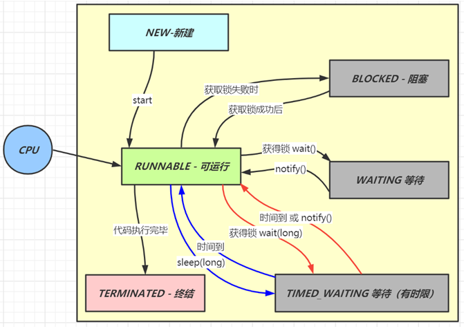
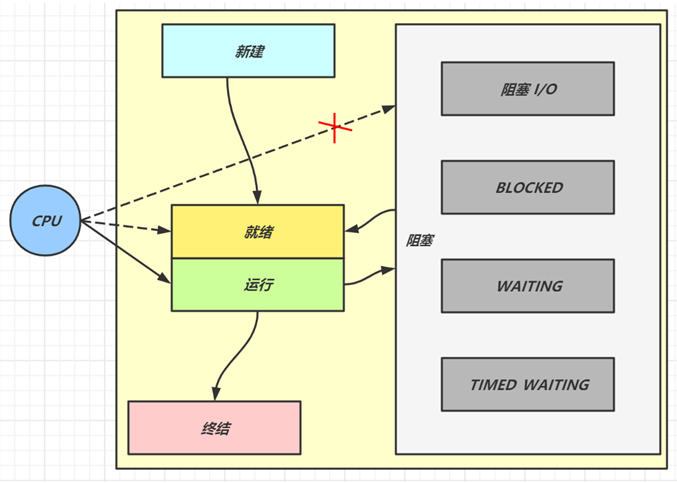

# 一、Java基础

## 1.1 语法篇

### 1.1.1 运算符 &和&&、|和||的区别

&运算符是按位与操作，只有当左右两边操作数对应的⼆进制数为都1时，结果位才为1，否则为0；

|运算符是按位或操作，只要左右两边操作数对应的⼆进制数有⼀个为1的时候，结果位就为1；

当用作逻辑运算时，& 和 && 都可以实现 且 这个功能，两者的区别（`a&b`、`a&&b`）：

- 无论a、b表达式的结果是true还是false，&会对a、b都进行运算；
- &&会先计算a，如果a为false，那么就不会继续计算b，直接返回结果，这称为短路操作；
- 判断语句中推荐使⽤ &&，效率更⾼；

| 和 || 和上面类似，&&和||称之为短路运算符。

### 1.1.2 用最有效率的方法计算2乘以8

使用位移运算符`2<<3`，将⼀个数左移n位，相当于乘以2的n次方，由于位运算是CPU直接⽀持的，所以效率更高。

在JDK源码中的位运算有很多，例如⾯HashMap的默认容量16：

```java
int DEFAULT_INITIAL_CAPACITY = 1 << 4; // aka 16
```

### 1.1.3 交换两个非0的int数值

⽅式⼀：

```java
public static void swap(int a, int b) {
	System.out.printf("a=%d, b=%d",a,b);
	a = a + b;
	b = a - b ;
	a = a - b;
	System.out.printf("\na=%d, b=%d",a,b);
}
```

方式二：

```java
public static void swap2(int a, int b){
	System.out.printf("a=%d, b=%d",a,b);
	a = a^b; // a1 = a^b
	b = b^a; // b = b^a^b
	a = a^b; // a = a1^b = a^b^a
	System.out.printf("\na=%d, b=%d",a,b);
}
```

### 1.1.4 Java数据类型的分类

- 基础数据类型：byte、short、int、long、float、double、char、boolean；
- 引⽤数据类型：其他都是引⽤类型；
  - String和Enum分别是什么类型：引⽤类型；

### 1.1.5 ++前置与后置

定义变量 `int i = 5;`，`return i++;` 和 `return ++i;` 返回结果是什么

- `return i++;`返回5；
- `return ++i;`返回6；

### 1.1.6 == 和equals的区别

- 基本数据类型需要⽤==判断是否相等；
- 引⽤数据类型：
  -  ==⽐较的是是栈中的值：
     -  基本数据类型是变量值；
     -  引用类型是堆中内存对象的地址；
  - equals⽐较的是具体的内容， 可以让开发者去定义什么条件去判断两个对象是否⼀样；

### 1.1.7 final关键字

- 修饰类：表示类不可被继承 ；
- 修饰方法：表示方法不可被子类重写，但是可以重载 ；
- 修饰变量：表示变量一旦被赋值就不可以更改它的值；

### 1.1.8 什么是字节码？采用字节码的好处是什么？

- 什么是字节码： 
  - Java中引入了虚拟机的概念，即在机器和编译程序之间加入了一层抽象的虚拟的机器；
    - JVM在任何平台上都提供给编译程序一个的共同的接口；
    - 编译程序只需要面向JVM，生成JVM能够理解的代码，然后由解释器来将JVM代码转换为特定系统的机器码执行;
  - 在Java中，供JVM理解的代码叫做**字节码**（即扩展名为 .class的文 件），它不面向任何特定的处理器，只面向JVM。;
  - 每一种平台的解释器是不同的，但是实现的JVM是相同的；
    - Java源程序经过编译器编译后变成字节码，字节码由JVM解释执行；
    - JVM将每一条要执行的字节码送给解释器，解释器将其翻译成特定机器上的机器码，然后在特定的机器上运行；
    - 这也就是解释了Java的编译与解释并存的特点；
  -  Java源代码---->编译器---->JVM可执行的Java字节码(即虚拟指令)---->JVM---->JVM中解释器----->机 器可执行的二进制机器码---->程序运行。 
- 采用字节码的好处：
  - （高效）Java语言通过字节码的方式，在一定程度上解决了传统解释型语言执行效率低的问题，同时又保留了解释型语言可移植的特点;
  - （跨平台）由于字节码并不专对一种特定的机器，因此Java程序无须重新编译便可在多种不同的计算机上运行;

### 1.1.9 使用泛型的好处

泛型提供了编译时类型安全检测机制，该机制允许程序员在编译时检测到非法的类型。泛型的本质 是参数化类型，也就是说所操作的数据类型被指定为一个参数。比如我们要写一个排序方法，能够 对整型数组、字符串数组甚至其他任何类型的数组进行排序，我们就可以使用 Java 泛型。

<u>**泛型的好处**</u>：

以集合来举例，使用泛型的好处是我们**不必因为添加元素类型的不同而定义不同类型的集合**，如整型集合类，浮点型集合类，字符串集合类，我们可以定义一个集合来存放整型、浮点型，字符串型数据；只要把底层存储设置了Object即可，添加的数据全部都可向上转型为Object，此外还可以通过规则按照自己的想法控制存储的数据类型；

### 1.1.10 try-catch-finally异常处理模块的返回值问题

下面代码 的try-catch-finally语句，try⾥⾯有个return, finally⾥⾯也有个return，结果会返回什么？为什么

```java
public static int test1() {
    int a = 1;
    try {
        System.out.println(a / 0);
        a = 2;
    } catch (ArithmeticException e) {
        a = 3;
        return a;
    } finally {
        a = 4;
    }
    return a;
}

public static int test2() {
    int a = 1;
    try {
        System.out.println(a / 0);
        a = 2;
    } catch (ArithmeticException e) {
        a = 3;
        return a;
    } finally {
        a = 4;
        return a;
    }
}
```

- `test1()`返回3、`test2()`返回4；
- 理由：
  - 在执⾏try、catch中的return之前不管有没有出现异常，**⼀定会执⾏finally中的代码**（如果finally存在）；
  - 如果finally中有return语句，就会直接执⾏finally中的return⽅法，所以finally中的return语句 ⼀定会被执⾏的；
  - 执⾏流程：finally执⾏前的代码⾥⾯有包含return，则会先确定return返回值的（此时并没有返回运算后的值，而是先把要返回的值保存起来，不管finally中的代码怎么样，返回的值都不会改变，任然是之前保存的值），然后再执行finally的代码，最后再执⾏return；

### 1.1.11 Exception与Error包结构

Java可抛出(Throwable)的结构分为三种类型：被检查的异常(CheckedException)，运行时异常 (RuntimeException)，错误(Error)。

### 1.1.12 JAVA 异常分类

### 1.1.13 throw 和 throws 的区别

### 1.1.12 找出某目录下的所有子目录以及子文件并打印到控制台

```java
private static void getAllFilePaths(File filePath, List<String> paths) {
    File[] files = filePath.listFiles();
    if(files == null){
        return;
    }
    for(File f : files){
        if(f.isDirectory()){
            paths.add(f.getPath());
            getAllFilePaths(f,paths);
        }else{
            paths.add(f.getPath());
        }
    }
}
```

## 1.2 String字符串

### 1.2.1 String str = new String("aaa"); 创建了几个对象

可能是一个、也可能是两个：

- 创建⼀个对象：如果常量池中存在`aaa`，则直接new⼀个`aaa`的字符串对象； 
- 创建两个对象：常量池不存在对象`aaa`，则会在常量池创建⼀个`aaa`对象，同时也会在堆里面创建⼀个`aaa`对象；

### 1.2.2  下面代码是比较什么？输出结果是什么？为什么是这样的结果？

```java
String str1= new String("aaa"); 
String str2= "aaa"; 
String str3= "aaa";
System.out.println(str1 == str2);
System.out.println(str2 == str3);
```

- `==`⽐较两边的引⽤内存地址是否⼀样;
- 第一个比较返回false，因为new 创建新的对象会开辟新的空间，所以地址不⼀样；
- 第二个比较返回true，因为此时"aaa" 存在于常量池中，都是从常量池⾥⾯获取值，地址相等

### 1.2.3 写出下面代码的执行结果，如果需要两个都为true，应该怎么修改？

```java
String s1 = "aaa";
String s2 = s1 + ".bbb";
String s3 = "aaa" + ".bbb";
System.out.println(s2 == "aaa.bbb"); 
System.out.println(s3 == "aaa.bbb");
```

- 第⼀条打印语句的结果为false， `s2 = s1 + ".bbb"` 构建了⼀个新的String对象，并将对象引⽤赋予s2变量，常量池中的地址不⼀样，但是值⼀样的；
  - 变量 + 常量 = 来⾃堆；
- 第⼆条语句打印的结果为true，javac编译会对""**字符串常量**""直接相加的表达式进⾏优化，不⽤等到运⾏期再去进⾏加法运算处理，⽽是直接将其编译成⼀个这些常量相连的结果；
  - 常量 + 常量 = 来⾃常量池；
- 如果需要第⼀个输出为true，只需要把变量改为常量即可，例如： `fianl String s1 = "aaa";` 。

不管是new String("XXX")和直接常量赋值, 都会在字符串常量池创建对应的字符串常量，只不过new String("XXX")方式会在堆中创建⼀个对象去指向常量池的对象，普通的常量赋值是直接赋值给变量。

### 1.2.4 String、StringBuffer与StringBuilder的区别及使用场景

相同点：

- 三者都是final， 不允许被继承；
- 本质都是char[]字符数组实现；

区别：

- String、StringBuffer与StringBuilder中，String是**不可变**对象，另外两个是**可变**的；
- String每次操作都会产生新的String对象；
- StringBuilder 效率更快，因为它不需要加锁，不具备多线程安全；
- StringBuffer⾥⾯操作⽅法都会使用`synchronized`关键字加锁，所以效率相对较低，但是是线程安全的；

使⽤场景： 

  - 操作少量的数据⽤String，但是如果需要经常改变内容且操作数据多情况下最好不要⽤ String ， 因为每次⽣成中间对象性能会降低 ；
  - 单线程下操作⼤量的字符串⽤StringBuilder，虽然线程不安全但是不影响 ；
  - 多线程下操作⼤量的字符串，且需要保证线程安全使用StringBuffer；

## 1.3 OOP

### 1.3.1 什么是面向对象？

对比面向过程，是两种不同的处理问题的角度，面向过程更注重事情的每一个步骤及顺序，面向对象更注重事情有哪些参与者（对象）、及各自需要做什么；

### 1.3.1 面向对象的四大特性

- 抽象:
  - 关键词abstract声明的类叫作抽象类，abstract声明的⽅法叫抽象方法；
  - 如果⼀个类中包含了⼀个或多个抽象⽅法，这个类就必须指定成抽象类；
  - 抽象抽象属于⼀种特殊的方法，它只是一个方法声明，并没有⽅法体；
  - 实际应用：抽象⽀付  `pay(⾦额，订单号)`，默认实现是本地⽀付，微信⽀付，⽀付宝⽀付，银⾏卡⽀付  
- 封装：
  - 明确标识出允许外部使用的所有成员函数和数据项，对数据的访问只能通过对外暴露的已定义的接口，这样可以做到内部实现细节对外部调用隐蔽，外部调用无需修改或者关心内部实现；
  - 在java中通过关键字`private`，`protected`和`public`以及缺省的访问权限修饰符实现封装；
  - 封装可以让代码更容易理解和维护，也加强了代码的安全性；
- 继承：
  - ⼦类继承⽗类的特征（属性）和⾏为（方法），使得⼦类对象具有⽗类的⽅法和属性；
  - ⼦类可以在父类的基础上做出自己的改变、扩展，子类共性的方法或者属性直接使用父类的，而不需要自己再定义，只需扩展自己个性化的；
- 多态：
  - 同⼀个⾏为具有多个不同表现形式的能⼒，基于对象所属类的不同，外部对同一个方法的调用，实际执行的逻辑不同；
  - 可以通过继承，方法重写，父类引用指向子类对象来实现多态；

### 1.3.2 Overload和Override的区别

- 重载Overload：表示**同⼀个类**中可以有多个方法名相同的⽅法，但这些⽅法的参数列表各不相同（参参数类型、个数、顺序），方法返回值和访问修饰符可以不同；
- 重写Override：发生在父子类中，子类重写父类方法表示**子类**中的⽅法可以与**父类**中的某个⽅法的名称和参数完全相同；
  - 子类返回值范围、抛出的异常范围小于等于父类，访问修饰符范围大于等于父类；
  - 如果父类方法访问修饰符为private则子类就不能重写该方法；

### 1.3.3 接口和抽象类的区别

抽象类：

- 可以存在普通成员方法；
- 成员变量可以是各种类型的；
- 抽象类只能继承一个；
- 接口的设计目的是对类的行为进行**约束**（更准确的说是一种“有”约束，因为接口不能规定类不可以有什么行为），也就是提供一种机制，可以强制要求不同的类具有相同的行为；接口只约束了行为的有无，但不对如何实现行为进行限制；
- 接口是对行为的抽象，表达的是 like a 的关系，比如： Bird like a Aircraft （像飞行器一样可以 飞），但其本质上 is a Bird 。接口的核心是定义行为，即实现类可以做什么，至于实现类主体是 谁、是如何实现的，接口并不关心。

接口：

- 只能存在public abstract 方法；
- 成员变量只能是public static final类型的；
- 接口可以实现多个；
- 抽象类的设计目的是代码复用，当不同的类具有某些相同的行为（记为行为集合A），且其中一 部分行为的实现方式一致时，A的非真子集（记为B）可以让这些类都派生于一个抽象类。在这个抽象类中实现了B，避免让所有的子类来实现B，这就达到了代码复用的目的。而A-B的部分则留给各个子类自己实现。正是因为A-B在这里没有实现，所以抽象类不允许实例化出来（否则当调用 到A-B时，无法执行）；
- 抽象类是对类本质的抽象，表达的是 is a 的关系，比如： BMW is a Car，抽象类包含并实现子类的通用特性，将子类存在差异化的特性进行抽象，交由子类去实现

### 1.3.3 接口是否可以继承接口？接口是否支持多继承？类是否支持多继承？接口里面是否可以有方法实现？

- 接口中可以有静态⽅法和⽅法体；
- 接口中所有的⽅法必须是抽象⽅法（JDK8之后就不是）；
- 接⼝不是被类继承了，⽽是要被类实现；
- 接⼝⽀持多继承，类不⽀持多个类继；

⼀个类只能继承⼀个类，但是能实现多个接口，接口能继承另⼀个接口，接口的继承使⽤`extends`关键字，和类继承⼀样；

### 1.3.4 JDK8中接口新特性

- interface中可以有static⽅法，但必须有⽅法实现体，该⽅法只属于该接口，接口名直接调⽤该⽅法 ；
- 接口中新增`default`关键字修饰的⽅法，default⽅法只能定义在接口中，可以在子类或子接口中被重写，default定义的⽅法必须有⽅法体；
- ⽗接⼝的default⽅法如果在⼦接⼝或⼦类被重写，那么子接口的实现对象、⼦类对象，调⽤该⽅法，以重写为准；
- 本类、接⼝如果没有重写⽗类（即接⼝）的default⽅法，则在调⽤default⽅法时，使⽤⽗类 （接⼝） 定义的default⽅法逻辑；

## 1.4 集合框架

### 1.4.1 Vector、ArrayList和LinkedList的联系和区别及使用场景

- `ArrayList`：
  - 底层是**数组**实现，每个元素之间不能有间隔，需要一块连续的内存；
  - **线程不安全**；
  - 随机访问快（根据下标进行访问）；
  - 尾部的插入和删除性能可以，但是对其他部分进行插入或者删除元素时，需要对数组进行复制、移动、代价比高；
- `LinkedList`： 
  - 底层是**双向链表**实现，不需要连续内存；
  - **线程不安全**；
  - 随机访问慢（需要沿着链表进行遍历）；
  - 头、尾插入和删除性能高，向链表中间增删元素时，性能也比较低
  - *LinkedList还提供了 List 接口中没有定义的方法，专门用于操作表头和表尾元素，可以当作堆、栈、队列和双向队列使用;*

- `Vector`：底层是**数组**实现，**线程安全**的，操作的时候使⽤synchronized进⾏加锁;
  - *某一时刻只有一 个线程能够写 Vector，避免多线程同时写而引起的不一致性*；

使⽤场景：

- Vector已经很少⽤了；
- 增加和删除场景多则⽤LinkedList；
- 查询和修改多则⽤ArrayList；

### 1.4.2 保证ArrayList线程安全的方式

- ⽅式⼀：⾃⼰写个包装类，根据业务⼀般是`add/update/remove`加锁；
- ⽅式⼆：使用`Collections.synchronizedList(new ArrayList<>());` ，其使用使⽤synchronized加锁；
- ⽅式三：使用`CopyOnWriteArrayList<>()`，其使⽤`ReentrantLock`加锁；

### 1.4.3 CopyOnWriteArrayList和Collections.synchronizedList实现线程安全有什么区别及使用场景

- `CopyOnWriteArrayList`：
  - 在执行修改操作时，会拷⻉⼀份新的数组进⾏操作（例如add、set、 remove等)，这样的代价⼗分昂贵，在操作执行完毕后，会将原来集合指向新的集合；
  - 在源码中，使⽤`ReentrantLock`可重⼊锁来保证不会有多个线程同时拷⻉⼀份数组
  - 使用场景：由于读⾼性能，所以适⽤读操作远远⼤于写操作的场景中使⽤，因为读的时候是不需要加锁的， 直接获取，删除和增加是需要加锁的；==>读多写少 
- `Collections.synchronizedList`：
  - 线程安全的原因是因为它⼏乎在每个⽅法中都使⽤了`synchronized`同步锁；
  - 使用场景：与`CopyOnWriteArrayList`相反，写操作性能⽐`CopyOnWriteArrayList`好，读操作性能并不如 `CopyOnWriteArrayList`；==>写多读少

### 1.4.4 CopyOnWriteArrayList的设计思想及缺点

设计思想：**读写分离+最终⼀致**；

缺点：

- 内存占⽤问题，由于写时复制机制，在内存⾥会同时驻扎两个对象：旧的对象和新写⼊的对象；
- 如果对象⼤则容易发⽣**Yong GC**和**Full GC**；

### 1.4.5 ArrayList的扩容机制

<u>初始容量</u>：

- 如果未指定集合容量，调用无参的构造函数：
  - 在JDK1.7之前`ArrayList`的默认容量是10；
  - 在JDk1.7之后`ArrayList`的默认容量是1；
- 若已经指定容量，则集合大小为指定容量；

<u>扩容时机</u>：

- 以JDK1.8为例，当集合**第⼀次**添加元素的时候，集合大小扩容为10；
- 当`ArrayList`的元素个数⼤于其容量，按照`扩容的⼤⼩= 原始⼤⼩+原始⼤⼩/2`（上次容量的**1.5倍**）来进行扩容；

扩容源代码：

```java
    /**
     * Increases the capacity to ensure that it can hold at least the
     * number of elements specified by the minimum capacity argument.
     *
     * @param minCapacity the desired minimum capacity
     */
    private void grow(int minCapacity) {
        // overflow-conscious code
        int oldCapacity = elementData.length;
        int newCapacity = oldCapacity + (oldCapacity >> 1);
        if (newCapacity - minCapacity < 0)
            newCapacity = minCapacity;
        if (newCapacity - MAX_ARRAY_SIZE > 0)
            newCapacity = hugeCapacity(minCapacity);
        // minCapacity is usually close to size, so this is a win:
        elementData = Arrays.copyOf(elementData, newCapacity);
    }
```

### 1.4.6 设计⼀个简单的ArrayList

### 1.4.7 List和Set的区别

<u>List</u>：

- **有序**，按对象进入的顺序保存对象；
- **可重复**，允许多个Null元素对象；
- 遍历方式：
  - 可以使用`Iterator`取出所有元素，再逐一遍历；
  - 可以使用`get(int index)`获取指定下标的元素;

<u>Set</u>:

- **无序**;
- **不可重复**，且最多允许有一个Null元素对象；
- 遍历方式：
  - 只能用Iterator接口取得所有元素，再逐一遍历各个元素；

### 1.4.7 了解Map吗？用过哪些Map的实现

`HashMap`、`Hashtable`、`LinkedHashMap`、`TreeMap`、 `ConcurrentHashMap`；

### 1.4.8 HashMap和Hashtable的区别

<u>HashMap</u>：

- 底层是基于**数组+链表**;
- **非线程安全**的;
  - 虽然HashMap是线程不安全的，但是它的效率远远高于Hashtable，这样设计是合理的，因为大部分的使用场景都是单线程。当需要多线程操作的时候可以使用线程安全的 `ConcurrentHashMap`；
  - `ConcurrentHashMap`使用了分段锁，并不对整个数据进行锁定，效率比Hashtable高；
- 默认容量是**16** ，扩容因子是0.75，每次扩容大小为原来的 2的指数倍;
- **允许有空(null)的键和值**;
  - 为null的key只能有一个，因为必须保证key的唯一性；
  - 可以有多个key值对应的value为null；
- 对key的hashcode做了**二次散列**，从而避免key的分布不均匀问题，影响查询性能；

<u>Hashtable</u>：

- 基于**哈希表**实现；
- **线程安全**的(因为加了`synchronized`)；
- 默认容量是**11**，扩容因子是0.75，每次扩容大小为原来的 2n+1；
- **不允许有 null的健和值**；
- 直接使用key的hashcode对数组长度取模；

- Hashtable比HashMap多提供了`elments()` 和`contains()`两个方法:
  - `elments()`方法：继承自 Hashtable的父类Dictionnary，用于返回此Hashtable中的value的枚举。 
  - `contains()`方法：判断该Hashtable是否包含传入的value，作用与`containsValue()`一致；（事实上`contansValue()` 就只是调用了一下`contains()`方法）

### 1.4.9 对象的 hashCode()和equals()方法，及使用场景

hashCode方法和equals方法都是是顶级类`Object`中的⽅法：

- `hashCode()`方法的返回值类型是int，根据⼀定的hash规则对数据进行散列，散列后得到**散列值** ；
- `equals()`方法的返回值类型是boolean，一般会根据⾃定义的匹配规则，判断两个对象的内容是否一致；

使⽤场景：对象⽐较、集合容器⾥⾯排重、⽐较、排序；

### 1.4.10 两对象比较

- 如果两个对象相等，则hashcode值是相同的，并且对两个对象分别调用equals方法都返回true；
- 如果两个对象有相同的hashcode值，它们也不一定是相等的，如果重写equals方法后，则也同时必须重写hashCode()方法；
- hashCode()的默认行为是对堆上的对象产生独特值。如果一个类没有重写hashCode()方法，则该类的两个对象无论如何都不会相等（即使这两个对象指向相同的数据）；

### 1.4.11 HashMap中可以使用任何类作为 key 吗

可以但需要注意以下几点：

- 如果类重写了`equals()`方法，它也应该重写 `hashCode()` 方法；
- 类的所有实例需要遵循与 `equals()`方法和 `hashCode()` 方法相关的规则；
-  自定义的key类的最佳实践是使之为不可变的：
  - hashCode 值可以被缓存起来，拥有更好的性能；
  - 可以确保 hashCode 和 equals 在未来不会改变；

### 1.4.11 编写⼀个User对象，重写其中的hashCode()和equals()方法

### 1.4.12 HashMap和TreeMap的区别

### 1.4.13 Set和Map的关系

核⼼就是不保存重复的元素，存储⼀组唯⼀的对象；

- `Set`的每⼀种实现都是对应Map⾥⾯的⼀种封装
  - HashSet对应的就是HashMap;
  - TreeSet对应的就是TreeMap;

### 1.4.x HashSet与HashMap的区别

<u>HashSet</u>：

- 实现了Map接口；
- 以key-value的形式存储；
- 调用`put()`方法向map中添加元素；
- 使用key来计算hashCode；

<u>HashMap</u>：

- 实现了Set接口；
- 仅存储对象；
- 调用`add()`方法向set中添加元素；
- 使用对象来计算hashCode，如果两个对象的hashCode相同则继续调用`equals()`方法进行比较；

### 1.4.x HashMap 与 HashTable的区别

<u>HashMap</u>：

<u>HashTable</u>：


### 1.4.13 常见Map的排序规则是怎样的？

- `LinkedHashMap`按照添加顺序排序;
- `TreeMap`默认按照⾃然排序，如果需要⾃定义排序，使用`TreeMap(Comparetor c)`；

### 1.4.14 如果需要线程安全，且效率高的Map，应该怎么做？

多线程环境下可以⽤concurrent包下的`ConcurrentHashMap`, 或者使⽤` Collections.synchronizedMap()`对Map进行包装，`ConcurrentHashMap`不但是线程安全，并且他的效率⽐`Hashtable`要⾼很多；

### 1.4.15 为什么Collections.synchronizedMap后是线程安全的？

使⽤`Collections.synchronizedMap`对Map包装后返回的map是加锁的；

### 1.4.16 HashMap底层数据结构

`HashMap`底层是由**数组+链表+红⿊树**（JDK1.8之后有红⿊树）组成；

`HashMap`整体上是一个数组，然后数组中的元素是⼀个链表，即数组和链表的结合体：`Node<K, V>[] table`

- table是数组，数组的元素是Entry(Node继承Entry)；
- Entry元素是⼀个 key-value的键值对，它持有⼀个指向下个Entry的引⽤；
- table数组的每个Entry元素同时也作为当前 Entry链表的⾸节点，也指向了该链表的下个Entry元素；
- 在JDK1.8中，当链表Entry的⻓度⼤于8并且数组容量超过64，链表会转换成红⿊树

### 1.4.17 什么是Hash冲突及常见的解决办法

Hash冲突的意思是**不同key计算得到的Hash值相同**，需要放到同个bucket中；

常⻅的解决办法：

- 链表法（**HashMap采⽤的是链表法**）；
- 开放地址法；
- 再哈希法；

### 1.4.18 HashMap底层是 数组+链表+红黑树，为什么要用这几类结构呢？

- 数组`Node<K, V> table` ，根据对象的key的Hash值进⾏在数组⾥⾯是哪个节点；
- 链表的作⽤是解决Hash冲突，将Hash值⼀样的对象存在⼀个链表放在hash值对应的槽位；
- 红⿊树是JDK8引入用来替代超过8个节点的链表，主要是为了**提升查询性能**，从原来的O(n)提升到了 O(logn)；

### 1.4.19 HashMap底层为何要选择红黑树

⼆叉查找树在特殊情况下也会变成⼀条线性结构，和原先的链表存在⼀样的深度遍历问题，查找性能 就会慢， 使⽤红⿊树主要是提升查找数据的速度，红⿊树是平衡⼆叉树的⼀种，插⼊新数据后会通过左旋，右旋、变 ⾊等操作来保持平衡，解决单链表查询深度的问题 数据量少的时候操作数据，遍历线性表⽐红⿊树所消耗的资源少

### 1.4.20 HashMap为何要等到链表长度超过8才进行树化

* 红黑树是用来避免 DoS 攻击，防止链表超长时性能下降，树化应当是偶然情况，是保底策略；
* hash 表的查找，更新的时间复杂度是 `O(1)`，而红黑树的查找，更新的时间复杂度是 `O(log⁡n)`，并且`TreeNode` 占用空间也比普通 Node 的大，如非必要，尽量还是使用链表；
* hash 值如果足够随机，则在 hash 表内按泊松分布，在负载因子 0.75 的情况下，长度超过 8 的链表出现概率是 0.00000006（亿分之6），树化阈值选择 8 就是为了让树化几率足够小；

### 1.4.21 HashMap红黑树何时会退化成链表

<u>树化规则</u>

* 当链表长度超过树化阈值 8 时，先尝试扩容来减少链表长度，如果数组容量已经 >=64，才会进行树化

<u>退化规则</u>

* 情况1：在扩容时如果拆分树时，树元素个数 <= 6 则会退化链表
* 情况2：remove 树节点时，若 `root、root.left、root.right、root.left.left `有一个为 null ，也会退化为链表

### 1.4.20 HashMap的put流程

<u>put 流程</u>：

- HashMap 是懒惰创建数组的，首次使用才会创建数组；

- 通过一定的hash算法计算索引（桶下标）；

- 如果桶下标还没人占用，则创建 Node 占位返回；

- 如果桶下标已经有人占用：
  - 如果是`TreeNode`占用，则走红黑树的添加或更新逻辑；
  - 如果普通`Node`占用，则走链表的添加或更新逻辑，并且如果添加后链表长度超过树化阈值，走树化逻辑；

- 返回前会检查容量是否超过阈值，一旦超过进行扩容（加载因子0.75）；

<u>1.7 与 1.8 的区别</u>：

- 链表插入节点时，1.7 是头插法，1.8 是尾插法；

- 1.7 是大于等于阈值且没有空位时才扩容，而 1.8 是大于阈值就扩容；

- 1.8 在扩容计算 Node 索引时，会优化；

<u>扩容（加载）因子为何默认是 0.75f</u>：

- 在空间占用与查询时间之间取得较好的权衡；
- 大于这个值，空间节省了，但链表就会比较长影响性能；
- 小于这个值，冲突减少了，但扩容就会更频繁，空间占用也更多；

### 1.4.x HashMap 与 ConcurrentHashMap的区别

HashMap 与 ConcurrentHashMap 都是以key-value 形式的存储数据；

<u>HashMap</u>：

- Map接口的一个实现类，线程不安全；
- 底层数据结构：
  - JDK 1.8 之前：数组 + 链表；
  - JDK 1.8 之后：数组 + 链表 + 红黑树；（当链表中元素个数达到 8 的时候，为了提升查询效率，链表会转为红黑树）

<u>ConcurrentHashMap</u>：

-  JUC 下的类，线程安全；
- 底层数据结构：
  - JDK 1.8 之前：分段锁现实的 Segment + HashEntry；
  - JDK 1.8 之后：采用 Node + CAS + Synchronized；

### 1.4.21 ConcurrentHashMap为什么性能比HashTable高

ConcurrentHashMap线程安全的Map, hashtable类基本上所有的⽅法都是采⽤synchronized 进⾏线程安全控制 ⾼并发情况下效率就降低 ConcurrentHashMap是采⽤了分段锁的思想提⾼性能，锁粒度更细化

### 1.4.22 JDK1.7和JDK1.8中ConcurrentHashMap实现的区别有没了解

JDK8之前，ConcurrentHashMap使⽤锁分段技术，将数据分成⼀段段存储，每个数据段配置⼀把 锁，即segment类，这个类继承ReentrantLock来保证线程安全 技术点：Segment+HashEntry JKD8的版本取消Segment这个分段锁数据结构，底层也是使⽤Node数组+链表+红⿊树，从⽽实现对 每⼀段数据就⾏加锁，也减少了并发冲突的概率，CAS(读)+Synchronized(写) 技术点：Node+Cas+Synchronized

### 1.4.23 ConcurrentHashMap的put的核心逻辑（JDK8以上版本）

spread(key.hashCode()) 重哈希，减少碰撞概率 tabAt(i) 获取table中索引为i的Node元素 casTabAt(i) 利⽤CAS操作获取table中索引为i的Node元素 put的核⼼流程 1、key进⾏重哈希spread(key.hashCode()) 2、对当前table进⾏⽆条件循环 3、如果没有初始化table，则⽤initTable进⾏初始化 4、如果没有hash冲突，则直接⽤cas插⼊新节点，成功后则直接判断是否需要扩容，然后结束 5、(fh = f.hash) == MOVED 如果是这个状态则是扩容操作，先进⾏扩容 6、存在hash冲突，利⽤synchronized (f) 加锁保证线程安全 7、如果是链表，则直接遍历插⼊，如果数量⼤于8，则需要转换成红⿊树 8、如果是红⿊树则按照红⿊树规则插⼊ 9、最后是检查是否需要扩容addCount()

## 1.5 并发编程

### 1.5.1 进程、线程、协程之间的关系

### 1.5.2 协程对于多线程的优缺点

### 1.5.3 并发和并行的区别

### 1.5.4 Java中实现多线程的方式

### 1.5.x 为什么要使用线程池

- **降低资源消耗**：提高线程利用率，降低创建和销毁线程的消耗；
- **提高响应速度**：任务来了，直接有线程可用可执行，而不是先创建线程，再执行；
- **提高线程的可管理性**：线程是稀缺资源，使用线程池可以统一分配调优监控；

### 1.5.x 线程池参数

<u>七大参数</u>

- **corePoolSize**：核心线程数目即池中会保留的最多线程数，是正常情况下创建工作的线程数，这些线程创建后并不会消 除，而是一种常驻线程；

- **maximumPoolSize**：最大线程数目 - 核心线程+救急线程的最大数目

- **keepAliveTime** 生存时间 - 救急线程的生存时间，生存时间内没有新任务，此线程资源会释放

- **unit** 时间单位 - 救急线程的生存时间单位，如秒、毫秒等

- **workQueue** - 当没有空闲核心线程时，新来任务会加入到此队列排队，队列满会创建救急线程执行任务

- **threadFactory** 线程工厂 - 可以定制线程对象的创建，例如设置线程名字、是否是守护线程等

- **handler** 拒绝策略 - 当所有线程都在繁忙，workQueue 也放满时，会触发拒绝策略
  - 抛异常 `java.util.concurrent.ThreadPoolExecutor.AbortPolicy`
  - 由调用者执行任务 `java.util.concurrent.ThreadPoolExecutor.CallerRunsPolicy`
  - 丢弃任务 `java.util.concurrent.ThreadPoolExecutor.DiscardPolicy`
  - 丢弃最早排队任务 `java.util.concurrent.ThreadPoolExecutor.DiscardOldestPolicy`

### 1.5.x 线程池处理流程


### 1.5.5 Java线程状态

<u>六种状态及转换</u>



* 新建
  * 当一个线程对象被创建，但还未调用 start 方法时处于**新建**状态
  * 此时未与操作系统底层线程关联
* 可运行
  * 调用了 start 方法，就会由**新建**进入**可运行**
  * 此时与底层线程关联，由操作系统调度执行
* 终结
  * 线程内代码已经执行完毕，由**可运行**进入**终结**
  * 此时会取消与底层线程关联
* 阻塞
  * 当获取锁失败后，由**可运行**进入 Monitor 的阻塞队列**阻塞**，此时不占用 cpu 时间
  * 当持锁线程释放锁时，会按照一定规则唤醒阻塞队列中的**阻塞**线程，唤醒后的线程进入**可运行**状态
* 等待
  * 当获取锁成功后，但由于条件不满足，调用了 wait() 方法，此时从**可运行**状态释放锁进入 Monitor 等待集合**等待**，同样不占用 cpu 时间
  * 当其它持锁线程调用 notify() 或 notifyAll() 方法，会按照一定规则唤醒等待集合中的**等待**线程，恢复为**可运行**状态
* 有时限等待
  * 当获取锁成功后，但由于条件不满足，调用了 wait(long) 方法，此时从**可运行**状态释放锁进入 Monitor 等待集合进行**有时限等待**，同样不占用 cpu 时间
  * 当其它持锁线程调用 notify() 或 notifyAll() 方法，会按照一定规则唤醒等待集合中的**有时限等待**线程，恢复为**可运行**状态，并重新去竞争锁
  * 如果等待超时，也会从**有时限等待**状态恢复为**可运行**状态，并重新去竞争锁
  * 还有一种情况是调用 sleep(long) 方法也会从**可运行**状态进入**有时限等待**状态，但与 Monitor 无关，不需要主动唤醒，超时时间到自然恢复为**可运行**状态

> ***其它情况（只需了解）***
>
> * 可以用 interrupt() 方法打断**等待**、**有时限等待**的线程，让它们恢复为**可运行**状态
> * park，unpark 等方法也可以让线程等待和唤醒

<u>五种状态</u>

五种状态的说法来自于操作系统层面的划分



* 运行态：分到 cpu 时间，能真正执行线程内代码的
* 就绪态：有资格分到 cpu 时间，但还未轮到它的
* 阻塞态：没资格分到 cpu 时间的
  * 涵盖了 java 状态中提到的**阻塞**、**等待**、**有时限等待**
  * 多出了阻塞 I/O，指线程在调用阻塞 I/O 时，实际活由 I/O 设备完成，此时线程无事可做，只能干等
* 新建与终结态：与 java 中同名状态类似，不再啰嗦

### 1.5.6 多线程开发中的常用方法

### 1.5.8 多线程的业务场景

### 1.5.9 不是线程安全的数据结构

### 1.5.10 在Java中可以有哪些方法来保证线程安全

### 1.5.11 volatile和synchronized的区别

### 1.5.12 为什么会出现脏读？

### 1.5.13 什么是指令重排

### 1.5.14 知道什么是happens-before

### 1.5.15 并发编程三要素+举例

### 1.5.16 进程间的调度算法

### 1.5.17 线程间的调度算法

### 1.5.18 日常开发中使用到的Java中的锁有哪些？

### 1.5.19 多线程死锁的例子

### 1.5.20 死锁的4个必要条件

### 1.5.21 优化代码，解决死锁

### 1.5.22 设计⼀个简单的不可重入锁

### 1.5.23 设计⼀个简单的可重入锁

### 1.5.24 对synchronized的理解

## 1.6 JVM

